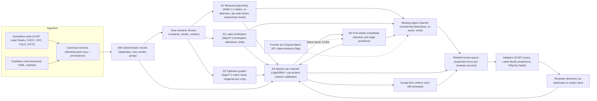
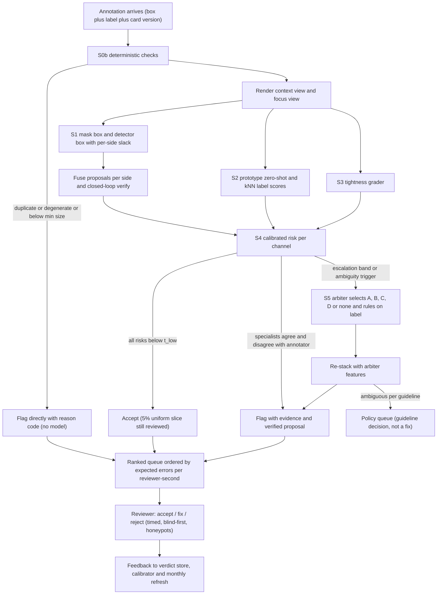

# pulsegen: VLM-based annotation QA for bounding-box datasets - design document

**Status:** Draft v0.2, 2026-09-14 (v0.1 2026-09-13, revised after a three-lens critique). Pre-implementation; nothing in this document has been built.
**Audience:** the 2-3 ML engineers and the technical lead who will decide what to build.
**Inputs:** a seven-dimension research digest, four candidate designs, a three-lens judge panel, a fact-check ledger of 53 entries covering about 25 independent claims (Appendix A), and the Claude vision documentation fetched on 2026-09-13. Every figure in the body is either ledger-confirmed, marked "(unverified)", or labelled as a planning estimate to be measured in a named phase.
**How to read this document:** the executive summary (one page) carries the recommendation, the key numbers and the decisions requested. A 30-minute read is the executive summary plus Sections 1, 5, 6 and 13. Sections 2-4 and 7-12 hold the evidence and the plan detail; Appendix A is the fact-check ledger that every figure in the body traces to.

## Executive summary

**What pulsegen is.** pulsegen ranks bounding-box annotations by calibrated probability of error and shows reviewers a verified proposed fix; it does not auto-correct. We recommend a measured-geometry, calibrated-ranker design with a frontier VLM only on an 8-15% uncertain band. (Section 5 compares four candidate designs, lettered A-D; the recommendation is the hybrid of B, C and D with A's guideline discipline. The letters are not needed to read this summary.)

- Build pulsegen as a **calibrated review ranker with measured geometry**, not an autonomous VLM judge. On real (not synthetic) annotation errors, published precision ranges from 11.5-47.5% across error types for loss inspection ([WACV 2024](https://arxiv.org/abs/2303.06999)) to 0.49-0.71 precision@100 for ObjectLab on COCO ([ObjectLab](https://arxiv.org/abs/2309.00832)), all far below synthetic-benchmark numbers, and the best detector-based methods still leave 44-66% of missing labels undetected ([Rechecked](https://arxiv.org/abs/2508.06556)). At that operating point a system that auto-corrects harms data; a system that orders human review by calibrated risk still delivers a large lift at a fixed review budget, and that lift is what we measure.
- **Measure box geometry, do not perceive it.** SAM 2.1 masks (annotator box, a 1.4x dilated box, jittered boxes and a centre point as prompts), label-conditioned re-detection (Grounding DINO / OWLv2, plus a k-fold in-domain detector on projects with enough data), per-side median fusion and a closed-loop re-prompt check produce the proposed box and per-side deltas. A VLM never emits a coordinate that becomes a correction: Qwen3-VL-8B reaches Acc@0.5 88.53% but only Acc@0.9 55.79% on Ref-L4, VLM self-verification confidence correlates with box correctness at r about 0.22, and Anthropic's own docs call Claude's localization "approximate".
- **Verify labels with project exemplars plus the guideline**, using SigLIP 2 prototypes, definitions and kNN consistency, stacked with the detector posterior; a **frontier verifier (Claude Sonnet 5 / Haiku 4.5 via the Batch API with structured outputs and a cached guideline prefix)** runs only on the uncertain band and only for projects whose data-residency flag allows it, and writes answer-conditioned rationales that later train the open arbiter.
- **The guideline card is a first-class, versioned, hashed input.** Correctness is convention-relative (COCO-ReM shows COCO mixes amodal and modal extents; TIDE found 30 of the 100 most confident Mask R-CNN localization errors and 50 of 100 background errors on COCO were ground-truth mistakes). Every verdict cites the card rule that decided it, and a 1K-box convention-swap test gates whether the system actually reads the card.
- **One LightGBM stacker per error channel, isotonic-calibrated per project**, orders a review queue by expected confirmed errors per reviewer-second, with a permanent 5% uniform random slice, honeypots (10% for the first four weeks of a project or reviewer, 5% thereafter) and a 20% blind-first arm. Nothing is auto-applied; a harmed-correction rate above 3% blocks a release.
- **An open VLM arbiter (LoRA-tuned Qwen3-VL-4B/8B, Apache-2.0) enters only on the 8-15% escalation band and only after a measured recall@10%-budget lift of at least 3 pp** with a paired-bootstrap CI excluding zero. It answers candidate-selection and per-edge questions in a 2x focus-crop frame, never free coordinates. No RL in the first program.
- **Missing objects and duplicates are separate channels with their own gates.** Duplicates are deterministic (any-class IoU > 0.8, with a label-conflict flag; COCO-ReM found 410 near-duplicate mask pairs at IoU > 0.8 with mixed labels, about 2.3% of COCO-2017 val instances; the same-class box-duplicate rate is re-measured on COCO val in P1). Missing objects are the most common real error (228 of 384 Rechecked KITTI pedestrian errors) and are invisible to any per-box judge, so a detector-driven propose-then-verify channel is built, gated and reported on its own.
- **Integrate through the tools' native primitives** (CVAT issues, Label Studio predictions with score and model_version, FiftyOne mistakenness fields) plus at most one bespoke A-vs-B review page; prompt text, JSON schema, marker style, crop policy and model id are one hashed artifact with an automatic regression gate.

**Key numbers.** Human box agreement ceiling: 88% mean IoU between VOC 2007 ground-truth boxes and mask-derived boxes (93% of boxes above IoU 0.7); LVIS double annotation 0.85 mask IoU (mask, not box). Default geometry acceptance therefore sits at IoU 0.80 with a 2 px per-side floor, below the 0.85-0.88 human-noise band; IoU 0.85 and above is informational only. Measured real error rates: roughly 5% of COCO images with a missing box, 3% with a badly located box, 0.7% with a swapped label (ObjectLab, informal estimate); at least 18% of KITTI pedestrian labels missing or inaccurate (Rechecked). Inference cost: self-hosted specialist stack, planning estimate $0.05-0.25 per 1K boxes (to be measured in week 1-2); Claude Sonnet 5 frontier verification about $7 per 1K calls at list price and $3.6 with the Batch API on pulsegen's own prompt; all frontier consumers together (15% escalation on Sonnet 5 batch, about 150 missing-candidate verifications on Haiku 4.5 batch, 10% Gemini audit) about $0.9 per 1K boxes uncached (ceiling $1.0) and about $0.7 with the cached card prefix, ceiling $0.8 (Section 11.2). Human review: verify-only microtask 12 s, verify-and-fix 60 s (assumptions, measured in the pilot); at $20/h a verify-and-fix pass over every box is about $333 per 1K boxes and a verify-only pass about $67 per 1K. Program cash excluding salaries: $8-16K, capped at $20K; GPU budget 500 GPU-h.

**First 6 weeks.** Week 1-2: canonical schema, Datumaro and Label Studio ingestion, guideline-card compiler, frozen view renderer with coordinate round-trip tests, license manifest, legal review kickoff (SAM 3, Objects365, Sama-COCO), adjudication-vendor RFP sent (decision end of week 2), one-hour vLLM and specialist throughput benchmark on the real crop distribution, real-error corpora ingested (Rechecked KITTI, COCO-ReM vs COCO val, Sama-COCO vs COCO val). Week 2-4: the team adjudicates a 2K-box internal pilot holdout itself (1,000 uniform + 1,000 enriched, Section 7.5) while the vendor is onboarded for the 10K scale-up; empirical noise histograms and confusion matrix frozen; corruption sampler v0 fitted to them. Week 3-6: zero-shot geometry cascade, baseline ladder, frontier verifier on an interim uncertain band, evaluation harness with review-budget curves and paired bootstrap. **Gate 0 (week 6):** baseline curves exist on the pilot holdout with Krippendorff alpha at or above 0.67, and the zero-shot cascade's recall@10% exceeds the best single baseline on the geometry slice by at least 5 pp as a point estimate (CI reported, not gated). Section 13 has a week-by-week table per person.

**Go/no-go gates (normative thresholds in Section 9.8).** Provisional Gate 1 (week 10, on the 2K pilot plus external sets): pooled recall@10% budget at or above 0.45 (4.5x lift over random) and missing-channel image-level recall@10% at or above 0.40 on Rechecked KITTI and COCO-ReM. Gate 1 confirmation (week 14, on the 10K holdout): the above plus geometry channels at or above 0.40, wrong_label at or above 0.55, duplicate precision at or above 0.90 and recall at or above 0.80, pooled ECE at or below 0.05 and per-slice ECE at or below 0.08 on slices with at least 100 gold errors, harmed corrections at or below 3%, beating the best single baseline by at least 8 pp with CI excluding 0. Precision at the surfaced threshold is reported, not gated: it equals recall@10% x prevalence / 0.10 by construction (0.225 at 5% prevalence, 0.81 at 18%). Gate 2 (week 16): blinded two-arm reviewer study, confirmed errors per reviewer-hour at least 2x the unassisted arm, suggestion-induced false accepts at or below 5 pp. Gate 3 (week 20): downstream AP75 gain beyond the CI width; arbiter tier admitted only on measured lift. **Degraded mode (invoked no earlier than week 14):** ship label, duplicate and missing channels with ranks only (no percentages, no proposals) and keep geometry as ranked evidence; if the missing channel also fails or is disabled, ship label, duplicate and deterministic checks with missing candidates as an unranked, precision-reported list; the benchmark and the feedback loop remain the product.

**Decisions requested this week.** (1) Approve the $20K cash cap and 3 people (L at 50% engineering + E1 + E2) for 20 weeks, or 2 people with the reduced scope in Section 13. (2) Name 2-3 pilot projects and their tools, and whether they are human- or auto-labelled. (3) Frontier tier default on or off for customer data (public-data work in weeks 1-10 runs with it on). (4) Approve the adjudication-vendor RFP and the $5-10K adjudication budget. (5) Confirm iou_accept 0.80 with IoU 0.85 informational.

---

## 1. Problem statement and scope

### 1.1 What an annotated image input is

An input item is one image of size W x H plus a list of annotations. Each annotation carries an axis-aligned box, a class label from the project taxonomy, optional attributes (occluded, truncated, group-of), and provenance (tool, project/task/job/frame ids, annotator id, source human or auto). Tools disagree on geometry conventions: Label Studio stores rectangles as x, y, width, height in percentages 0-100 of the image plus original_width and original_height in pixels ([Label Studio predictions guide](https://labelstud.io/guide/predictions)); CVAT, COCO, VOC, YOLO and KITTI each use their own frames. pulsegen normalizes everything to absolute-pixel xyxy on the original image with per-annotation provenance, and attaches a versioned guideline card (Section 6.3) to every project. Annotations may come from humans or from auto-labelers; the source is recorded (`annotator: {type: human | auto, model_family: ...}`, e.g. `grounding-dino-swin-b`) and reported as an evaluation slice because published base rates exist only for human-labelled datasets. The model family matters: the common auto-labelers (Roboflow Auto Label via Grounding DINO, Autodistill Grounded SAM) use the same detector families pulsegen re-detects with, so a same-family re-detector would agree with the auto-labeler's own systematic errors; Section 6.1 S1 masks such features per project.

### 1.2 The two questions, and the third that must be handled

- **Q1, label:** is the class label correct under the project taxonomy and its definitions?
- **Q2, geometry:** is the box correctly sized and positioned under the guideline's extent convention, neither loose nor cropping the object, and covering exactly one instance?
- **Q3, coverage:** are there objects that should have a box but do not, and are there duplicate boxes on the same object?

Q3 is not optional. In the largest real-error benchmark with crowd-validated ground truth for boxes, 228 of the 384 label errors found in 1,497 KITTI validation images were pedestrians missing entirely and 156 were inaccurate boxes; a further 85 original boxes were spurious ([Rechecked, arXiv 2508.06556v2](https://arxiv.org/abs/2508.06556)). COCO-ReM found 410 near-duplicate mask pairs overlapping at IoU > 0.8 in COCO-2017 val (about 2.3% of instances, often with different labels) and rebuilt the validation set from 36,781 to 40,689 instances: 33,498 COCO instances retained, about 7.2K added (6,135 from LVIS, 1,056 from LVIS-trained models, manually verified) and about 3.3K original COCO instances removed ([COCO-ReM, ECCV 2024](https://arxiv.org/abs/2403.18819)). A per-box judge is structurally blind to both: the closest prior art, ClipGrader, states it "is not trained to find missing annotations" ([ClipGrader](https://arxiv.org/abs/2503.02897)). TIDE shows why this matters for model training: 30 of the 100 most confident Mask R-CNN localization errors and 50 of the 100 most confident background errors on COCO were due to misannotated or ambiguously annotated ground truth ([TIDE, ECCV 2020](https://arxiv.org/abs/2008.08115)).

### 1.3 What "properly maintained box size" means, quantitatively

Geometry correctness is defined relative to the **ideal box under the guideline card**, not to pixels in the abstract:

| Quantity | Definition in pulsegen | Default | Why |
|---|---|---|---|
| Ideal box | The box a competent annotator following the card would draw (visible extent or amodal extent per card; one instance unless the crowd rule applies) | per card | Re-annotation studies show the same pixels get different correct boxes under different conventions (COCO-ReM amodal vs modal; Sama-COCO crowd splitting) |
| Acceptance IoU | IoU(annotation, ideal) at or above `tolerance.iou_accept` | 0.80 (0.70 for objects with shorter side under 32 px); IoU 0.85 and above is informational | Human agreement between VOC 2007 GT boxes and mask-derived boxes is 88% *mean* IoU with 93% above 0.7 ([extreme clicking, ICCV 2017](https://arxiv.org/abs/1708.02750)), so a large share of correct human boxes fall below IoU 0.88 against an independent reference; Open Images accepted semi-automatic boxes at IoU > 0.7 with a mean of about 0.77 on the V7 facts page (about 0.82 on the V4 page). LVIS's 0.85 double-annotation figure is *mask* IoU, which is systematically lower than box IoU for the same objects, and is not used to justify a box threshold. A box threshold inside the 0.85-0.9 band is inside annotator noise; 0.80 sits below it. The gold-vs-single-drawer IoU distribution (per-edge median of three drawers vs each drawer) is measured in P1 and the default is re-based at G0 if it does not sit below the measured noise band |
| Per-side tolerance | Signed deviation of each side from the ideal, normalized by box width or height, with an absolute floor | 5% of side, floor 2 px | Real errors are asymmetric; a single-side slack of 15% still yields IoU 0.87, so the per-side view is needed to surface cropping and to explain flags. Consistency with the IoU rule: a box out by exactly 5% on all four sides has IoU 1/(1.1 x 1.1) = 0.826, above iou_accept 0.80, so a box that passes every per-side check also passes the IoU check (this is why iou_accept is not 0.85: at 5% per side it would need to be at or below 0.82) |
| Severity bins | ok at or above 0.80; minor 0.70-0.80; needs_fix 0.50-0.70; wrong below 0.50 | per project | Rechecked calls an intersecting box with IoU < 0.5 "inaccurate"; ClipGrader's synthetic "bad" band is IoU 0.5-0.8, which meets the ok boundary; TIDE's foreground threshold is 0.5 and its background threshold 0.1; CVAT's default matching IoU is 0.4 |
| Direction | loose (annotation extends beyond the ideal), cropping (annotation cuts the object), shifted (both on opposite sides), part_of_object, group_multiple | reported always | Cropping is usually worse than looseness of equal IoU under detection-training guidelines; a scalar IoU hides it |

**Size regimes (one rule, used by every component).**

| Regime | Shorter side | Behaviour |
|---|---|---|
| Below `min_object_px` (card, default 10) | under 10 px | No box required by the card; existing boxes get verdict `abstain_unscored` with reason `object_below_min_object_px`; never a proposal |
| Small | `min_object_px` to under 32 px | `iou_accept_small` 0.70; 4-6x zoom crop as an extra view; always escalated; metrics reported as a separate slice; suspicion plus abstention, never correction |
| Normal | 32 px and above | Defaults above |

Correctness is therefore **guideline-relative**: an occluded person's amodal box is correct under `extent: amodal` and loose under `extent: visible`; a seven-person group box is correct under a group rule with threshold 5 and a group_multiple error under an individuals rule; a painting of a dog is correct under `depictions: annotate` and not_an_object under `depictions: skip`. The system must receive these parameters, and it must be allowed to answer "ambiguous under this guideline".

### 1.4 Scope

**In scope (v1):** axis-aligned boxes on still images; closed taxonomies of up to a few hundred classes; human and auto-labelled sources; batch QA of whole datasets and an interactive editor-triggered check; CVAT, Label Studio and FiftyOne integrations; COCO/VOC/YOLO/CVAT/KITTI/Open Images/Label Studio formats; on-prem deployment with the frontier tier disabled.

**Out of scope (v1):** oriented boxes, polygons, masks, keypoints, video tracks; taxonomy design; discovery of classes outside the taxonomy; automatic application of corrections without a human decision; medical/aerial/industrial accuracy claims before a per-project audit (Section 12).

### 1.5 Assumptions

1. Real per-box error prevalence in target pipelines is between 3% and 15% and dominated by missing and loose boxes; class swaps are under 1% of images. This is inferred from COCO and KITTI studies and must be measured in the pilot holdout (Section 7.6).
2. Each project can produce a written guideline card in a one-day interview plus a 300-box onboarding audit (the first 200 boxes double as the guideline pilot; 300 is the calibrator's minimum, so one number is used everywhere); conventions are often implicit today.
3. One H100/L40S-class GPU is available for batch work and a 24 GB GPU for interactive checks; a share of projects forbid any external API.
4. Reviewers can be timed and can run a blinded two-arm study on one 4K-box pool enriched to at least 400 confirmed errors, each box seen once per arm by different reviewers (about 8K timed decisions, 33-67 reviewer-hours at 15-30 s per decision).

### 1.6 Success criteria (measured on adjudicated real errors, never on synthetic data)

Thresholds are normative in Section 9.8, which also records why each number was chosen; this table is a copy. "Gate 1" means the week-14 confirmation on the 10K holdout; the week-10 provisional gate uses only the two rows marked "provisional at week 10" (pooled recall and the missing channel; Section 9.8).

| Criterion | Gate 1 (week 14; provisional week 10 where marked) | Target (week 20) |
|---|---|---|
| Recall of confirmed errors at a 10% review budget, pooled (lift over random = recall / 0.10) | at or above 0.45 (4.5x lift); provisional at week 10 | at or above 0.60 (6x lift) |
| Recall@10% budget, geometry channels (loose, cropping, shifted, part, group) | at or above 0.40 | at or above 0.55 |
| Recall@10% budget, wrong_label channel | at or above 0.55 | at or above 0.65 |
| Precision at the surfaced threshold (10% budget) | reported, not gated: precision@10% = recall@10% x measured prevalence / 0.10 (0.225 at 5% prevalence and recall 0.45; 0.81 at 18%); below about 5.6% prevalence it is under 0.25 by construction | reported |
| Harmed corrections (proposal lowers IoU to gold by more than 0.05 on an ok box) | at or below 3% | at or below 2% |
| ECE, 15 equal-mass bins | pooled at or below 0.05; per slice at or below 0.08 on slices with at least 100 gold errors | pooled at or below 0.05; per slice at or below 0.08 |
| Duplicate channel (deterministic): precision and recall on COCO-ReM near-duplicate pairs and the pilot holdout, reported separately | precision at or above 0.90 and recall at or above 0.80; harmed rate n/a | same |
| Confirmed errors per reviewer-hour vs unassisted arm | n/a | at least 2x |
| Self-hosted inference cost per 1K boxes | at or below $0.25 (S0-S4 only) | at or below $0.25 with the arbiter tier; at or below $0.15 without it |
| Missing channel: image-level recall at 10% of images | at or above 0.40 on Rechecked KITTI and COCO-ReM added instances; provisional at week 10 | at or above 0.55 |
| Convention-swap flip rate (Section 7.5) | frontier tier and S4 at or above 80% | arbiter at or above 90% |

---

## 2. Annotation error taxonomy

The taxonomy maps onto TIDE's six detector-error types with the roles of ground truth and prediction swapped ([TIDE](https://arxiv.org/abs/2008.08115)), onto ObjectLab's three categories, and onto CVAT's conflict types so verdicts can be scored against and exported into existing tools. Prevalence figures are from public datasets; target-pipeline prevalence is to be measured in the pilot holdout.

| Error type | Definition | Quantitative criterion | Measured prevalence (source) | Detectable by a per-box judge? | pulsegen channel |
|---|---|---|---|---|---|
| Wrong class (swapped) | Box on a real object, label is a different taxonomy class | IoU with the object at or above 0.5, label differs from consensus | about 0.7% of COCO 2017 images (ObjectLab, informal estimate from ranked inspection) | Yes, semantic; hardest for sibling classes (cup/bowl, cow/sheep) | Label |
| Depiction / not an object | Box on a picture, toy, reflection, mannequin, or on background | No real instance under the card's depiction policy | Part of TIDE's "ambiguous" background errors (50 of 100 top background errors were GT mistakes) | Partly; guideline-dependent | Label + ambiguity |
| Loose box | Box extends beyond the ideal on one or more sides | IoU(annotation, ideal) below iou_accept, side deltas positive | Included in about 3% of COCO images "badly located" (ObjectLab); see note (a) | Weak for cheap methods: loss inspection AUROC 65.49 on shifted boxes vs 94.92 for drops ([WACV 2024](https://arxiv.org/abs/2303.06999)); measurable with masks | Geometry |
| Cropping / too tight | Box cuts part of the object | Side deltas negative beyond tolerance | Not separately measured in public corpora; see note (a); to be measured in the pilot | Weak: a box-prompted mask is confined by the prompt, hence the dilated prompt | Geometry |
| Shifted | Box offset; loose on one side and cropping on the opposite | Mixed-sign side deltas | As above; see note (a) | Weak for loss/feature methods | Geometry |
| Part of object | Box covers a sub-part (a shirt instead of a person) | Ideal box contains the annotation; containment ratio high, IoU low | To be measured | Requires semantics plus geometry | Geometry + arbiter |
| Group box on multiple instances | One box spans several instances where the card requires individuals | Box contains at least N same-class instances | Sama-COCO split many COCO crowds (counts unverified); COCO-ReM re-marked grouped instances | Deterministic candidate check, then arbiter | Geometry + ambiguity |
| Duplicate | Two boxes on the same instance | Any-class IoU > 0.8 with another box; `label_conflict` set when the labels differ (a **conflicting pair**), in which case the pair is also routed to the label channel to decide which label is right | 410 near-duplicate *mask* pairs at IoU > 0.8 with mixed labels, about 2.3% of COCO-2017 val instances (COCO-ReM); the same-class *box* duplicate rate is re-measured on COCO val in P1 | Deterministic, no model | Duplicate (S0b); conflicting pairs also Label |
| Spurious / background (TIDE Bkgd) | Box with no object of any class | IoU at or below 0.1 with any real instance | 85 spurious boxes among 896 KITTI pedestrian boxes (Rechecked); about 3.3K COCO val instances removed by COCO-ReM | Yes | Spurious (own stacker; label verdict not_an_object) |
| Missing (TIDE Miss) | Object required by the card has no box | Unmatched validated instance | 228 of 384 KITTI errors (Rechecked); about 5% of COCO images (ObjectLab); about 7.2K instances added to COCO val by COCO-ReM (6,135 from LVIS, 1,056 model-sourced, manually verified) | No | Missing (image-level) |
| Extent-convention mismatch | Box correct under one extent rule, wrong under the other | Depends on card `extent` | COCO-2017 itself mixes amodal and modal handling (COCO-ReM) | Only with the card | Ambiguity / policy queue |
| Ambiguous per guideline | Competent annotators following the card would disagree | Adjudicator marks ambiguous | About 20% of flagged classification errors had no annotator consensus in a classification study (Northcutt et al., unverified) | Must abstain | Policy queue |

Note (a): Rechecked found 156 of 896 KITTI pedestrian boxes with IoU < 0.5 to the validated box ("inaccurate"); the direction (loose, cropping, shifted, group) is not decomposed in Rechecked, so the figure is shared by the loose, cropping and shifted rows and is decomposed on the pilot holdout.

Precision on real errors is the operating constraint for the whole taxonomy: loss inspection reports 11.5% (VOC), 15.5% (BDD), 24.5% (COCO) and 47.5% (KITTI) precision across all error types when flagging real test-set errors, rising to 61.0% (COCO) and 71.5% (VOC) when only missing-label errors are counted; ObjectLab's precision@100 on real COCO-bench errors is 0.49 with a Detectron2 X-101 model (0.71 on the full COCO train set). All of these are far below the same methods' synthetic-benchmark numbers.

---

## 3. Requirements

### 3.1 Functional

| Area | Requirement |
|---|---|
| Inputs | Datasets in COCO, VOC, YOLO, CVAT XML, KITTI, Open Images and Label Studio JSON; images as files or URLs; a guideline card per project; optional exemplar crops per class; optional prior model predictions |
| Per-annotation outputs | Label verdict with calibrated p_error and proposed label; geometry verdict with calibrated p_error, estimated IoU to ideal, per-side signed deltas, a closed-loop-verified proposal with two independent sources; duplicate reference; rationale citing a card rule; abstention flag; TIDE/ObjectLab/CVAT mapping; provenance hashes (Section 6.5) |
| Per-image outputs | Missing-object candidates with calibrated p_missing; duplicate pairs; image queue score |
| Ranking | A review queue ordered by expected confirmed errors per reviewer-second, per channel and pooled, with a budget slider |
| Integrations | Push to CVAT as issues, to Label Studio as predictions with score and model_version, to FiftyOne as mistakenness / possible_missing / possible_spurious fields; ingest reviewer decisions from Label Studio and CVAT webhooks |
| Review UX | One bespoke page: A-vs-B side-by-side crop, four actions (A correct / B correct / neither-fix / ambiguous-to-policy), keyboard-only, timed; blind-first mode; honeypots. The four actions map to `human_outcome.decision` as: A correct -> `reject` (flag dismissed); B correct -> `fix` with `fixed_box` = proposal; neither-fix -> `fix` with the drawn box; ambiguous -> `ambiguous`; a deletion of A -> `accept` (spurious confirmed) |
| Feedback | Every reviewer decision joined to its verdict and versions; weekly stacker and calibrator refit; monthly grader refresh; champion/challenger promotion |
| Guideline handling | Card compiler with versioning; changing a card bumps guideline_version and invalidates the project calibrator until a 300-item audit passes. Re-scoring after a card change follows the default in Section 14 (Q15): S0b and S4 re-run on all annotations, S1-S3 only for fields that change geometry semantics, reviewed items never re-opened |

### 3.2 Non-functional

| Requirement | Value | Note |
|---|---|---|
| Batch throughput | at least 20K boxes per GPU-hour for the specialist stack (S0-S4) | Planning target; measured in week 1-2 with the real crop distribution |
| Interactive latency | p95 at or below 2 s per image on one 24 GB GPU (S0-S4 only; VLM excluded from the interactive path) is a P0 measurement target with a 10 s planning ceiling | No supporting datapoint exists for 2 s (SAM 2.1 encoder plus per-box decoder prompts, Grounding DINO Swin-B on up to 7 context crops plus a full-image pass, OWLv2, SigLIP 2 on two views, the grader); if the P0 benchmark on an L4/A10G misses 2 s, the interactive path runs SAM 2.1 B+ + SigLIP 2 + grader only and re-detection features are filled from the batch store |
| Self-hosted cost | Gate 1 (S0-S4 only): at or below $0.25 per 1K boxes. Week 20: at or below $0.25 with the arbiter tier, at or below $0.15 without it | GPU at about $3/GPU-h (unverified; re-quote at each gate) |
| Frontier cost | at or below $1.0 per 1K boxes all-in, uncached (15% escalation on Sonnet 5 batch + about 150 missing-candidate verifications per 1K boxes on Haiku 4.5 batch + 10% Gemini audit; the sum is about $0.9); about $0.7 with the cached card prefix (ceiling $0.8) | Section 11.2 sums the three consumers |
| Lift at the surfaced threshold | pooled recall@10% budget at or above 0.45 at Gate 1, i.e. 4.5x lift over random; precision at the threshold is derived (recall x prevalence / 0.10) and reported, not gated | At 5% prevalence the derived precision is 0.225; at 18% (KITTI-like) 0.81 |
| Calibration | pooled ECE at or below 0.05; per-slice ECE at or below 0.08 on slices with at least 100 gold errors; scores shown as percentages only when a project calibrator with at least 300 gold items exists, otherwise ranks only | |
| Privacy / on-prem | Runs fully inside the customer network with the frontier tier disabled by a per-project flag; no image bytes in logs; only hashes and customer-storage references | |
| Versioning | pipeline, model ids, prompt_hash, schema_hash, render_version, guideline_version, calibrator_id on every record; regression run on any change | |
| Statistical reporting | Paired bootstrap over images (10K resamples) for every model-vs-baseline claim; slices reported only with at least 100 gold errors | |

### 3.3 Explicit non-goals

- No autonomous correction of any dataset; a human decision precedes every write-back.
- No claim of tightness discrimination above IoU 0.85; that band is inside human agreement noise (88% mean IoU between human boxes and an independent reference), so IoU 0.85 and 0.9 metrics are informational.
- No RL, no chain-of-thought, no iterative self-refinement loops in v1.
- No bespoke annotation editor; the tools keep their UIs.
- No support for taxonomies that lack a written card; onboarding writes one first.

---

## 4. Landscape

### 4.1 How annotation tools do QA today

QA in current tools is agreement-based, not model-judged. Ledger-verified facts:

| Tool | Mechanism | Verified details |
|---|---|---|
| CVAT | Ground-truth jobs, honeypots, consensus replica jobs, quality reports | Default matching IoU 0.4; conflict types missing_annotation, extra_annotation, mismatching_label, mismatching_direction, mismatching_attributes, mismatching_groups, covered_annotation (a warning-level low_overlap conflict at threshold 0.8 existed in v2.30 but is gone from develop after the 2.74.0 refactor); honeypot coverage recommended at 5-15% of data; consensus via per-job replicas with a 0-1 merged score ([CVAT auto-QA](https://docs.cvat.ai/docs/qa-analytics/auto-qa/), [consensus](https://docs.cvat.ai/docs/qa-analytics/consensus/)) |
| CVAT ML hooks | Nuclio serverless functions (Community and Enterprise; certain functions on CVAT Online); native functions / AI agents and Hugging Face / Roboflow functions are Enterprise and Online/Cloud only; the Nuclio detector handler receives a base64 image and threshold and returns confidence, label, points, type ([CVAT AI models](https://docs.cvat.ai/docs/annotation/auto-annotation/ai-models/)) |
| Label Studio Enterprise | Two-way greedy best-IoU agreement; unmatched or label-mismatched boxes score 0 ([agreement metrics](https://docs.humansignal.com/guide/agreement_metrics)) |
| Label Studio (all editions) | Predictions carry model_version and a score; rectangle regions are percent coordinates; webhooks time out after 1 s by default (WEBHOOK_TIMEOUT) and are never retried; action names are TASKS_CREATED, ANNOTATION_CREATED, ANNOTATION_UPDATED, ANNOTATIONS_DELETED and so on ([webhooks](https://labelstud.io/guide/webhooks)) |
| FiftyOne Brain | compute_mistakenness matches at hard-coded IoU 0.5 and flags possible_missing for unmatched predictions with confidence strictly above 0.95 and possible_spurious for unmatched ground truth ([mistakenness.py](https://github.com/voxel51/fiftyone-brain/blob/main/fiftyone/brain/internal/core/mistakenness.py)) |
| Encord Active | Geometric heuristics: object aspect ratio, relative and absolute area, closeness to image borders, frame object density, annotation duplicates ([encord-active source](https://github.com/encord-team/encord-active/tree/main/src/encord_active/lib/metrics/geometric)) |

No vendor documents a per-box VLM judge for boxes; vendor LLM QA features target text and captions (research digest; unverified beyond the docs cited above). The integration hooks that exist are predictions-with-score (Label Studio), issues and Nuclio functions (CVAT) and dataset fields (FiftyOne); pulsegen targets those.

### 4.2 Prior art on automated annotation-error detection, and its accuracy on real errors

| System | Approach | Accuracy on real errors (ledger-verified) | Gap for pulsegen |
|---|---|---|---|
| ObjectLab (cleanlab; [arXiv 2309.00832](https://arxiv.org/abs/2309.00832)) | Per-image score from out-of-sample detector predictions (overlooked, badly located, swapped) | COCO-bench (2,171 images, 5 classes, 251 mislabeled): AP 0.365 vs 0.222 for a naive mAP baseline; precision@100 0.49 (X-101) / 0.43 (Faster R-CNN); COCO-full P@100 0.71 / 0.57 | Per-image, needs an in-domain detector, weak on shifts |
| Loss inspection ([WACV 2024](https://arxiv.org/abs/2303.06999)) | Detector loss on simulated drops/flips/shifts/spawns | AUROC (BDD, Swin-T): drops 94.92, flips 99.68, shifts 65.49, spawns 98.48; precision on real errors 11.5-47.5% all types, 61-71.5% drops only, 97% on a proprietary set | Shifted boxes are the hard class |
| Rechecked / REC✓D ([arXiv 2508.06556v2](https://arxiv.org/abs/2508.06556)) | Detector-based proposals plus crowd validation; first real-error detection-and-correction benchmark | Base detectors saturate at 186 (YOLOX) and 260 (Cascade R-CNN) of 330 validated missing boxes: up to 44% of missing labels undetected under default matching, 66% under relaxed matching; direct box annotation 44.11 s/box, full validated pipeline 124.75 s/box | External benchmark for the missing and geometry channels; human microtask cost anchor |
| ClipGrader ([arXiv 2503.02897](https://arxiv.org/abs/2503.02897)) | CLIP ViT-L/14@336px fine-tuned on a 1.2-1.5x square crop with a 3 px magenta box; bad = GT perturbed to IoU 0.5-0.8; background IoU at or below 0.2 | COCO 91% accuracy, 84.7% recall of good, 1.8% false acceptance of bad (synthetic negatives); 87% / 2.1% with 10% of COCO; LVIS 79%; about 11% when the COCO-trained model is applied to over 1,100 unseen LVIS classes; objects with both sides under 20 px removed; cannot find missing annotations | Recipe reused as the tightness grader; no correction, no guideline, no zero-shot transfer |
| AutoVDC ([arXiv 2507.12414](https://arxiv.org/abs/2507.12414)) | Propose (task model) then verify (VLM on overlay plus padded crop) | KITTI with about 30% injected noise: LoRA-tuned Llama-3.2-Vision-11B with CoT end-to-end F1 0.93 (R 0.92, P 0.94); same model without CoT 0.89; zero-shot 0.60; GPT-4.1 0.82; Gemini Flash 2.0 0.81; detector-only proposals 0.82 | Synthetic noise; closest architectural precedent for propose-then-verify |
| Self-correction mirage ([arXiv 2606.13156v2](https://arxiv.org/abs/2606.13156)) | Qwen3-VL-4B iterative box refinement with rendered feedback | Confidence vs correctness r about 0.22; +2.4 pp Acc@0.5 only with oracle step selection; "stopping at step 0 matches the base and beats every shippable rule" | A VLM must not verify or refine its own boxes |
| Noise impact on training ([Li et al. 2020](https://arxiv.org/abs/2003.01285)) | Faster R-CNN R50-FPN on VOC07+12 | 78.2 mAP@0.5 clean; 75.5 at 20% box noise; 59.3 at 40% box noise; 66.9 with 40% label noise plus 20% box noise; 50.0 with 40% box plus 40% label noise; mean IoU 0.45 at 40% box noise | Justifies the downstream mAP check; note the noise model is far harsher than production noise |

### 4.3 Candidate models

| Model | Size | License | Coordinate convention | Grounding evidence (ledger) | Fine-tunability | Serving notes |
|---|---|---|---|---|---|---|
| Qwen3-VL-8B-Instruct | 8B-class dense (param count and VRAM: about 9B, about 18 GB bf16, unverified) | Apache-2.0 | [x1,y1,x2,y2] normalized 0-1000, JSON bbox_2d ([Qwen3-VL report](https://arxiv.org/abs/2511.21631), section 3.2.4) | RefCOCO-avg 89.1, ODinW-13 44.7 mAP (Table 4); on Ref-L4 Acc@0.5 88.53, Acc@0.75 77.42, Acc@0.9 55.79, mean IoU 80.94 ([arXiv 2608.19553](https://arxiv.org/abs/2608.19553), retrospective) | LoRA via ms-swift 4.5.3 (grounding schema auto-conversion), TRL, LLaMA-Factory | vLLM 0.29.x pinned (tested; v0.29.0 released 2026-09-09) with 0.11.0 as the floor Qwen3-VL requires; transformers at or above 4.57.0; official FP8 checkpoint Qwen/Qwen3-VL-8B-Instruct-FP8 |
| Qwen3-VL-4B-Instruct | 4B-class | Apache-2.0 | same | RefCOCO-avg 89.0, ODinW-13 48.2 | same | Pilot and interactive tier |
| Qwen3-VL-235B-A22B-Instruct | MoE | Apache-2.0 | same | RefCOCO-avg 91.9, ODinW-13 48.6 (Table 2) | full only | Not needed |
| Qwen3.8-27B | 27B dense, multimodal, released 2026-08-14 | Apache-2.0 | to be verified | Roboflow object detection 65.7% mAP@50 (low effort); no grounding report verified | to be verified | No 8B-class Qwen3.8 exists (family: 27B, Flash-Next 125B/6B-active under Qwen Community License, 2.4T-A95B, hosted Max); escalation backbone only after benchmark |
| InternVL3.5-8B | 8B | Apache-2.0 | `<ref>..</ref><box>[[x1,y1,x2,y2]]</box>` normalized 0-1000 (InternVL docs) | RefCOCO val 92.4, RefCOCO+ val 87.9, RefCOCOg val 89.6, overall 89.7 (Table 7) | ms-swift, InternVL code | Fallback backbone |
| SAM 2.1 (Hiera-L / B+) | 224M / 81M (unverified) | Apache-2.0 | absolute pixels in and out | Box/point prompts, masks plus predicted IoU | Not needed | Default segmenter; fits a 24 GB GPU |
| SAM 3 | 848M | Meta "SAM License" (gated; commercial use permitted by omission; derivatives redistributed only under the same license; ITAR and military exclusions) | absolute pixels; text, exemplar, box, point, mask prompts | COCO box AP 56.4, LVIS box AP 53.6, SA-Co/Gold cgF1 54.1 (GitHub README); SAM 3.1 on 2026-03-27 | Training code shipped | Opt-in after legal review; do not ship in the Helm chart |
| Grounding DINO (original) | Swin-T/B | Apache-2.0 open weights | absolute pixels | Open-vocabulary detector; zero-shot AP figures not ledger-verified | Fine-tune possible | Re-detection and missing channel |
| Grounding DINO 1.5/1.6 Pro, DINO-X | n/a | API-only via DeepDataSpace (paid) | n/a | Not usable offline | n/a | Excluded from the product path |
| OWLv2 (base/large ensemble) | ViT-B/16, ViT-L/14 | Apache-2.0 | absolute pixels | Open-vocabulary detector; known to collapse on aerial imagery (27.6% F1 on LAE-80C, unverified) | Self-training recipe | Second re-detection opinion |
| SigLIP 2 So400m/14@384 | about 400M vision | Apache-2.0 (google/siglip2-so400m-patch14-384 model card, verified 2026-09-14) | n/a (embeddings) | Zero-shot classifier; basis for prototypes and the tightness grader | Vision-tower fine-tune | Milliseconds per crop |
| Claude Sonnet 5 / Opus 5 / Haiku 4.5 | API | API | Absolute pixel coordinates of the image as sent; "does not work well" with normalized 0-1000 requests ([coordinates docs](https://platform.claude.com/docs/en/build-with-claude/vision-coordinates)) | Roboflow Vision Evals: Claude Fable 5.1 61.4% mAP@50 (low effort), 65.0% (high); docs state localization is approximate | Prompting only | ceil(w/28) x ceil(h/28) visual tokens; high-resolution tier (Claude 4.7 and later, incl. Opus 5, Sonnet 5, Fable 5.x) 2576 px / 4784 tokens, standard tier (Haiku 4.5) 1568 px / 1568 tokens; structured outputs; Batch API 50% off |
| Gemini 3.8 Flash / 3.5 Flash | API | API | box_2d [ymin, xmin, ymax, xmax] normalized 0-1000 (y first) | Roboflow: Gemini 3.5 Flash 70.6%, 3.8 Flash 68.1%, 3.1 Pro 67.4% mAP@50 (low effort) | Prompting only | Gemini 3-family images cost 280/560/1120/2240 tokens via media_resolution (default 1120); 3.8 Flash $0.75/$3.75 per MTok through 2026-12-31, then $1.50/$7.50 |
| GPT-6 Astra | API | API | Not documented (unverified) | Roboflow: 82.1% mAP@50 low effort, 83.6% high, rank 1 of 53 | Prompting only | Per-token pricing not verified; treat as a benchmark reference, not a dependency |

Excluded: Rex-Omni (IDEA license over Qwen research license), YOLO-World (GPL-3.0), Molmo 2 (non-commercial training-data caveat), Florence-2 / PaliGemma 2 (location-token specialists better suited to proposal heads than verdicts) (license and capability notes from the research digest; unverified).

### 4.4 Known VLM localization limits and the mitigations pulsegen adopts

| Limit | Evidence | Mitigation in pulsegen |
|---|---|---|
| Boxes are coarse in the IoU 0.8-0.9 band | Qwen3-VL-8B Acc@0.9 55.79% vs Acc@0.5 88.53% on Ref-L4; Claude docs: coordinate outputs are approximate; small elements lose precision after downscaling | Geometry is measured by masks and detectors; the VLM only selects among drawn candidates and answers per-edge questions; every proposal is closed-loop verified |
| A VLM cannot verify its own box | Self-verification r about 0.22; iterative refinement gains vanish under label-free stopping | No self-refinement loops; verifiers are independent signals; est_iou never comes from the VLM (the frontier schema's `estimated_iou_band` is logged as a stacker feature only) |
| Explicit "thinking" hurts perception tasks | Perception-R1: RefCOCO 75.1 with thinking vs 89.1 without (Qwen2-VL-2B) | Arbiter emits strict JSON, no chain-of-thought, max 160 tokens; frontier tier at `output_config.effort: low` on Sonnet 5 (Haiku 4.5 does not accept the effort parameter and runs without thinking by default; its output is bounded by max_tokens and the schema) with output tokens alarmed |
| Verbalized confidence is poorly calibrated | r about 0.22 above; VLM confidences are inputs, not decisions | Stacker plus per-project isotonic calibration; VLM yes/no logprobs and choices are features |
| Visual-prompt fragility: marker colour, thickness and JPEG quality reorder model rankings (VPBench, unverified) | | Rendering constants frozen and versioned (render_version), ablated once per model, regression gate on change |
| Normalized coordinates degrade Claude; y-first order on Gemini; resize-coupled pixels on Qwen2.5-VL | Anthropic docs; Gemini docs; Qwen2.5-VL report | One coordinate adapter per provider; absolute pixels of the pre-resized image for Claude with oversized_image = error; crop-frame 0-1000 for Qwen3-VL/InternVL; round-trip unit tests |
| Small objects | ClipGrader removed objects under 20 px; Claude docs warn on very small images | Separate small-object regime (Section 1.3 size regimes: shorter side from `min_object_px` to under 32 px): 4-6x zoom crops, lower iou_accept (0.70), always escalated, abstention allowed, metrics reported separately; suspicion plus abstention, not correction |
| Zero-shot transfer to unseen taxonomies collapses for fine-tuned graders | ClipGrader about 11% on unseen LVIS classes | Prototypes from project exemplars need no retraining; frontier tier covers cold start where the data-residency flag allows it; on-prem projects initialize prototypes from their own unreviewed annotations with a robust estimator (Section 6.1 S2); arbiter LoRA is per-family, calibrated per project |

---

## 5. Candidate architectures considered

Four designs were produced independently and scored by three judges (feasibility, accuracy, cost, time-to-value, risk; each 1-10, 10 best). Codenames in parentheses appear once here only.

- **Option A, single fine-tuned VLM** (PulseGen-Uno): one LoRA-merged Qwen3-VL-8B does label verdict, geometry verdict, estimated IoU, corrected box in a 2x crop frame, missing-object scan and refinement; about 380K guideline-conditioned synthetic-plus-real examples, then a GSPO phase; no specialists in the serving path.
- **Option B, geometry-first cascade with a VLM arbiter** (Caliper): SAM 3 or SAM 2.1 masks plus Grounding DINO re-detection re-measure every box; a LightGBM quality scorer over about 45 features predicts IoU-to-gold and per-side slack; SigLIP 2 prototypes verify labels; a LoRA-tuned Qwen3-VL-8B arbiter sees lettered candidate boxes on the 8-15% escalation band and selects one or answers none_adequate.
- **Option C, frontier-API-first then distill** (pulsegen-FJ): Claude Sonnet 5 via Batch API with structured outputs and a cached guideline prefix judges every box as a verifier (comparative and per-edge questions), a SAM 2.1 + OWLv2 sidecar supplies numbers, then a SigLIP 2 pre-filter and a Qwen3-VL-8B student are distilled from about 300K API-labelled boxes.
- **Option D, benchmark-first calibrated ranker** (PulseRank): a 12K-box adjudicated benchmark first; per-channel LightGBM risk scores over about 70 cheap signals (deterministic checks, re-detection agreement, SAM tightness, SigLIP consistency, a ClipGrader-style grader) with per-project isotonic calibration; a queue ordered by expected confirmed errors per reviewer-second; a small VLM only where it measurably adds lift.

### 5.1 Judge-panel scores

| Option | Engineering feasibility and cost lens (F/A/C/T/R = total) | ML accuracy and failure-mode lens | Product value and operations lens | Sum |
|---|---|---|---|---|
| A single fine-tuned VLM | 5/7/6/4/4 = 26 | 6/6/7/4/4 = 27 | 6/7/7/4/4 = 28 | 81 |
| B geometry-first cascade | 6/8/8/6/7 = 35 | 7/8/8/6/6 = 35 | 7/8/8/7/6 = 36 | 106 |
| C frontier-first then distill | 8/6/6/9/7 = 36 | 8/6/5/8/5 = 32 | 8/6/6/9/6 = 35 | 103 |
| D benchmark-first ranker | 8/6/9/7/8 = 38 | 8/6/9/7/7 = 37 | 9/6/9/7/8 = 39 | 114 |

All three lenses scored D highest (38 vs 35, 37 vs 35, 39 vs 36 against B), and all three recommended the same hybrid.

### 5.2 Strengths and weaknesses

| Option | Strengths | Weaknesses (judges' consensus) |
|---|---|---|
| A | Strongest guideline conditioning (card-derived labels, contrastive card-swap pairs, cited rule); one deployment; crop-frame coordinates remove the 0.1%-of-image quantization objection | Perception, not quantization, is the binding constraint: at 672 px with 32 px visual tokens one token is about 9-10% of the box side, so the ok/loose boundary sits at the token grain; no independent geometric measurement; est_iou is a verbalized number from a model whose self-assessment correlates weakly with truth; generative missing scan is the least evidenced piece; no reviewer sees a flag before week 9-12; failure means an 8B retrain, not a routing change |
| B | Best answer to the localization weakness: geometry measured, fused, closed-loop verified; VLM only selects; evidence per flag (two proposals, per-side deltas); zero-shot cascade in week 3-4 gives an early signal; small compute (about 180 GPU-h required) | Breadth: five model families, a 45-feature scorer, a router with many thresholds, an arbiter SFT that can only be mined after the cascade exists; SAM 3 licensing pushes the real product to SAM 2.1; open-vocabulary detectors collapse off natural images and the 30% escalation cap erases the cost advantage there |
| C | Fastest reviewer-visible value (week 6, zero training); correct use of structured outputs, Batch API, prompt caching, oversized_image = error; the 1.4x dilated SAM prompt is the single best geometry detail of the four; benchmark-first | Two systems (API now, distillation later, 400-800 GPU-h) and the mid-course switch is where small teams stall; highest recurring cost; excludes data-residency customers until distillation; zero-shot geometry judgement ceiling (AutoVDC: zero-shot GPT-4.1 F1 0.82 vs fine-tuned 0.93 on synthetic noise) |
| D | Most buildable and cheapest (all Apache-2.0/MIT, one 3 GPU-h fine-tune, GPU under $1K); honest about 5-50% real-error precision; best calibration discipline (per-project isotonic with shrinkage, permanent random slice, honeypots, blind-first); ordering objective matches product value; k-fold in-domain detector survives domain shift | Lowest accuracy ceiling as designed: single 1.0x SAM proposal (no dilation, no fusion, no closed-loop), SigLIP margins weak on sibling classes, conventions only as tree features with no component that reads the guideline; the team owns a review UI; ~70 features across five extractors is a lot of glue |

### 5.3 Rationale for the recommended hybrid

The judges converged on one shape: **Option D's skeleton and workflow, Option B's measured geometry and arbiter discipline, Option C's frontier bootstrap and versioned-artifact hygiene, and Option A's guideline-card and crop-frame rules wherever a VLM is involved.** The reasons, in priority order:

1. **The evidence says rank, do not judge.** On real errors, published precision ranges from 11.5-47.5% across error types for loss inspection (WACV 2024) to 0.49-0.71 precision@100 for ObjectLab on COCO, all far below synthetic-benchmark numbers, and recall of missing boxes saturates at 56-79% (Rechecked). A ranker at that precision still yields a 4-5x lift at a 10% budget; a judge that auto-applies at that precision damages labels.
2. **Geometry must be a measurement.** The ledger confirms the three facts that decide this: Qwen3-VL-8B Acc@0.9 55.79%; self-verification r about 0.22; Claude's documented "approximate" localization. Masks and re-detection give per-side numbers a reviewer can check in seconds; a VLM verdict gives a sentence.
3. **Time-to-value for a 2-3 person team.** D and B produce a review-budget curve by week 6 with zero training; A produces nothing reviewer-visible before week 9-12 and rides on 700+ GPU-h of sweeps plus an RL phase.
4. **The cold-start and convention problems need a VLM, but a constrained one.** Fine-tuned graders collapse on unseen classes (ClipGrader about 11%); prototypes from exemplars and a frontier verifier with the card cover day one; a LoRA arbiter is admitted only on measured lift, and only for selection and per-edge questions in the crop frame.
5. **Everything else is instrumentation.** Blind-first, honeypots, the random slice, harmed-correction gates and hashed artifacts are cheap, and they are what turns a 12-week program into measurements instead of promises.

What we explicitly did not adopt: Option A's generative missing scan and free-coordinate corrections; Option C's API-on-every-box as the steady state; Option B's SAM 3 on the critical path; Option D's single un-verified SAM proposal.

---

## 6. Recommended architecture

### 6.1 Components

| # | Component | Role | Learned? | License path |
|---|---|---|---|---|
| S0 | Ingestion and canonical schema | Datumaro (MIT, LICENSE file verified 2026-09-14; PyPI 1.13.11) for COCO/VOC/YOLO/CVAT/KITTI/Open Images; hand-written Label Studio adapter (percent to pixel, rotation); record = absolute-pixel xyxy on the original image + provenance (incl. `annotator.type` and `annotator.model_family` for auto-labelled sources) + guideline_version; deterministic side facts (size bucket, border touch, any-class neighbour IoUs) | No | MIT |
| S0b | Deterministic checks | `duplicate_candidate` = any-class IoU > 0.8 with another box, with `label_conflict` true when the labels differ (a conflicting pair, additionally routed to the label channel to decide which label is right); degenerate or out-of-bounds; below `min_object_px` (abstain_unscored); border-touch; group candidate = box containing at least `crowd_rule.threshold_n` same-class boxes at 70% containment; label not in taxonomy. Short-circuits: same-label duplicates never reach a model | No | n/a |
| G | Guideline card compiler | YAML card (Section 6.3) to versioned hash, numeric rules for S0b and the stacker, text prefix for VLM tiers, exemplar crops for prototypes | No | n/a |
| V | View renderer | Two frozen views per box (Section 6.6) plus candidate overlays; identical code path in training and inference; render_version stamped | No | n/a |
| S1 | Measured geometry | SAM 2.1 image encoder once per image; prompt decoder with the annotator box, a 1.4x dilated box plus centre point, and four jittered boxes (each side moved by 4-8% of w/h); keep the mask with the highest predicted IoU; features: tight box, per-side signed slack, stability (mean pairwise mask IoU across prompts), components, fill ratio, coverage, occlusion ratio. Re-detection: Grounding DINO (context crop 3x the box, clamped 512-1024 px, prompt = label plus confusable siblings) and OWLv2 (second opinion), plus one full-image taxonomy pass per image that feeds the missing channel. On projects with at least 5K labelled images: a 3-fold out-of-sample in-domain detector (RT-DETR via transformers `RTDetrForObjectDetection`, e.g. PekingU/rtdetr_r50vd, Apache-2.0, verified 2026-09-14; explicitly not the Ultralytics package, which is AGPL-3.0) feeding cleanlab ObjectLab sub-scores and FiftyOne mistakenness as features. Fusion: proposed box = per-side mean of the mask box and the Grounding DINO box when they agree within 3% of w/h per side; when OWLv2 also agrees, the per-side median of the three; otherwise the stacker-selected source. Closed loop: re-prompt SAM with the proposal and require the returned mask box to agree within 2% per side, otherwise escalate instead of proposing. **Auto-labelled sources:** when `annotator.model_family` matches a re-detector family (Grounding DINO or OWLv2), that re-detector's features are masked (NaN) for the project, the other re-detector or the k-fold in-domain detector is required, and the missing channel is gated on a detector family independent of the source. **Amodal cards:** on `extent: amodal` projects every S1 signal still measures visible extent, so boxes with occlusion_ratio above 0.15 get geometry verdict `extent_convention_dependent`, are excluded from the geometry gate, are reported as a separate slice and never receive a proposal; the geometry channel on such projects runs ranks-only until amodal supervision exists (Section 7.2) | No (k-fold detector: per project) | Apache-2.0 (SAM 3 opt-in) |
| S2 | Label verification | SigLIP 2 So400m/14@384 on (i) a tight crop with 10% padding and (ii) a 1.5x context crop with the mask kept sharp and surroundings blurred (optional, ablated); zero-shot prompts from card definitions with depiction negatives ("a toy X", "a drawing of X", "a reflection of X", "X on a screen"); per-project class prototypes (mean embedding of 20-200 accepted exemplars, refreshed nightly). **Cold start:** prototypes are initialized from the project's own unreviewed annotations with a robust estimator (per-class median embedding after removing the 20% lowest-margin crops), flagged `prototype_source: unreviewed` until at least 20 reviewed exemplars exist for the class, at which point they switch to accepted-only; classes below that threshold report label risk as ranks only, and on data-residency projects (no frontier cold start) this is the only path. kNN label consistency against the project's own crops; fused with the detector posterior by a small logistic stacker once at least 2K verified items exist | Prototypes; logistic head | Apache-2.0 (verified) |
| S3 | Tightness grader | SigLIP 2 vision tower fine-tuned ClipGrader-style on a 1.2-1.5x square crop with a 3 px magenta box: heads {good, bad_geometry, background} plus a 20-bin IoU head; objects under 20 px kept but tagged so the small regime is trained and reported separately; receives `extent` as a conditioning input only once amodal supervision exists (Section 7.2) | Yes (3-12 GPU-h per run) | Apache-2.0 (verified) |
| S4 | Stacker and calibration | One LightGBM binary classifier per channel (wrong_label, loose, cropping, shifted, part, group, spurious; image-level missing; duplicate is deterministic in S0b and has no stacker) over about 50-70 features incl. card parameters as categoricals, monotone constraints on physically interpretable features; real gold weighted 5x synthetic; 5-fold cross-fitting on gold-dev; isotonic calibration per channel per project once at least 300 gold items exist, else global calibrator with shrinkage n/(n+200); p_any = 1 - prod(1 - p_c) | Yes (CPU minutes) | MIT |
| S5 | VLM arbiter (escalation band only) | Phase 1: frontier verifier (Claude Sonnet 5 at `output_config.effort: low`; Haiku 4.5 if recall@10% drops by at most 3 pp, with the effort field omitted because Haiku 4.5 rejects it) via Batch API. Phase 2, conditional: LoRA Qwen3-VL-4B/8B on vLLM; label-margin and small-object escalations route to the 4B adapter, group/depiction/occlusion/extent escalations to the 8B adapter; the 8B share is expected at 30-50% of escalations and is measured in P6. Task: select among lettered candidates A (annotator), B (mask box), C (detector box), D (fused, only if it differs by more than 3% on any side) or none_adequate; rule on the label; per-edge assessment; ambiguity type; a rationale of at most 40 words citing a card rule. Its choices and logprobs are stacker features, never final verdicts | Phase 2 only | Apache-2.0 / API |
| M | Missing-object channel | Unmatched full-image detections (score above tau, max IoU to any annotation below 0.3, outside ignore and crowd regions) re-scored by S2 on their crop; top-3 per image verified with the question "is there an unannotated {label} inside box M that the guideline requires?" by Haiku 4.5 batch where the frontier tier is allowed, or by the open arbiter once it exists. **No-VLM path** (data-residency projects before P6, or frontier tier off): candidates ranked by detector score x S2 label probability x calibrated prior, no verification call, shown under an "unverified candidates" banner, capped at 5 per image; a per-project precision floor of 0.20 at the surfaced threshold (measured on reviewer outcomes) below which the channel auto-disables. Disabled by default when the card says `exhaustive: false` (LVIS-style federated labelling) and by the onboarding domain alarm (Section 10.5) | No | Apache-2.0 |
| Q | Ranked review queue | queue_score = sum_c(p_c x w_c) / expected_seconds(task_type); steady-state batch composition 80% exploit, 10% uncertainty band, 5% uniform random, 5% honeypots (honeypots are 10% and exploit 75% during the first four weeks of a project or reviewer); blind-first on 20% | No | n/a |
| X | Adapters | CVAT issues, Label Studio predictions with score and model_version, FiftyOne fields, CSV; idempotent webhook receivers that acknowledge in under 1 s and enqueue (Label Studio webhooks are not retried) | No | n/a |
| F | Feedback loop | (features, verdict, human outcome, seconds, versions) tuples; weekly stacker and calibrator refit; monthly S3 refresh; quarterly arbiter refresh; champion/challenger on a frozen per-project holdout | | |
| FT | Frontier tier | Behind a per-project data-residency flag; used for S5 cold start (Sonnet 5 batch), missing-candidate verification (Haiku 4.5 batch), rationale writing (answer-conditioned), and a 10% cross-vendor disagreement audit (Gemini 3.8 Flash through the same coordinate adapter, without exemplar images). The provider adapter strips `output_config.effort` for models that do not accept it (Haiku 4.5) | | API |

### 6.2 Architecture diagram



### 6.3 Versioned guideline card

The card is the contract that makes correctness computable. It is compiled once per project, hashed, stored with every verdict, and re-compiled (new hash) on any change; a change invalidates the project calibrator until a 300-item audit passes.

```yaml
card_schema: pulsegen.card.v1
project_id: proj-42
guideline_version: sha256:...        # computed from the canonical serialization below
authored_by: "QA lead + pulsegen onboarding interview"
authored_on: 2026-10-06
source_document: "s3://customer/guidelines/v3.pdf"   # reference only; never sent to a model
annotator: {type: human, model_family: null}          # type: human | auto | mixed; model_family e.g. grounding-dino-swin-b (masks the matching re-detector, Section 6.1 S1)
extent: visible                     # visible | amodal (amodal: occluded boxes are extent_convention_dependent, Section 6.1 S1)
min_object_px: 10                   # objects smaller than this on both sides need no box
exhaustive: true                    # false for federated or partial labelling; disables the missing channel by default
crowd_rule: {mode: individuals, threshold_n: 5}      # individuals | group_box
truncation_rule: box_visible_part_only
occlusion_rule: box_visible_part_only
depiction_policy: skip              # annotate | skip | separate_class
parts_rule: ignore_parts_below_5pct_area
ignore_regions: [dont_care]         # attribute names or region classes to exclude
tolerance:
  iou_accept: 0.80                  # IoU 0.85 and above informational; 4-sided slack at side_tolerance_frac must give IoU >= iou_accept
  iou_accept_small: 0.70            # shorter side from min_object_px to under 32 px
  side_tolerance_frac: 0.05         # 1/(1.1*1.1) = 0.826 >= 0.80
  side_tolerance_px_min: 2
review_cost_weights: {wrong_label: 1.0, loose: 0.8, cropping: 1.0, shifted: 0.9, part: 1.0, group: 1.0, spurious: 0.7, missing: 1.2}
taxonomy:
  - id: 3
    name: cup
    definition: "Open-top drinking vessel without a stem; includes mugs."
    includes: [mug, paper cup]
    excludes: [wine glass, bowl, bottle, vase]
    confusable_siblings: [bowl, wine glass, vase]
    exemplar_ids: [ex_0031, ex_0032, ex_0040]        # 0-20 accepted crops, stored as hashes
  - id: 4
    name: bowl
    definition: "Wide open vessel, wider than tall, used for food."
    excludes: [cup, plate]
    confusable_siblings: [cup, plate]
changelog:
  - {version: sha256:prev, date: 2026-09-20, note: "crowd threshold 3 -> 5"}
```

Consumers: S0b reads the numeric rules; S4 receives `extent`, `crowd_rule.mode`, `depiction_policy` and `tolerance` as features and thresholds; S2 builds its prompts from definitions and its prototypes from exemplars; S5 and FT receive the prose rendering (about 600-1,200 tokens for an 80-class taxonomy; retrieved per-class chunks above about 300 classes) as a cached prefix plus up to 4 exemplar crops after the cache breakpoint.

### 6.4 One annotation's path



Escalation triggers. The band is defined on p_any (not on each of the eight channels): t_low and t_high are set per project so that the escalation set is 8-15% of boxes; the initial values are 0.15-0.85 on p_any and are overwritten at the first calibrator fit (fitted, not fixed). Additional triggers, each card-adjustable: IoU(mask box, detector box) below 0.7; S0b group candidate; p_depiction above 0.2; shorter side under 32 px (the small regime, Section 1.3); occlusion ratio above 0.3; top-2 class margin below 0.2; `extent: amodal` with mask coverage below 0.9; every missing candidate. **Interim rule before S4 exists (P2, weeks 3-6):** the escalation set is the 15% of boxes with the lowest min(IoU(annotator, mask box), IoU(annotator, detector box)) or an S2 top-2 margin below 0.2, plus all S0b group candidates. Abstain (policy queue): arbiter returns ambiguity_type other than none, or confidence below 60. The 5% uniform random slice is drawn from all boxes regardless of verdict and replaces any separate sampling of accepted boxes.

### 6.5 Per-annotation output JSON

All coordinates are absolute pixels on the original image. Values marked "computed" are recomputed server-side and never taken from a model.

**Canonical enums (the only strings used in this schema, in Appendix B and in the adapters).**

| Enum | Values |
|---|---|
| Channels | `wrong_label`, `spurious`, `loose`, `cropping`, `shifted`, `part`, `group`, `duplicate` (deterministic, S0b), `missing` (image-level; lives on the `missing_candidate` record, not in per-annotation `risk`) |
| Label verdict | `correct`, `wrong_class` (fine-grained confusions are `wrong_class` with `alternatives`), `not_an_object`, `depiction`, `ambiguous_per_guideline` |
| Geometry verdict | `ok`, `loose`, `cropping`, `shifted`, `part_of_object`, `group_multiple`, `wrong_object`, `extent_convention_dependent`, `unassessable` |
| Duplicate verdict (own block, not in the geometry enum) | `none`, `duplicate_candidate`, `conflicting_pair` |
| Routing decision | `accept`, `flag`, `escalated_flag`, `escalated_accept`, `abstain_ambiguous`, `abstain_unscored` |
| Abstain reason | `object_below_min_object_px`, `image_unreadable`, `label_not_in_taxonomy`, `no_signals_available`, `ambiguous_per_guideline` |
| Human outcome decision | `accept`, `fix`, `reject`, `ambiguous` (UI mapping in Section 3.1) |
| Record kind | `annotation_verdict`, `missing_candidate`, `duplicate_pair` |

```json
{
  "kind": "annotation_verdict",
  "schema_version": "pulsegen.verdict.v1",
  "annotation_id": "ls-4471-12",
  "image_id": "img-000912",
  "project_id": "proj-42",
  "input": {"label": "cup", "box_xyxy_px": [412.0, 233.5, 688.0, 601.0], "source": "human", "source_model_family": null, "annotator_id": "a17"},
  "label": {
    "verdict": "correct",
    "verdict_enum": ["correct", "wrong_class", "not_an_object", "depiction", "ambiguous_per_guideline"],
    "p_error": 0.04,
    "proposed_label": null,
    "alternatives": [{"label": "bowl", "p": 0.09}],
    "evidence": {"prototype_cosine_top1": 0.71, "prototype_source": "accepted", "zero_shot_margin": 0.52, "knn_consistency": 0.90,
                 "detector": {"label": "cup", "score": 0.83, "alt_label": "bowl", "alt_score": 0.31},
                 "p_depiction": 0.02, "p_background": 0.01}
  },
  "geometry": {
    "verdict": "loose",
    "verdict_enum": ["ok", "loose", "cropping", "shifted", "part_of_object", "group_multiple", "wrong_object", "extent_convention_dependent", "unassessable"],
    "p_error": 0.61,
    "est_iou_to_ideal": 0.78,
    "iou_accept_used": 0.80,
    "severity_bin": "minor",
    "side_delta_norm": {"left": 0.105, "top": 0.007, "right": 0.101, "bottom": 0.008},
    "side_delta_px": {"left": 29, "top": 3, "right": 28, "bottom": 3},
    "side_assessment": {"left": "too_far_out", "top": "ok", "right": "too_far_out", "bottom": "ok"},
    "proposal": {
      "box_xyxy_px": [441.0, 236.0, 660.0, 598.0],
      "source": "fused_mask_detector",
      "iou_to_input": 0.79,
      "closed_loop_verified": true,
      "independent_proposals": [
        {"source": "sam21_mask", "box_xyxy_px": [440.0, 235.5, 661.0, 598.5], "predicted_iou": 0.91, "stability": 0.90},
        {"source": "grounding_dino", "box_xyxy_px": [442.0, 237.0, 659.0, 597.0], "score": 0.83}
      ]
    },
    "mask_components": 1, "occlusion_ratio": 0.05, "size_bucket": "medium"
  },
  "duplicate": {"verdict": "none", "verdict_enum": ["none", "duplicate_candidate", "conflicting_pair"], "of": null, "iou": null, "label_conflict": false},
  "risk": {"any": 0.63, "wrong_label": 0.04, "loose": 0.55, "cropping": 0.03, "shifted": 0.06, "part": 0.02, "group": 0.01, "spurious": 0.01, "duplicate": 0.0},
  "routing": {
    "decision": "flag",
    "decision_enum": ["accept", "flag", "escalated_flag", "escalated_accept", "abstain_ambiguous", "abstain_unscored"],
    "queue_score": 0.060,
    "review_task": {"type": "verify_box_ab", "question": "Is box A (annotator) or box B (proposal) the correct visible extent of the cup?", "expected_seconds": 10},
    "reason_codes": ["specialists_agree_input_loose"],
    "stages_run": ["S0b", "S1", "S2", "S3", "S4"]
  },
  "arbiter": {"invoked": false, "model_id": null, "box_choice": null, "edge_assessment": null, "ambiguity_type": null, "confidence": null, "none_adequate_note": null},
  "rationale": {
    "text": "Box A extends about 10 percent past the cup on the left and right; both mask and detector agree; label matches the cup definition.",
    "rule": "tolerance.iou_accept",
    "source": "templated"
  },
  "confidence": 0.63,
  "abstain": {"flag": false, "reason": null, "reason_enum": ["object_below_min_object_px", "image_unreadable", "label_not_in_taxonomy", "no_signals_available", "ambiguous_per_guideline"]},
  "calibration": {"calibrator_id": "proj-42-iso-v3", "scope": "project", "scope_enum": ["project", "global_shrunk", "uncalibrated"], "n_gold_project": 812, "ece_last_audit": 0.031},
  "taxonomy_map": {"tide": "Loc", "objectlab": "badloc", "cvat_conflict": null},
  "provenance": {
    "pipeline_version": "0.4.1",
    "model_ids": {"segmenter": "facebook/sam2.1-hiera-large", "detector": "grounding-dino-swin-b", "detector2": "google/owlv2-base-patch16-ensemble", "embedder": "siglip2-so400m-patch14-384", "grader": "gh-2026-10-02", "stacker": "st-2026-10-09", "arbiter": null},
    "prompt_hash": null, "schema_hash": "sha256:...", "render_version": "r3", "marker_style_version": "m2",
    "guideline_version": "sha256:...", "created_at": "2026-10-09T14:03:11Z"
  },
  "cost": {"gpu_ms": 41, "api_usd": 0.0},
  "human_outcome": null
}
```

Notes. All numeric fields in this example are consistent with the formulas in 6.1 and the bins in 1.3 (est_iou 0.78 against iou_accept 0.80 is `minor`; queue_score = (0.04 x 1.0 + 0.55 x 0.8 + 0.03 x 1.0 + 0.06 x 0.9 + 0.02 x 1.0 + 0.01 x 1.0 + 0.01 x 0.7) / 10 s = 0.060 with the 6.3 weights); CI asserts this on the fixture. `cvat_conflict` maps to `missing_annotation`, `extra_annotation` or `mismatching_label`; geometry flags have no current CVAT conflict type (low_overlap was removed from the develop branch), so they are pushed as issues with the per-side deltas in the message. `human_outcome` is filled by the feedback loop as `{"decision": "accept|fix|reject|ambiguous", "fixed_box": [...], "fixed_label": "...", "seconds": 9.4, "reviewer_id": "r3", "blind_first": true, "ts": "..."}`; the four UI actions map to it as: A correct -> `reject`; B correct -> `fix` with `fixed_box` = proposal; neither-fix -> `fix` with the drawn box; ambiguous -> `ambiguous`; deleting A -> `accept` (spurious confirmed). A missing candidate is a separate record with `"kind": "missing_candidate"`, a box, a proposed label, calibrated `p_missing`, the detector score, the S2 label probability and the verifier verdict (or `"verified": false` on the no-VLM path). A duplicate pair is a `"kind": "duplicate_pair"` record naming both annotation ids, the IoU and `label_conflict`. Abstained records still carry evidence and are charged as reviewer load in every metric.

### 6.6 Exactly how a box is presented to any VLM

The presentation is a frozen, versioned artifact (`render_version`, `marker_style_version`), ablated once per model on the dev holdout, and identical in training and inference so overlay statistics cannot become a shortcut.

**Image 1, context view.** The full frame downscaled to a 768 px long edge (e.g. 768 x 576 = ceil(768/28) x ceil(576/28) = 28 x 21 = 588 Claude visual tokens), JPEG quality 95. **No candidate-specific overlay is drawn on it:** every annotation of the image, including the candidate, is drawn as a 1 px grey (#808080) dashed rectangle with a small numeric mark (marks omitted above 40 boxes), and the candidate is identified in the text by its mark number ("the annotation under review is mark 7"). Because the image bytes are therefore identical for every box of the image, the encoded image can be reused across boxes: content-hash multimodal caching in vLLM, and the Files API plus a prompt-cache breakpoint after Image 1 for Claude (batch requests do not guarantee cache hits, so the cost model in 11.2 does not count on this reuse). The candidate is drawn in magenta only on Image 2.

**Image 2, focus view.** A square crop of side clamp(2.0 x max(w, h), 96 px, min(W, H)) in original pixels, centred on the candidate and shifted to stay inside the image (training-time jitter: context factor U(1.7, 2.3), centre jitter of 10% of the side; inference: fixed 2.0, centred). For objects in the small regime (shorter side under 32 px), side = max(6 x max(w, h), 160 px); the object then fills between about 6% (10 px object) and 17% (32 px object) of the crop side, which is why the 4-6x zoom crop (Image 3) is also sent for this regime. Resized to 672 x 672 (24 x 24 = 576 Claude visual tokens; 441 tokens on Qwen3-VL at 32 px units), PNG. Overlays are drawn **after** resizing: candidate A magenta 3 px with 8 px corner ticks; when selection prompting is used, B (mask box) cyan #00FFFF, C (detector box) yellow #FFFF00, D (fused) green #00FF00, each 3 px; neighbouring annotations inside the crop 1 px grey dashed with their marks. The class name is never burned into pixels; it appears only in text so the vision path must verify it.

**Images 3-6, optional.** Up to four 224 px exemplar crops of the annotated class (64 Claude tokens each) after the cache breakpoint; for objects under 32 px a 4-6x zoom crop.

**Text.** Label and definition; A's coordinates in the frame the model uses; size in original pixels and size bucket; source; S0b flags; neighbour marks with labels and IoU; the measured numbers (IoU(A,B), IoU(A,C), per-side slack, mask stability, components, occlusion ratio, class scores); the escalation reason codes; the questions; and the output schema.

**Coordinate frames per model family (one adapter, unit-tested by round trip).**

| Consumer | Frame we send | Frame we ask for | Rule |
|---|---|---|---|
| Claude (Sonnet 5, Opus 5, Haiku 4.5) | Absolute pixels of Image 2 as sent ("box A occupies pixels [x1,y1,x2,y2] of Image 2 (672 x 672)") | Absolute pixels of the named image, origin top-left | Docs: Claude works best with absolute pixel coordinates and does not work well with normalized 0-1000; images are pre-resized with the published resize rule so nothing is resized server-side, and every image block sets `transformations: {"oversized_image": "error"}`; the padding to multiples of 28 does not move the origin; any coordinates returned are offset by the crop origin and scale |
| Qwen3-VL, InternVL3.5 | Image-2 frame, integers 0-1000, x-first | Same | Qwen3-VL and InternVL both normalize to 0-1000; with the object spanning about 50% of the crop one bin is about 0.2% of the box side; the model-native string is produced only in the collator |
| Gemini 3.x | Image-2 frame, 0-1000, **y-first** [ymin, xmin, ymax, xmax] | Same | Adapter swaps axis order; default media_resolution costs 1120 tokens per image |
| Qwen2.5-VL (not selected) | Absolute pixels of the resized input (multiples of 28) | Same | Resize-coupled; only used if a round-trip test passes |
| SAM 2.1 / SAM 3, Grounding DINO, OWLv2 | Absolute pixels on the original image (or the 3x context crop, mapped back) | n/a | Geometry is computed, not asked |

The VLM is never asked for an IoU that influences a verdict: the frontier schema's coarse `estimated_iou_band` (Appendix B.1) is logged as a stacker feature only, and `severity_bin` and `est_iou_to_ideal` are always computed from S1 measurements. It is asked comparative questions (which drawn candidate matches the card's extent convention), directional questions (per edge: ok, too_far_out, cuts_object), semantic questions (label under the definitions; depiction; ambiguity type) and for a rationale that cites a card field. If it answers none_adequate it may describe what is missing in words ("must include the handle"); the description routes to a human, never to a box.

---

## 7. Data strategy

### 7.1 Seed datasets (clean labels for synthetic corruption and prototypes)

Every example carries a manifest row {source, image_license, annotation_license, real|synthetic, corruption_params, teacher_model_id} so non-commercial sources can be excluded from any customer-facing build without retraining from scratch.

| Dataset | Use | Annotation license | Image license | Known noise | Status |
|---|---|---|---|---|---|
| COCO 2017 train/val | Core seed; real pairs via COCO-ReM and Sama-COCO | CC BY 4.0 (unverified; confirm on cocodataset.org) | Flickr terms, mixed CC | About 5% images with a missing box, 3% badly located, 0.7% swapped (ObjectLab informal); 410 duplicate pairs in val (COCO-ReM); mixed amodal/modal extents | Core |
| LVIS v1 | Exhaustive-vs-federated contrast; 5,000 val2017 images annotated twice (0.85 mask IoU) for agreement ceilings | CC BY 4.0 (unverified) | as COCO | Federated: "missing" only inside positive sets | Core; card `exhaustive: false` |
| Open Images V7 subset (about 60K images) | Occlusion/truncation/group/depiction flags; 600-class hierarchy for sibling swaps; source of the convention-swap set (Section 7.5) | CC BY 4.0 by Google (ledger H15: partially confirmed) | Listed CC BY 2.0 with Google's disclaimer | 15.85M boxes; 90% of the 14.6M training boxes manually drawn by extreme clicking, 10% semi-automatic verified at IoU > 0.7 (mean about 0.77 per the V7 page); val/test fully manual | Core |
| SKU-110K | Dense retail slice | CC BY 4.0 (unverified) | | | Slice |
| Objects365 | Vocabulary breadth | CC BY 4.0 annotations **and** "academic purpose only"; no image redistribution (confirmed) | Flickr terms | | Only after written legal sign-off |
| KITTI + Rechecked corrections | External real-error test | KITTI CC BY-NC-SA 3.0; Rechecked code MIT, no separate data license stated (ledger H19: partially confirmed) | | 896 original to 1,567 validated pedestrians | Evaluation only |
| COCOA (amodal masks on COCO) and KINS (amodal boxes on KITTI) | Amodal supervision and evaluation for `extent: amodal` projects (Section 6.1 S1) | Unverified; assumed research-only until the license pages are checked (Section 14 legal items) | as COCO / KITTI | | Evaluation only until legal sign-off; training use only if the license allows |
| xView, DOTA, VisDrone, nuImages | Aerial/drone/driving stress slices | CC BY-NC-SA 4.0; academic only; CC BY-NC-SA 3.0; CC BY-NC-SA 4.0 (all confirmed) | | | Research-phase evaluation only |
| BDD100K | Driving slice | Research/non-commercial (unverified) | | | Evaluation only |

### 7.2 Real-error pair sources (build these before any synthetic data; weeks 1-3)

| Source | What it gives | Size | License |
|---|---|---|---|
| Rechecked KITTI pedestrians | 228 missing, 156 inaccurate (0 < IoU < 0.5), 85 spurious original boxes in 1,497 images; validated boxes | 384 errors + 85 FP | Code MIT; data license unstated; KITTI non-commercial: evaluation only |
| COCO-ReM val vs COCO-2017 val | 410 near-duplicate mask pairs (IoU > 0.8, mixed labels) as duplicate/conflicting-pair gold; about 7.2K added instances (6,135 from LVIS, 1,056 model-sourced, manually verified) as missing-object gold; about 3.3K removed COCO instances as spurious/duplicate/low-quality gold; amodal-vs-modal disagreements as convention pairs | about 10.5K items plus 410 pairs | COCO-ReM license CC BY 4.0 (unverified) |
| Sama-COCO vs COCO | Human-vs-human box variation on the same images (the "acceptable variation" band) and a residue of split crowds, tighter boxes and added instances; crowd-split pairs feed the convention-swap set | Paper reports about 310K confident IoU > 0.9 matches (unverified) | Sama-COCO annotations "Creative Commons" per Sama's page, CC BY 4.0 per the ledger (D06: partially confirmed); on the Section 14 legal list |
| COCOA / KINS amodal annotations | Amodal-vs-visible box pairs for the same instances; the only supervision for `extent: amodal` geometry verdicts | To be sized after license check | Unverified; evaluation only until legal sign-off |
| LVIS double-annotated subset | Two independent annotation runs on the 5,000 COCO val2017 images; dataset-average mask IoU 0.85 | 5,000 images | LVIS license (unverified) |
| Cityscapes 459 real errors (arXiv 2508.17930) | Segmentation-style real errors | 459 | Non-commercial (unverified); evaluation only |
| ObjectLab COCO-bench | 251 mislabeled of 2,171 images, 5 classes | 2,171 images | Repository availability unverified; request from authors |
| 2026 AI Review survey (Hussain et al.) inspected images | About 47K inspected images across seven benchmarks (unverified) | n/a | Request from authors |

From these we freeze, per size bucket, the empirical histograms of IoU-to-consensus and of (dx, dy, dw, dh)/side, the class-confusion matrix, and per-type base rates. These are the calibration targets for the corruption sampler and the real rows (weighted 5x) for the stacker.

### 7.3 Synthetic corruption sampler (fitted in-house)

No off-the-shelf sampler exists. The KaLOS repository cited by all four designs is an inter-annotator-agreement toolkit with no noise generator; the size-dependent, heavy-tailed generator described in the KaLOS paper is released separately as small, undocumented research code (github.com/Madave94/empirical-vision-noise-generator, MIT, calibrated on LVIS, VinDr-CXR and TexBiG). We do not depend on it; we fit our own sampler to the Section 7.2 histograms and budget 1.5 engineer-weeks for it (Section 13 effort table).

Per clean instance, with probability 0.4, draw one corruption with continuous parameters (else the instance is a clean example on the same hard-object distribution):

| Corruption | Parameters | Share of corruptions | Label under the card |
|---|---|---|---|
| Loose | scale 1.08-2.0x; anchor random among centre, corner, edge | 25% | ok if IoU at or above iou_accept; minor in [iou_accept - 0.10, iou_accept) (the 1.3 severity bin); loose below |
| Cropping | scale 0.5-0.92x or one-side truncation 8-50% | 15% | cropping |
| Shifted | centre offset 5-40% of w/h, random direction | 20% | shifted |
| Merge with neighbour | union with an adjacent same-class box; conditioned on IsGroupOf-like density | 8% | group_multiple or ok per crowd_rule |
| Part only | box on a 20-60% sub-region of the mask | 7% | part_of_object |
| Edge truncation | clip at the image border | 3% | ok or cropping per truncation_rule |
| Duplicate | jittered copy, IoU 0.8-0.97 | 5% | duplicate |
| Wrong object / background | box moved onto a different instance, or random box with IoU at or below 0.2 to any GT | 7% | wrong_object / not_an_object |
| Class swap | 70% hierarchy or synset sibling or SigLIP-text nearest neighbour; 20% empirical confusion matrix; 10% uniform | 10% | wrong_class |

Parameters are drawn so the corrupted-vs-clean IoU histogram matches the real-pairs histogram (mass in 0.5-0.85 with a heavy tail), not the uniform recipes of the noisy-box literature (mean IoU 0.45 at 40% noise in Li et al.). Guideline-derived labels: the same corrupted pixels are labelled under each of five card families (COCO, VOC, Open Images, Sama-COCO, KITTI) so that convention-dependent cases (amodal vs visible, crowd thresholds, depictions) get card-dependent targets; 10-12% of grader and arbiter examples are contrastive card-swap pairs.

### 7.4 Anti-shortcut measures

- Identical rendering, rounding and quantization for clean and corrupted boxes; overlays drawn after resize by the same code path.
- Continuous parameters, random anchors and random edge selection; no fixed discrete scale factors; no aspect-preserving-only scaling.
- Clean boxes on hard objects (occluded, truncated, tiny, crowded, depictions where the card says annotate) at the same rate as corrupted ones, so "hard-looking = error" is not learnable.
- Small synthetic-vs-real discriminator trained on held-out real errors; AUROC above 0.65 triggers sampler re-tuning.
- All headline metrics on the real-error holdout only; synthetic numbers are secondary and CI-only.

### 7.5 Adjudicated holdout protocol (staged)

**Stage 1, internal pilot (weeks 2-4): 2,000 boxes plus 300 whole images, adjudicated by the team.** This exists so that Gate 0 and the first stacker are not hostage to vendor onboarding, which typically takes 4-8 weeks. It also serves as the vendor's training set and alpha check. **Pilot draw** (the baseline stack does not exist yet, so no enrichment by risk score): 1,000 boxes uniform at random from COCO val, Open Images val and the first pilot project, plus 1,000 boxes enriched from signals that exist by week 2 (S0b deterministic flags, Grounding DINO vs OWLv2 disagreement, frontier-vs-open zero-shot disagreement, mask-vs-annotator IoU below 0.7), with inverse-probability weights stored per item. Expected confirmed errors: at 5% prevalence about 50 from the uniform half and 150-200 from the enriched half (assuming 3-4x enrichment), i.e. 200-250 pooled and typically 20-60 per geometry channel; at 15% prevalence about 500-550 pooled. **P1 exit criterion:** at least 40 confirmed errors in each gated channel group (pooled geometry, wrong_label, missing, duplicate); if a group is short, the enriched draw is extended by 500 boxes before P1 closes. These counts are why week 10 is a provisional gate (Section 9.8).

**Stage 2, vendor scale-up (weeks 4-12): 10,000 boxes plus 1,500 whole images**, sampled from COCO val, Open Images val, SKU-110K and any partner pipeline. The vendor works in the pulsegen microtask page (hosted, no customer data), so timing, honeypots (5%) and card display are identical across Stage 1 and Stage 2; vendor-tool adjudication is not accepted. Vendor selection happens in P0 (RFP in week 1, decision by end of week 2) so onboarding can finish by week 8; if the vendor is not live by week 8, Stage 2 runs with contract reviewers on the same page (about 200 h at $25/h) and the G1 confirmation moves to week 16.

Stratification (Stage 2): by prior risk score from the week-6 baseline stack (top 5%, 5-20%, 20-50%, bottom 50%), by object size (under 32^2, 32^2-96^2, above 96^2 plus a tiny bucket under 16^2), by class-frequency bucket, by annotator source, plus **a uniform random stratum of at least 1,500 boxes** and **disagreement strata** mined from independent signals (frontier-vs-open model disagreement, mask-vs-detector disagreement) so that the gold set is not biased toward errors the baselines already find. Inverse-probability weights are stored per item so every reported metric is a population estimate.

Protocol per box: two independent trained verifiers (verify-or-fix microtask, timed); adjudicator on any disagreement (expected 15-30%); a third box drawer for every fix so the consensus box is the per-edge median of three; each item tagged with channel labels and an ambiguous/guideline-dependent flag; the card is in the task UI. The per-drawer IoU to the three-drawer median is recorded for every fixed item and reported in P1 as the gold-vs-single-annotator IoU distribution that the iou_accept default is checked against (Section 1.3). Agreement gates: Krippendorff alpha with 1 - IoU distance at or above 0.67 (target 0.8; the 0.667 floor is Krippendorff's conventional minimum, unverified here), Cohen's kappa on label verdicts at or above 0.7. No number is published from a stratum that fails the gate.

Targets: at least 400 confirmed errors overall and at least 100 per major channel (missing, loose/shifted, cropping/part, wrong_label, group/duplicate); wrong_label needs enrichment via the low-margin stratum because its natural prevalence is about 0.7% of images. Split: 60% gold-dev (cross-fitted stacker training and calibration) and 40% gold-test (frozen; touched only at gates).

**Convention-swap set (built in P3, weeks 6-8; kept outside gold-dev).** 1,000 boxes whose correct verdict depends only on the card: (a) Sama-COCO vs COCO crowd-split pairs (crowd_rule flip: individuals vs group_box); (b) Open Images boxes with IsDepiction = 1 (depiction_policy flip: annotate vs skip); (c) Open Images boxes with IsOccluded = 1 or IsTruncated = 1 (extent and truncation_rule flip: visible vs amodal, visible part vs full). Each item carries an adjudicated target under both cards, produced during the vendor stage with the same protocol. **Flip rate per channel** = the fraction of items whose verdict changes to the card-specific target when only the card changes (same pixels, same box). Gates: frontier tier and S4 at or above 80% at G1 (week 14); every arbiter checkpoint at or above 90% (Section 8.1). This is the test of whether the system reads the card rather than the pixels.

### 7.6 Sizes, power and costs

Wilson 95% half-widths (computed): overall verdict accuracy near 0.9 is +/-1.9 pp at n = 1,000 and +/-1.3 pp at n = 2,000; recall on the error class near 0.8 is +/-3.9 pp with 400 confirmed errors and +/-7.8 pp with 100. At 5% prevalence, 400 errors need about 8,000 uniformly sampled boxes; enrichment plus inverse-probability weighting reaches the same count with fewer boxes, which is why the 10K-box scale-up is enriched. A two-arm comparison with about 400 errors per arm detects a 10 pp recall difference at 80% power; paired bootstrap on identical boxes needs fewer.

Cost model for adjudication (assumptions, to be replaced by measured seconds from the internal pilot): 2 verifiers x 25 s + 20% adjudication x 90 s + 10% third-drawer fixes x 45 s = about 72 s per box; 10K boxes = about 200 labour-hours; at $20-30/h = $4-6K. Sensitivity: Rechecked measured 37.87-77.85 s per box for semantic validation microtasks and 124.75 s for its full validated pipeline, so the vendor stage could reach about 350 hours ($7-10K). Whole-image missing scans: 1,500 x 2 x 30 s = 25 hours ($0.5-0.75K). Internal pilot: about 40 team-hours.

---

## 8. Model and training plan

### 8.1 What runs zero-shot, what is trained

| Component | Zero-shot / trained | Data | Compute (planning estimate, to be confirmed by the week-1 throughput benchmark) |
|---|---|---|---|
| SAM 2.1 masks, Grounding DINO, OWLv2 | Zero-shot | none | Feature extraction over the holdout and real-pairs images: about 30-60 GPU-h |
| k-fold in-domain detector (transformers `RTDetrForObjectDetection`, Apache-2.0 checkpoints such as PekingU/rtdetr_r50vd; not Ultralytics, which is AGPL-3.0; listed in the license manifest) | Trained per project with at least 5K images | project labels, 3 folds | about 12 GPU-h plus about 1 engineer-day per project |
| SigLIP 2 zero-shot and prototypes | Zero-shot plus per-project mean embeddings | 20-200 exemplars per class | GPU seconds nightly |
| S3 tightness grader | Trained: SigLIP 2 vision tower fine-tuned, text tower frozen (ClipGrader's ablation found vision-only fine-tuning matches full fine-tuning, per the research digest; unverified detail), heads {good, bad_geometry, background} + 20-bin IoU | 250K synthetic instances (40% corrupted) for 3 epochs, then 1 epoch on a 70/30 synthetic/real mix; AdamW, lr 1e-5 on the tower with layer-wise decay 0.85, 1e-3 heads, weight decay 0.05, batch 128, cosine, head dropout 0.25, label smoothing 0.1, Huber loss on IoU; photometric and centre-jitter augmentation only | 3-12 GPU-h per run (the only anchor is ClipGrader: 2-3 h per epoch on 6 x A100 for ViT-L/14@336 over COCO, i.e. 12-18 GPU-h per COCO epoch; our 250K-instance x 4-epoch schedule scales to roughly 5-15 GPU-h at that rate, less with a smaller crop set); 8-10 sweep runs (crop margin 1.2/1.5/2.0, marker thickness 2/3/5 px, mix ratio, 5% and 10% data fractions for the scaling curve): 30-120 GPU-h |
| S4 stacker + calibrators | Trained: LightGBM per channel (500 trees, 31 leaves, lr 0.03, min_child_samples 50, feature_fraction 0.8, monotone constraints), 5-fold cross-fitting on gold-dev, model selection on recall@10% budget; isotonic per channel per project | gold-dev + real pairs (5x) + synthetic | CPU minutes per refit |
| S2 logistic stacker | Trained once at least 2K verified items exist | verified crops | CPU |
| S5 frontier verifier | Zero-shot prompting (Appendix B) | none | API; Section 11 |
| S5 open arbiter (conditional) | Step 1 zero-shot Qwen3-VL-4B/8B with the same prompt as a stacker feature; step 2 LoRA SFT only if the zero-shot or frontier tier lifts recall@10% by at least 3 pp (CI excluding 0) | 60K examples: 40K synthetic escalation-like cases with exact answers, 20K real from gold-dev, public corpora and frontier-labelled production crops with answer-conditioned rationales (audited on 1K items); 10-15% replay of RefCOCO-style grounding and generic VQA | 4B: LoRA r=16, alpha 16, dropout 0.05 on all LLM linear layers, vision tower frozen, merger trainable, lr 1e-4 cosine, effective batch 64, 2 epochs, no chain-of-thought: about 25-40 GPU-h; 8B: r=32, about 60-100 GPU-h; framework ms-swift 4.5.3 (grounding schema auto-converts coordinates) or TRL (version unverified) |

Gates on every arbiter checkpoint: RefCOCO val Acc@0.5 canary must not drop more than 1 point against the base model; box_choice accuracy and per-channel recall on gold-dev; convention-swap flip rate at or above 90%; the 'rule' field audited on 500 items.

### 8.2 Coordinate conventions per model family and their pitfalls

| Family | Convention | Pitfall | Test |
|---|---|---|---|
| Qwen3-VL (all sizes) | [0,1000] normalized, x-first, JSON `bbox_2d` (report section 3.2.4) | One bin = 0.1% of the image; on a 4,000 px image a bin is 4 px, about 20% of a 20 px object; hence the crop frame | Round trip label -> tokens -> decoded box -> IoU at or above 0.995 |
| Qwen2.5-VL | Absolute pixels of the resized input (height and width rounded to multiples of 28; model-seen size = image_grid_thw x 14; rescale by coord / input_size x original_size per the official cookbook) | Labels must be computed in the resized frame; framework rescaling behaviour is not documented; excluded unless the round trip passes | same |
| InternVL3.5 | `<ref>..</ref><box>[[x1,y1,x2,y2]]</box>` normalized 0-1000, rounded to integers | Different serialization from Qwen; same bin size | same |
| Gemini 3.x | box_2d [ymin, xmin, ymax, xmax] 0-1000 | y before x; a swapped reading silently corrupts geometry | Adapter test with an asymmetric box |
| Claude | Absolute pixels of the image as sent (post-resize); origin top-left; normalized requests "do not work well" | Server-side downscaling changes the frame; use the published resize rule client-side and `oversized_image: error`; padding to multiples of 28 does not shift the origin; normalize by resized dims, not padded dims; over 20 images per request triggers a stricter per-image size limit | Send a synthetic image with a known box; assert returned pixels within 1 px |
| SAM / Grounding DINO / OWLv2 | Absolute pixels | Crop-to-original mapping | Unit test on crops |

All labels are stored as normalized floats in a canonical [0,1] xyxy space; model-native strings are generated only in the collator or adapter; a per-model round-trip unit test runs in CI.

### 8.3 Compute estimate for the program

| Item | GPU-hours (planning estimate) |
|---|---|
| Feature extraction for holdout, real pairs and baselines | 30-60 |
| S3 grader sweeps | 30-120 |
| k-fold detectors (2 projects) | about 24 |
| Baseline ladder incl. ClipGrader re-implementation and zero-shot open VLM | 20-30 |
| Arbiter zero-shot evaluation on the escalation band | 5-10 |
| Arbiter LoRA (conditional; 4B pilot then 8B, 3 runs) | 100-200 |
| Refreshes in the first year | about 60 |
| **Required without the arbiter LoRA** | **170-305** |
| **With the conditional LoRA program** | **270-505; budget 500** (the top of the range needs both the grader sweep and the 8B LoRA at their upper bounds; the sweep is cut to stay under 500) |

At about $3 per GPU-hour on neocloud H100/A100 instances (unverified; re-quote at each gate) the program's GPU cost is $0.5-1.5K. A one-hour benchmark in week 1 fixes the two numbers every cost figure depends on: tokens per second per GPU for the grader and arbiter at the real crop distribution, and requests per second for the specialist stack.

### 8.4 When RL is and is not worth it (verified evidence only)

- **Where RL helped:** VLM-R1 (GRPO on Qwen2.5-VL-3B with a continuous IoU reward plus a format reward; lr 1e-6, 8 rollouts, beta 0.04, 2 epochs) reached 90.55 Acc@0.5 on RefCOCO val after 600 steps versus 88.7 for SFT, which was identical to the untrained base; the main gain was out-of-domain (LISA-Grounding 63.14 RL vs 54.82 SFT vs 56.51 base). Visual-RFT (Qwen2-VL-2B, IoU-averaged reward) gained +21.9 mAP on an 8-category COCO 2-shot setting (19.6 to 41.5) and +15.4 on a 6-rare-category LVIS 10-shot setting.
- **Where it hurt:** Perception-R1 found that adding an explicit thinking process lowered grounding accuracy (RefCOCO 75.1 with thinking vs 89.1 without; RefCOCO+ 67.9 vs 81.7; RefCOCOg 71.3 vs 85.7) on Qwen2-VL-2B.
- **What this means for pulsegen:** the arbiter's job is selection and per-edge verdicts, not box regression, so the documented RL gains (box regression, few-shot detection, OOD grounding) do not transfer directly. RL is not planned for the first program. It becomes worth trying only when (a) the LoRA arbiter is in production, (b) at least 10-15K reviewer-verified hard escalations exist as prompts, and (c) either box_choice accuracy on the real holdout is below 90% or the override rate exceeds 15%. If run: GRPO/GSPO from the SFT checkpoint, rewards = box_choice correctness + label verdict correctness + strict JSON format, each normalized separately before summing (MO-GRPO finding, unverified), 8 rollouts, lr 1e-6, KL 0.02, max 192 completion tokens, no chain-of-thought, 1 epoch; monitor output length and per-term reward variance. Estimate 120-200 GPU-h. Note that all published VLM RL gains used full-parameter updates; LoRA-only parity is unverified.

---

## 9. Evaluation plan

### 9.1 Per-channel metrics

| Channel | Primary | Secondary |
|---|---|---|
| Label | PR-AUC and precision@K / precision@T on the error class (ObjectLab convention); top-1 and top-3 accuracy of the proposed label on confirmed wrong-label items | AUROC; F1 at the deployed threshold; per-class confusion |
| Geometry | Recall and precision of the geometry error class at 10% budget; MAE and Spearman of est_iou_to_ideal vs gold IoU; balanced accuracy of ok-vs-not at IoU 0.5 and 0.80 (0.85 and 0.9 reported with CIs as informational only); per-side signed error normalized by w/h with direction; `extent_convention_dependent` items reported as a separate slice and excluded from the gate | ClipGrader-comparable "false acceptance of bad boxes" and "recall of good boxes" on the synthetic CI set |
| Corrections | IoU(proposal, gold); delta-IoU vs the input box; % improved / % harmed (harmed = IoU to gold drops by more than 0.05 on an ok box); fraction reaching IoU at or above 0.80 and 0.85; closed-loop pass rate | Reviewer acceptance rate |
| Duplicate | Precision and recall of `duplicate_candidate` on COCO-ReM near-duplicate pairs and the pilot holdout (gate: precision at or above 0.90, recall at or above 0.80); conflicting-pair label accuracy | |
| Spurious | Precision and recall at 10% budget (own stacker) | |
| Missing | Image-level recall at 10% of images; candidate precision at the surfaced threshold; false candidates per image | Rechecked KITTI and COCO-ReM added instances as external tests |
| Calibration | ECE (15 equal-mass bins), Brier, reliability diagrams per channel and per slice; LaECE-style calibration of est_iou against realized IoU (fiveai/detection_calibration protocol, unverified) | Measured on gold-test and on the production 5% random slice |
| Abstention | Coverage-risk curve and AURC with abstained boxes charged as reviewer load | |
| Explainability | Blinded reviewer rating of rationale plus evidence usefulness (1-5); time-to-decision per flagged item | |

### 9.2 Workflow-aligned metrics (the headline)

- **Review-budget curve:** boxes sorted by queue score; x = fraction of reviewer-seconds (and, secondarily, fraction of boxes); y = fraction of gold errors captured, inverse-probability weighted; report recall@5%, @10%, @20% and the area, per channel and pooled.
- **Precision at the surfaced threshold** (10% budget).
- **Expected confirmed errors per reviewer-second** and **cost per confirmed error** = (reviewer seconds x wage + inference $) / confirmed errors. Two task types are used everywhere in this document: **verify-only** (accept / reject a flag or an A-vs-B pair), 12 s per item by assumption; **verify-and-fix** (draw or correct a box), 60 s per item by assumption (Rechecked measured 44.11 s for direct box drawing, Su et al. 25.5 s draw + 9.0 s verify). Both are measured in the pilot and every cost figure is labelled with its task type.
- **Harmed-correction rate** per model_version (release gate at or below 3%).
- **Suggestion-induced false-accept rate** = false accepts in the shown-proposal arm minus the blind-first arm.
- **ECE per slice.**

### 9.3 Baseline ladder (all implemented before any fine-tuning; all scored on the identical box set with paired bootstrap over images, 10K resamples)

1. Random and deterministic-only (S0b).
2. Grounding DINO / OWLv2 agreement heuristic (same-class max IoU, cross-class high-confidence overlap, unmatched high-confidence predictions).
3. cleanlab 2.9.0 ObjectLab and FiftyOne compute_mistakenness on those detections (and on the k-fold detector where available). External anchor: ObjectLab AP 0.365 vs 0.222 and P@100 0.49 on COCO-bench.
4. SAM tight-box IoU alone (sidecar-only geometry).
5. SigLIP 2 zero-shot crop classification (label verdicts).
6. ClipGrader re-implementation (CLIP ViT-L/14@336, magenta box on a 1.2-1.5x crop, vision-encoder fine-tune on the same synthetic data); the strongest cheap geometry prior art; its code repository is not available, so it is re-implemented (unverified availability).
7. Zero-shot frontier binary verifier on every box (Claude Haiku 4.5 and Sonnet 5; Gemini 3.8 Flash as the cross-vendor point), same two views.
8. Base Qwen3-VL-8B zero-shot with the same prompt (isolates the value of any fine-tuning).
9. "VLM-on-everything" arm once an arbiter exists (the competing design), to keep the trade visible.

pulsegen must beat baselines 3, 4 and 6 on pooled recall@10% budget and specifically on the geometry slice, with a paired-bootstrap 95% CI excluding zero, before it is promoted. External anchors that must be matched or beaten: Rechecked's detector recall of 186-260 of 330 missing boxes (56-79%), ObjectLab's P@100 0.49 on real COCO-bench errors.

### 9.4 Stress slices (reported only with at least 100 gold errors, otherwise with CIs and marked underpowered)

COCO area buckets plus a tiny bucket under 16^2; LVIS-style class-frequency buckets; occlusion and truncation flags (Open Images flags; CrowdHuman visible-vs-full boxes if licensed); crowded (at least 3 same-class boxes overlapping at IoU > 0.3); aspect ratio below 0.33 or above 3; border-truncated; domain (natural, retail, driving, aerial via VisDrone/DOTA evaluation-only); annotator source (human vs auto-label), including the stress slice "auto-labelled with a same-family re-detector" (source model family equals Grounding DINO or OWLv2, with that re-detector masked per Section 6.1 S1); classes with fewer than 20 accepted exemplars (prototypes from unreviewed annotations); guideline family (visible vs amodal projects, with the `extent_convention_dependent` slice reported separately); ambiguous items included and excluded.

### 9.5 Statistical power

About 400 confirmed errors give +/-3.9 pp on recall; per-slice claims need at least 100 errors (+/-7.8 pp); the 1,500-box uniform stratum gives an unbiased prevalence estimate to about +/-1.1 pp at 5% prevalence. Model-vs-baseline differences use paired bootstrap on identical boxes, resampling images. The two-arm human study uses one 4K-box pool enriched from gold-test to at least 400 confirmed errors (about a 10% error rate; a uniform 4K pool at 5% prevalence would hold only about 200 and could not carry the claim), each box seen once per arm by different reviewers; with about 400 errors per arm this detects a 10 pp recall difference at 80% power.

### 9.6 Human study design

Blinded two-arm study (weeks 12-16): one 4K-box pool enriched to at least 400 confirmed errors (Section 9.5); arm 1 ranked queue with evidence and verified proposals, arm 2 unranked without pulsegen output; 4 reviewers crossed over arms by image block so each box is judged once per arm by different reviewers (about 8K timed decisions, 33-67 reviewer-hours at 15-30 s per decision); the card's tightness rule shown in the task UI (raw human preference favours boxes 1.5-2x too large, unverified); logged seconds per decision; honeypots at 10% for a reviewer's first four weeks and 5% thereafter (known errors and known-good items from gold) to measure reviewer accuracy; a blind-first sub-arm (20% of items: verdict recorded before the proposal is revealed) to measure suggestion-induced false accepts; a 5% uniform random slice for residual error-rate estimation; Krippendorff alpha (1 - IoU) and Cohen's kappa for reviewer agreement.

### 9.7 Downstream detector-mAP check

Train one fixed detector (RT-DETR class, fixed seed and schedule) on (i) original labels, (ii) labels cleaned by human review at a 10% budget, (iii) at a 20% budget; evaluate on the adjudicated gold split; report AP, AP50, AP75, AP90 and LRP with paired bootstrap CIs. Geometry cleaning is expected to appear mainly at AP75 and above (COCO-ReM's re-evaluation shows label refinement mostly moves high-IoU metrics; box noise cost Faster R-CNN 78.2 to 75.5 mAP@0.5 at 20% synthetic noise and to 59.3 at 40%). Use a detector family independent of the k-fold in-domain detector to avoid confirmation bias. A pipeline that does not move AP75 beyond the CI width is not sold as training-set cleaning, only as evaluation-set and delivery QA.

### 9.8 Go/no-go thresholds and degraded mode (normative; Section 1.6 is a copy)

Expected confirmed-error counts behind each gate: 2K pilot 200-550 pooled (20-60 per geometry channel at 5% prevalence; Section 7.5); 10K enriched holdout at least 400 pooled and at least 100 per major channel. A threshold marked "planning choice" has no derivation beyond judgement and is re-based at G0 from the pilot data.

| Gate | When | Threshold | Why this number | If missed |
|---|---|---|---|---|
| G0 | week 6 | Harness, 2K pilot holdout with alpha at or above 0.67, baseline curves; on at least 60 confirmed geometry errors in the pilot, the zero-shot cascade's recall@10% exceeds the best single baseline by at least 5 pp as a point estimate (CI reported, not gated; inferential gating starts at week 14) | 60 geometry errors give a half-width of about 10 pp, so a CI-excluding-zero requirement at week 6 would fail for reasons unrelated to the method; 5 pp is the smallest difference worth a design decision | Ablate presentation and prompts for 2 weeks; if still missed, geometry becomes ranked-only evidence and the plan proceeds with label, duplicate and missing channels |
| G1 provisional | week 10 (2K pilot + external sets) | Pooled recall@10% at or above 0.45 (random = 0.10, i.e. 4.5x lift); missing image-level recall@10% images at or above 0.40 on Rechecked KITTI and COCO-ReM added instances. Per-channel geometry, wrong_label, duplicate, per-slice ECE and the +8 pp margin are reported but not gated; degraded mode is **not** invoked at week 10 | 0.45 is a planning choice re-based in week 3 from ObjectLab's released COCO-bench scores (the recall its PR curve implies at a 10% image budget); 0.40 on missing is below Rechecked's detector ceiling (56-79% of missing boxes) to leave room for the verification step's precision filter | Two one-week rounds of threshold re-fit on gold-dev and prompt/presentation ablation; no scope change before week 14 |
| G1 confirmation | week 14 (10K holdout) | Pooled recall@10% at or above 0.45; geometry channels at or above 0.40; wrong_label at or above 0.55; missing at or above 0.40; duplicate precision at or above 0.90 and recall at or above 0.80; pooled ECE at or below 0.05 and per-slice at or below 0.08 on slices with at least 100 gold errors; harmed at or below 3%; convention-swap flip rate at or above 80% for the frontier tier and S4; beats the best single baseline by at least 8 pp with CI excluding 0. Precision@10% is reported (recall x prevalence / 0.10), not gated | Geometry 0.40 and wrong_label 0.55: planning choices (wrong_label is set higher because label signals are the best-evidenced, ClipGrader 91% on seen classes); duplicate 0.90/0.80: a deterministic rule should be near-perfect on same-label pairs and the recall floor allows for conflicting pairs; ECE 0.05/0.08: 100 gold errors per slice cannot resolve ECE below about 0.08; 8 pp = twice the +/-3.9 pp half-width at 400 errors so the difference is detectable; 3% harmed: below the 4-5% of ok boxes that a 0.05-IoU tolerance flags from annotator noise alone (measured on Sama-COCO vs COCO pairs in week 3); 80% flip rate: planning choice | **Degraded mode:** ship label + duplicate + missing channels with ranks only (no percentages, no proposals); geometry as ranked evidence without proposals; per-project k-fold detector signals prioritized; re-gate in 6 weeks. **If the missing gate is also missed or the channel is disabled** (domain alarm, `exhaustive: false`, or no verifier on a data-residency project): ship label + duplicate + deterministic S0b checks with ranks only, and surface missing candidates as an unranked, precision-reported list capped at 5 per image under an "unverified candidates" banner |
| G2 | week 16 | Confirmed errors per reviewer-hour at least 2x the unassisted arm; median verify time at or below 15 s per box item and 30 s per missing-scan image; honeypot catch at or above 90%; suggestion-induced false accepts at or below 5 pp; residual error rate after a 20% budget review at or below 40% of the original (random slice) | 2x is the minimum at which cost per confirmed error beats a full verify-only pass in the 11.2 worked example; 15 s / 30 s: the verify-only assumption plus margin; 90% catch: CVAT's honeypot practice (planning choice); 5 pp: the honeypot noise floor at a 90% catch rate; 40% residual: planning choice | Proposals hidden for any channel that fails the false-accept test; run one A/B on task wording (A-vs-B question vs yes/no) and one on batch composition (exploit share 80% vs 60%) on 1K boxes each, adopt the better arm; if false accepts remain above 5 pp, hide proposals for that channel and ship ranks only; no wider rollout |
| G3 | week 20 | AP75 gain beyond the CI width on the downstream check; arbiter tier admitted only if recall@10% lift at or above 3 pp with CI excluding 0 at escalation at or below 15%, convention-swap flip rate at or above 90%, and self-hosted cost at or below $0.25 per 1K | 3 pp: below the +/-3.9 pp half-width would be unmeasurable, so the CI requirement carries the decision; 15%: the escalation budget the cost model assumes; 90%: planning choice (an arbiter that ignores the card 1 time in 10 is not trustworthy on convention cases) | Keep the frontier tier opt-in only; no LoRA program; revisit after more reviewer data |

Degraded mode on an on-prem (data-residency) project is the second fallback row above by construction, because the missing verifier is the frontier tier until the open arbiter exists (P6): label channel from prototypes (ranks only for classes under 20 accepted exemplars), duplicate and deterministic checks, geometry as ranked evidence, missing candidates unranked and precision-reported.

---

## 10. System design

### 10.1 Ingestion formats

Datumaro (MIT, LICENSE file verified 2026-09-14; PyPI 1.13.11) reads COCO, Pascal VOC, YOLO, CVAT XML, LabelMe, KITTI, Open Images and ImageNet; Label Studio JSON needs a hand-written adapter (x, y, width, height in percent of the image, `original_width` / `original_height`, `image_rotation`; pixel_x = x / 100 x original_width). Images are referenced by URL or path and hashed; only hashes and crops in customer storage are retained. The canonical record is the Section 6.1 schema; conversions are covered by round-trip tests.

### 10.2 Serving

- **Specialist stack (S0-S4):** one GPU worker batched per image (SAM 2.1 encoder once per image, decoder prompts per box; Grounding DINO on crops and one full-image pass; OWLv2; SigLIP 2 embeddings; the grader); LightGBM on CPU. Interactive editor-triggered path runs S0-S4 only on one 24 GB GPU; p95 at or below 2 s per image is a P0 measurement target (L4/A10G) with a 10 s planning ceiling; if 2 s is missed, the interactive path runs SAM 2.1 B+ + SigLIP 2 + grader and re-detection features come from the batch store (Section 3.2). The interactive path returns the same JSON as batch with `calibration.scope` set to whatever calibrator exists (ranks only until the project calibrator is valid).
- **Open VLM tier (S5, conditional):** vLLM 0.29.x pinned and tested (Qwen3-VL requires at least 0.11.0 and transformers at least 4.57.0) with the FP8 checkpoint, OpenAI-compatible structured outputs with the verdict JSON schema, multimodal content-hash caching so the context view (which carries no candidate-specific overlay, Section 6.6) is encoded once per image, and prefix caching for the card. One request per box, images first, the card as the stable prefix, only the focus view and the per-box question varying.
- **Throughput must be benchmarked in week 1.** The only public datapoint is a user-posted vLLM benchmark (issue #24728, 2025-09-12): Qwen2.5-VL-7B-Instruct on a single A100 40 GB served image requests at 13.24 req/s at unlimited request rate, 6.08 req/s at concurrency 10 and 20.89 req/s at concurrency 50, with unspecified image sizes; it is an upper bound for our 1.1K-visual-token calls. Until `vllm bench serve` runs on the real crop distribution, every VLM cost figure in Section 11 is within a 3x band; the planning assumption is 3-8 req/s per H100-class GPU.
- **Frontier tier:** Claude Messages API with `output_config.format` json_schema (constrained decoding; schemas cannot carry numeric range constraints, so ranges are enums and server-side clamps), Batch API (50% off; a batch is limited to 100,000 requests or 256 MB; most complete within an hour; results available for 29 days), prompt caching on the card prefix, images pre-resized client-side with `oversized_image: error`. Up to 600 images per request on 1M-context models (100 on 200K-context models); over 20 images per request triggers a stricter per-image dimension limit, so exemplars are capped at 4. Provider adapter also targets Gemini 3.8 Flash for the 10% cross-vendor audit. Batch turnaround means the frontier tier is never on the interactive path.

### 10.3 Integrations

| Tool | Push-back | Pull (feedback) | Notes |
|---|---|---|---|
| CVAT | Issues on the frame with the box as position and the verdict, rule and per-side deltas as message (Issues REST API; endpoint to be confirmed against current docs, unverified) | Webhooks on job/issue updates with a before_update diff and an HMAC signature header (unverified details) | Nuclio detector functions are image-in / shapes-out and cannot take existing shapes as input, so pulsegen runs as an external service; native AI-agent functions are Enterprise/Online only |
| Label Studio | Predictions with `score` = risk.any and `model_version`; regions converted to percent coordinates; per-region score optional | Webhooks ANNOTATION_CREATED / ANNOTATION_UPDATED / ANNOTATIONS_DELETED; receiver must acknowledge within the 1 s default timeout and enqueue, because failed deliveries are never retried (develop branch raises the default to 10 s and auto-disables a webhook after 50 consecutive failures) | Enterprise can order review by prediction score (unverified); Community sorts the Data Manager by score |
| FiftyOne | Fields mistakenness = risk.any, mistakenness_loc = max(loose, cropping, shifted), possible_missing, possible_spurious, plus pulsegen evidence fields | Dataset round-trips | Same field names as compute_mistakenness for drop-in comparison |
| Encord | Task-agent pathway routing (encord-agents) | Editor-agent callbacks | Details unverified; P7 |
| Bespoke page | One A-vs-B page with four actions, keyboard-only, timed, blind-first and honeypots; hardened for external (vendor) users in P2 | Writes to the verdict store | The only UI pulsegen owns |
| Interactive path (editor-triggered check) | Label Studio: a pulsegen ML backend implementing `predict(tasks)` (the Label Studio ML backend contract, Apache-2.0; served on `/predict`) that returns cached verdicts from the store or runs S0-S4 synchronously with a 2 s deadline and returns `unscored` beyond it. CVAT: no synchronous hook on Community, so verdicts are pushed through the Issues API when a job is opened (webhook `job` event); an Enterprise/Online AI-agent function is the alternative. FiftyOne: a plugin operator that calls the same service | Same webhooks as the batch rows | Same JSON as batch with `calibration.scope` set to the calibrator that exists; VLM tiers never on this path |

CVAT outcome derivation (the pull column above delivers an issue event and a separate job-update shape diff, so `human_outcome.decision` is joined within a reconciliation window of 15 minutes keyed on job id and annotation id): issue resolved AND matching shape unchanged within the same job update -> `reject` (flag dismissed); shape changed with IoU to the proposal above 0.9 -> `fix` (proposal accepted, `fixed_box` = new shape); shape changed otherwise -> `fix` (manual); shape deleted -> `accept` (spurious confirmed); issue comment containing the keyword `ambiguous` -> `ambiguous`; anything else after the window -> no outcome (excluded from the calibrator, counted in the reconciliation report).

### 10.4 Versioned artifacts

Every verdict stores `pipeline_version`, per-component `model_ids`, `prompt_hash` (system text + question templates), `schema_hash`, `render_version` and `marker_style_version` (colour, thickness, corner ticks, JPEG quality, crop policy), `guideline_version`, `calibrator_id`, and API usage fields (input, cached and output tokens, latency). Changing any of them is a new artifact; CI reruns gold-dev automatically and a drop above 2 points on any gated metric blocks deployment. Changing the output schema on the frontier tier invalidates its prompt cache, so the schema is frozen per release. The provider adapter owns per-model request differences: it sends `output_config.effort` only to models that accept it (Sonnet 5, Opus 5) and strips it for Haiku 4.5, swaps coordinate order for Gemini, and drops exemplar images from the Gemini audit prompt.

### 10.5 Monitoring and drift alarms

- Reviewer override rate per model_version vs the calibrated expected error rate (alert above 5 pp deviation).
- ECE and prevalence on the permanent 5% uniform random slice (the only unbiased view once reviewers see mostly top-ranked items).
- Honeypot catch rate per reviewer (below 90% pauses that reviewer's decisions from the feedback set).
- Escalation rate per project (SLO 8-15%, alert above 20%); frontier spend per project.
- Domain alarm at onboarding: rate of SAM-vs-detector IoU > 0.85 on accepted boxes; below 60% the missing channel is disabled and the escalation cap is raised until an in-domain detector passes.
- Embedding drift on crop embeddings and verdict-rate drift per channel (Evidently-style detectors).
- Harmed-correction rate per model_version; output-token count per frontier call (alarm above 300 on the low-effort tier).

### 10.6 On-prem constraints

CVAT Community and Label Studio Community self-host; the specialist stack and vLLM run inside the customer network; the frontier tier is disabled by the per-project data-residency flag and the system is required to function without it. Logs contain hashes, not image bytes. Packaging: a Helm chart with the specialist services, vLLM (optional) and the verdict store beside CVAT / Label Studio. SAM 3 weights are not included in the chart because the SAM License requires derivatives and materials to be redistributed only under the same agreement and excludes ITAR-controlled end uses; SAM 2.1 (Apache-2.0) is the default segmenter and SAM 3 is a customer-side opt-in after legal review. Data-handling terms for any frontier vendor are confirmed in a DPA before a project's flag is set.

---

## 11. Cost model

### 11.1 One-time costs (excluding salaries)

| Item | Estimate | Assumptions |
|---|---|---|
| Adjudicated holdout, vendor stage (10K boxes + 1,500 images) | $4.5-6.75K; sensitivity up to $10K | 72 s per box (Section 7.6) at $20-30/h; Rechecked-like 124.75 s per box doubles it |
| Internal 2K-box pilot | about 40 team-hours (1 engineer-week, in the Section 13 effort table) | |
| Reviewer study | $0.7-2K | 8K timed decisions x 15-30 s = 33-67 reviewer-hours at $20-30/h (Section 9.6) |
| Per-project onboarding (x 3 pilot projects) | $0.4-0.5K reviewer cost; engineer time in Section 13 | Per project: 1 engineer-day interview + card authoring; 300-box audit at about 72 s/box = 6 reviewer-hours; k-fold detector 12 GPU-h + 1 engineer-day where the project has at least 5K images; calibrator re-fit after each card change = 300 reviewed boxes (a standing cost, 6 reviewer-hours per change) |
| GPU | $0.5-1.5K | 170-505 GPU-h (Section 8.3) at about $3/GPU-h (unverified) |
| Frontier API: baselines, ablations, uncertain-band labelling, rationales, missing verification | $1-2K | e.g. 100K Sonnet 5 batch calls at about $0.0036 = $360; ablation grid over about 3K dev boxes x 6 variants x 4 models under $1K |
| Storage and egress | about $0.2K | about 1.5 TB of images and renders |
| Sampler engineering not in any design | 1.5 engineer-weeks | Section 7.3; in the Section 13 effort table |
| **Total cash** | **$8-13K; about $16K with the adjudication sensitivity; capped at $20K** | Rows sum to $7.7-12.95K; with the $10K adjudication sensitivity $16.2K |
| Engineering | 3 people x 20 weeks = 50 engineer-weeks (L at 50%); effort table and critical path in Section 13; 2 people is feasible if the arbiter LoRA and Encord adapter are dropped and P3-P5 extend by 4 weeks | |

### 11.2 Per-1K-annotation inference cost by tier

**Tier S, self-hosted specialist stack.** Per-box GPU time is to be measured in week 1-2. Planning range 40-120 ms per box aggregate (SAM decoder prompts, detector crop pass on a fraction of boxes, SigLIP views, grader), i.e. 40-120 GPU-seconds per 1K boxes (11-33 GPU-hours per million boxes), plus amortized per-image encoder and full-image passes at about 7 boxes per image. At $3/GPU-h (unverified): about **$0.03-0.10 per 1K boxes**; with serverless overhead, CPU and headroom **$0.05-0.15**. Ceiling in the requirements: $0.25.

**Tier A, open arbiter on the escalation band.** 150 calls per 1K boxes split across two adapters: about 50-70% (75-105 calls) on the 4B adapter at an assumed 5-12 req/s and 30-50% (45-75 calls) on the 8B adapter at 3-8 req/s per H100-class GPU (both unmeasured; the 8B share is measured in P6). 4B: 6-21 GPU-s; 8B: 6-25 GPU-s; total 12-46 GPU-seconds = **$0.01-0.04 per 1K boxes**; 2x that at a 30% escalation cap on off-domain projects. The context view carries no candidate-specific overlay (Section 6.6), so its encoding is cached per image and the per-call cost is dominated by the focus view.

**Tier F, Claude frontier verification.** The billing formula is visual tokens = ceil(width/28) x ceil(height/28); a 1000 x 1000 image is 1,296 tokens on every tier and Anthropic's docs price it at about $1.30 per thousand images on Haiku 4.5 ($1 per MTok input) and $6.48 per thousand on Opus 5 ($5 per MTok). List prices as of 2026-09-13: Haiku 4.5 $1/$5, Sonnet 5 $2/$10 (introductory price made permanent), Opus 5 $5/$25 per MTok input/output; Batch API 50% off (Haiku 4.5 $0.50/$2.50, Sonnet 5 $1/$5, Opus 5 $2.50/$12.50). Fable 5.1 at $10/$50 is not used per box.

Reference arithmetic from the verified facts file (a generic prompt): one 1000 x 1000 overlay (1,296 tokens) + one 400 x 400 crop (ceil(400/28) = 15; 225 tokens) + about 600 text tokens = about 2.1K input tokens and about 150 output tokens gives Sonnet 5 $0.0057 standard / $0.0029 batch per call, Haiku 4.5 $0.0029 / $0.0015, Opus 5 $0.0144 / $0.0072. pulsegen's own prompt is larger, and the figures below use it.

**pulsegen prompt, explicit token line.** Card prefix about 1,000 tokens (system, cacheable) + per-box user text about 400 tokens (measurements, neighbours, questions; the schema is sent as `output_config.format`, not as text) + images 1,420 tokens (768 x 576 context = 588; 672 x 672 focus = 576; four 224 px exemplars = 256) = about 2,820 input tokens; about 150 output tokens. With the card prefix cached, 1,000 of those tokens are billed at the cache-read rate. Verified on the prompt-caching page (2026-09-14): cache reads cost 0.1x the base input price, and the multiplier stacks with the Batch API discount. The minimum cacheable prefix is 512 tokens on Opus 5, 1,024 tokens on Sonnet 5 and 4,096 tokens on Haiku 4.5; shorter prefixes are silently not cached. The Sonnet 5 cached column therefore requires the system prefix (card plus instructions) to reach at least 1,024 tokens, which an 80-class card with definitions does (pad with the full definitions rather than truncating). The Haiku 4.5 cached column applies only if the prefix exceeds 4,096 tokens, which a small card does not; Haiku 4.5 calls are budgeted uncached below.

| Model (batch prices) | Per call, uncached | Per call, cached prefix | Per 1K calls (uncached) |
|---|---|---|---|
| Haiku 4.5 ($0.50/$2.50 per MTok) | 2,820 x $0.50/M + 150 x $2.50/M = $0.0018 | $0.0013 only if the prefix reaches the 4,096-token cache minimum; otherwise $0.0018 (assumed) | $1.8 |
| Sonnet 5 ($1/$5) | 2,820 x $1/M + 150 x $5/M = $0.0036 | 1,820 x $1/M + 1,000 x $0.10/M + $0.00075 = $0.0027 | $3.6 |
| Opus 5 ($2.50/$12.50) | $0.0071 + $0.0019 = $0.0089 | $0.0068 | $8.9 |

Standard (non-batch) prices are 2x these: Sonnet 5 about $0.0071 per call uncached, i.e. about $7 per 1K calls.

**Frontier consumers per 1K annotated boxes (the auditable sum behind the 3.2 ceiling).**

| Consumer | Calls per 1K boxes | Model | Uncached | Cached prefix |
|---|---|---|---|---|
| Escalation-band verification (15%) | 150 | Sonnet 5 batch | $0.54 | $0.41 |
| Missing-candidate verification (100-200; 150 assumed, measured in the pilot) | 150 | Haiku 4.5 batch | $0.27 ($0.18-0.36) | $0.27 (prefix below Haiku 4.5's 4,096-token cache minimum, so uncached) |
| Cross-vendor audit (10% of escalations and missing candidates) | 30 | Gemini 3.8 Flash batch (see below) | $0.05 | n/a |
| **Total** | | | **about $0.9 (up to $1.0 at 200 missing calls)** | **about $0.75** |

The 3.2 ceiling is therefore $1.0 per 1K boxes all-in uncached and about $0.8 with the cached prefix (rounded up from the table to leave room for the measured candidate rate). Running the escalation band on Haiku 4.5 instead of Sonnet 5 (allowed if recall@10% drops by at most 3 pp, Section 6.1 S5) lowers the first row to $0.27 uncached.

**Cross-vendor audit, Gemini 3.8 Flash.** Exemplar images are excluded from the audit prompt (four exemplars would add 4 x 1,120 tokens on Gemini 3.x); two images at the default 1,120 tokens each + 1,400 text = 3,640 input x $0.75/M + 150 x $3.75/M = about $0.0033 per call standard, about $0.0016 in batch ($0.375/$1.875); at 30 audited calls per 1K boxes that is about $0.05 per 1K boxes in batch ($0.16 if the audit sampled 10% of all boxes). Prices double on 2027-01-01 ($1.50/$7.50), so the audit budget doubles then.

**Human cost, the number that matters** (task types from Section 9.2; all times are assumptions until the pilot measures them). At $20/h a verify-and-fix pass over every box (60 s per box) is about $333 per 1K boxes; a verify-only pass over every box (12 s) is about $67 per 1K; a 10% ranked verify-only budget is about $6.7 per 1K boxes, which is 7-130x the inference tiers (7x the all-in frontier sum of about $0.9, 12x the Sonnet 5 escalation band alone, 25x Haiku, 45-130x Tier S). Worked example at 1M boxes and 5% prevalence (50K errors), verify-only in both arms: a 10% budget catching 60% of errors (precision at the threshold 0.30 by construction) costs about $6.7K of reviewer time plus $150-1,000 of inference and confirms 30K errors, about $0.23-0.26 per confirmed error; a full verify-only pass costs about $67K and, at 85% human recall, about $1.57 per confirmed error; at 60 s per item both arms scale 5x ($33K vs $333K).

---

## 12. Risks and mitigations

| # | Risk | Evidence | Mitigation | Owner |
|---|---|---|---|---|
| 1 | No off-the-shelf noise sampler: the "KaLOS generator" cited by all designs does not exist in that repository; the separate research repo is undocumented | Ledger D00 | Fit the sampler in-house to Section 7.2 histograms; 1.5 engineer-weeks budgeted; discriminator probe | E1 |
| 2 | Adjudication is the largest cash and calendar item; vendor onboarding takes 4-8 weeks; alpha below 0.67 or fewer than 100 errors per type | Judges' cross-cutting concern; Rechecked microtask costs 37.87-124.75 s per box | Staged holdout: 2K internal pilot in weeks 2-4, vendor RFP in week 1 and decision by week 2, contract-reviewer fallback if the vendor is not live by week 8; enrichment strata; publish no stratum below alpha 0.67 | L |
| 3 | Gates set above what the literature achieves on real errors, with no defined fallback | Published real-error precision from 11.5-47.5% (loss inspection, across types) to 0.49-0.71 P@100 (ObjectLab on COCO); missing recall 56-79% | Gate 1 recall@10% 0.45 is a planning choice re-based at G0 from ObjectLab's released scores; precision is derived, not gated; two degraded modes defined (Section 9.8); every threshold carries a "why" column | L |
| 4 | VLM throughput and therefore VLM cost unmeasured (3x band) | Only datapoint: Qwen2.5-VL-7B, A100 40 GB, unspecified image sizes | `vllm bench serve` on the real crop distribution in week 1; cost figures re-quoted at each gate | E2 |
| 5 | Review UI becomes a product the ML team owns | Judges' concern | Push-back through CVAT issues and Label Studio predictions; exactly one bespoke page | L |
| 6 | Model and price staleness: no 8B-class Qwen3.8; Gemini 3.x prices double 2027-01-01; vendor model updates change behaviour silently | Ledger D07, H10 | Pin model ids and vLLM 0.29.x; hashed artifacts with regression gate; Qwen3-VL-8B stays the open backbone; Qwen3.8-27B priced explicitly (about 3x serving cost, unverified) before any escalation | E2 |
| 7 | SAM 3 license: gated; derivatives redistributed only under the same terms; ITAR exclusions; on-prem chart would trigger redistribution | Ledger D06 | SAM 2.1 default; SAM 3 customer-side opt-in after legal review; report the SAM 2.1 vs SAM 3 delta on the holdout | L + legal |
| 8 | Missing objects are the most common real error and detector coverage collapses off natural images | Rechecked 228 of 384; OWLv2 27.6% F1 on aerial data (unverified) | Separate channel and gate; k-fold in-domain detector where at least 5K images; onboarding domain alarm disables the channel until it passes; no-VLM path with a 0.20 precision floor and auto-disable (Section 6.1 M); second degraded-mode row covers a disabled channel | E1 |
| 9 | Holdout enrichment by baseline score under-represents errors only a stronger model finds | Judges' concern | Uniform stratum of at least 1,500 boxes; disagreement strata from independent signals (frontier vs open model, mask vs detector); the pilot is 50% uniform | L |
| 10 | Guideline cards assumed to exist; conventions are implicit; every card change invalidates the calibrator | Judges' concern | Budget a one-day interview and 300-box onboarding audit per project (Section 11.1); the card for pilot project 1 is a P3 deliverable so it precedes shadow mode; calibrator re-fit after card changes is a standing cost (300 reviewed boxes); re-scoring policy in Section 14 Q15 | L |
| 11 | Gold noise at the tightness threshold: human agreement is about 0.88 mean IoU against an independent reference, so verdicts at IoU 0.85-0.9 are inside annotator noise; reviewers prefer loose boxes | Extreme clicking 88% mean IoU (box); LVIS 0.85 (mask IoU, not used for the box threshold); human preference for 1.5-2x boxes (unverified) | iou_accept 0.80 with a 2 px floor, below the noise band; IoU 0.85 and 0.9 informational; per-edge median of three drawers for gold; gold-vs-single-drawer IoU distribution measured in P1 and the default re-based at G0; card rule shown in the UI | L |
| 12 | Synthetic-to-real gap: real errors are asymmetric, single-edge and correlated with occlusion; symmetric synthetic noise teaches shortcuts | Loss inspection real-error precision; AutoVDC results are on injected noise | Histogram-matched sampler; identical rendering; real rows weighted 5x; discriminator probe AUROC at or below 0.65; headline numbers on real errors only | E1 |
| 13 | Overlay shortcut and marker fragility across every learned grader and arbiter | VPBench-style reordering (unverified) | Frozen, versioned rendering; one ablation per model; identical code path for clean and corrupted boxes | E2 |
| 14 | Automation bias: shown proposals raise false accepts; a wrong accepted proposal is worse than no flag | Judges' concern | Blind-first 20%; honeypots 10% for a reviewer's first four weeks then 5%; harmed-correction gate at or below 3%; single-source or unverified proposals shown as suggestions only, never one-click applied | L |
| 15 | Fine-grained sibling confusions have about 0.7% base rate and are where CLIP-style margins and zero-shot VLM naming are weakest | ObjectLab estimate; ClipGrader about 11% on unseen classes | Enrichment via low-margin stratum; prototypes from project exemplars; frontier tier for cold start where allowed; on-prem cold start from unreviewed-annotation prototypes (robust median) with ranks only below 20 accepted exemplars, expected to be the weakest configuration on sibling classes and reported as its own slice; report per-class with CIs | E1 |
| 16 | Small objects (under 16-32 px) unreliable for every component | ClipGrader dropped objects under 20 px; Claude docs warn on very small images | Separate regime (Section 1.3 size regimes): zoom crops, iou_accept 0.70, always escalated, abstention, separate metrics; scope is suspicion plus abstention, not correction | E2 |
| 17 | Benchmarks are COCO-family; paying customers are medical/aerial/industrial where detectors and CLIP-style classifiers collapse | Judges' concern; xView/DOTA/VisDrone/nuImages non-commercial | Per-project 300-box onboarding audit before ranked review; "uncalibrated, ranks only" banner below 2x lift; second-domain validation in weeks 20-24 | L |
| 18 | Data-residency: some customers forbid any external API | Judges' concern | System runs with the frontier tier off; cold start then relies on unreviewed-annotation prototypes (ranks only below 20 accepted exemplars per class) and, after P6, the open arbiter; the missing channel runs the no-VLM path until then | E2 |
| 19 | Load-bearing prior-art numbers are hypotheses for our data (ClipGrader, AutoVDC on synthetic noise; Ref-L4 retrospective) | Ledger notes | Re-measure on the internal holdout in weeks 1-6; never quote them as pulsegen performance | L |
| 20 | Label Studio webhooks never retry and time out at 1 s; lost feedback silently biases calibration | Ledger H31 | Receiver acknowledges in under 1 s and enqueues; periodic reconciliation pull of annotations by updated_at | E1 |
| 21 | Auto-labelled projects share a model family with the re-detectors (Roboflow Auto Label and Autodistill use Grounding DINO), so re-detection agrees with the auto-labeler's own errors, inflating accepts, silencing the missing channel and biasing the domain alarm upward | Prior-art research on auto-labelers; Section 1.1 | `annotator.model_family` recorded on card and schema; same-family re-detector features masked per project; the other re-detector or the k-fold in-domain detector required; missing channel gated on an independent family; stress slice in 9.4 | E1 |
| 22 | Amodal-extent projects have no supervision: every S1 signal measures visible extent and the five card families have no amodal ground truth | COCO-ReM notes COCO mixes conventions; Section 6.1 S1 | Occluded boxes (occlusion_ratio above 0.15) on amodal cards get `extent_convention_dependent`, no proposal, separate slice; COCOA/KINS as evaluation sources pending legal review; geometry ranks-only on amodal projects until amodal supervision exists | E1 |

---

## 13. Phased plan

**Headcount plan: 3 people = L (technical lead, 50% engineering) + E1 (data and geometry) + E2 (serving and VLM).** The evaluation-and-workflow duties that a fourth person would own (harness, holdout protocol, human study, adapters, verdict store) are split L 60% / E1 40%; no "E3" exists in the plan and Section 12 uses the same three labels. With 2 people (L + E1), drop the arbiter LoRA and the Encord adapter and extend P3-P5 by 4 weeks. Capacity: L 10 + E1 20 + E2 20 = 50 engineer-weeks (EW) over 20 weeks.

| Phase | Weeks | Deliverables | Owners | Gate | If the gate is missed |
|---|---|---|---|---|---|
| P0 Foundations | 1-2 | Canonical schema (incl. `annotator.model_family`); Datumaro + Label Studio ingestion; guideline-card compiler with five card families; frozen view renderer with render_version; coordinate adapters with round-trip tests (Claude, Gemini, Qwen3-VL, InternVL, SAM/detectors); license manifest (incl. transformers RT-DETR, COCOA/KINS pending); legal review kickoff (SAM 3, Objects365, Sama-COCO, COCOA/KINS); adjudication-vendor RFP to two vendors in week 1, decision by end of week 2; one-hour vLLM and specialist throughput benchmark incl. p95 per-image latency of S0-S4 on an L4/A10G; real-error corpora ingested | L, E1, E2 | Round-trip tests pass; throughput and latency numbers recorded; vendor chosen | Slip is absorbed by P1 |
| P1 Pilot holdout and real pairs | 2-4 | 2K-box + 300-image internal holdout adjudicated by the team (1,000 uniform + 1,000 enriched; alpha at or above 0.67; at least 40 confirmed errors per gated channel group); gold-vs-single-drawer IoU distribution reported; vendor onboarding started; noise histograms and confusion matrix frozen; same-class box-duplicate rate measured on COCO val; sampler v0; timed microtask page v0 | L, E1 | Alpha at or above 0.67 on the pilot; per-channel error counts reached | Re-train the protocol on 500 boxes; extend the enriched draw by 500 boxes; do not start the vendor until it passes |
| P2 Zero-shot cascade and baselines | 3-6 | S0b rules (any-class duplicates, conflicting pairs); SAM 2.1 prompts incl. dilated; Grounding DINO / OWLv2 with same-family masking; SigLIP 2 zero-shot and prototypes (incl. unreviewed-annotation cold start); baseline ladder 1-8; frontier verifier on the interim uncertain band (Section 6.4; Batch API, cached card); evaluation harness with review-budget curves and paired bootstrap; microtask page hardened for external (vendor) users | E1, E2, L | **G0 (week 6)** | Presentation ablation for 2 weeks; geometry demoted to ranked evidence |
| P3 Ranker v1 | 6-10 | Grader S3 trained and ablated; stacker + isotonic calibration; fusion and closed-loop verification; missing channel incl. the no-VLM path; verdict store + webhook receivers; CVAT / Label Studio / FiftyOne adapters; convention-swap set built (1K boxes, weeks 6-8); guideline card authored and frozen for pilot project 1 (weeks 6-8); shadow mode on one project (no reviewer impact) by week 8 | E1, E2, L | **Provisional G1 (week 10)** on pilot + external sets | Two one-week rounds of threshold re-fit and ablation; no scope change before week 14 |
| P4 Live ranked queue | 10-14 | Vendor holdout complete (10K boxes); G1 confirmed at week 14; live ranked queue in one project with reviewer-seconds measured; honeypots; 5% random slice; weekly refit; convention-swap flip rate measured for the frontier tier and S4; per-project onboarding audit (300 boxes) for pilot projects 1-2; Label Studio ML-backend interactive path | L, E1 | G1 confirmed | Stay in shadow mode; re-fit t_low/t_high on gold-dev to hit the 8-15% escalation budget and re-run the G1 metrics; at most two one-week rounds, then degraded mode. If the vendor is not live by week 8, run Stage 2 with contract reviewers on the bespoke page (about 200 h at $25/h) and push G1 confirmation to week 16 |
| P5 Human study and downstream check | 12-16 | Blinded two-arm study (one 4K-box pool enriched to at least 400 errors, 4 reviewers crossed by image block, blind-first sub-arm); downstream RT-DETR check; cost-per-confirmed-error report | L, E1 | **G2 (week 16)** | Hide proposals for failing channels; one A/B on task wording and one on batch composition (1K boxes each), adopt the better arm; if false accepts remain above 5 pp, ship ranks only for that channel; no wider rollout |
| P6 Arbiter experiment | 14-20 | Zero-shot Qwen3-VL-4B/8B on the escalation band as stacker features; LoRA SFT only if lift at or above 3 pp (4B and 8B routing per Section 6.1 S5, 8B share measured); per-project adaptation playbook; drift monitors; on-prem Helm chart (SAM 2.1, no SAM 3); cross-vendor audit | E2 | **G3 (week 20)** | Frontier tier stays opt-in; no LoRA; revisit at 10-15K reviewer-verified escalations |
| P7 Hardening and second domain | 20-24 | Second-domain onboarding (retail via SKU-110K or a licensed driving set) with the k-fold branch; Encord adapter; CVAT/FiftyOne interactive paths; champion/challenger promotion; documentation of the benchmark protocol; decision on SAM 3 and Qwen3.8-27B | All | ROI report | Scope next program |

**Effort estimates (engineer-weeks, planning; 20% contingency applied to the total).**

| Deliverable | EW | Deliverable | EW |
|---|---|---|---|
| Canonical schema + ingestion + round-trip tests | 1.5 | S3 grader + ablations | 2 |
| Guideline-card compiler (five families + pilot card) | 1.5 | Stacker + calibration | 1.5 |
| View renderer + coordinate adapters | 1.5 | k-fold detector pipeline | 1.5 |
| License manifest, legal, vendor RFP, benchmarks | 1 | Missing channel incl. no-VLM path | 1.5 |
| Real-error corpora + noise histograms | 1.5 | Verdict store + webhook receivers | 1.5 |
| 2K pilot adjudication (40 team-hours) + protocol | 1.5 | Adapters: CVAT, Label Studio, FiftyOne (1 each) | 3 |
| Sampler | 1.5 | Convention-swap set | 1 |
| Microtask page v0 + hardening | 2 | Live queue, honeypots, random slice, weekly refit | 2 |
| S1 measured geometry (SAM prompts, two re-detectors, masking) | 3 | Onboarding audits (2 projects) | 0.5 |
| Fusion + closed loop | 1 | Human study | 2 |
| S2 label verification + prototypes | 1.5 | Downstream detector check + cost report | 1.5 |
| Baseline ladder 1-8 | 2.5 | Arbiter zero-shot + drift monitors + playbook | 2.5 |
| Frontier verifier + provider adapter | 1 | Helm chart | 1 |
| Evaluation harness (curves, bootstrap, slices) | 2 | Label Studio interactive path | 1.5 |
| **Core scope (P0-P6 excluding conditional items)** | **46** | Conditional / P7: arbiter LoRA 2, cross-vendor audit 0.5, Encord 1, CVAT/FiftyOne interactive 1 | 4.5 |

Core scope 46 EW; with 20% contingency 55 EW against 50 EW of capacity. The 5 EW gap is closed by one of: L at about 75% engineering for the program (capacity 55), or the Label Studio interactive path (1.5 EW) and the human-study tail slipping 2 weeks into P7. The conditional LoRA (2 EW) runs only if G3's lift condition is met and comes out of E2's P6 allocation. **Critical path:** P1 pilot holdout (week 4) -> S1/S2 features (week 6) -> S3 + stacker (week 9) -> provisional G1 (week 10) -> vendor holdout complete (week 12-14) -> G1 confirmation (week 14) -> human study (weeks 12-16) -> G2. The vendor holdout is the only external dependency on it.

**Weeks 1-6 by person (each cell is a named artifact: a CI job, a notebook, a table or a page).**

| Week | L | E1 | E2 |
|---|---|---|---|
| 1 | Repo skeleton and CI; license manifest; legal kickoff memo; vendor RFP sent to two vendors | Canonical schema + Datumaro/Label Studio ingestion with round-trip tests (CI job) | View renderer + coordinate adapters with round-trip tests (CI job); one-hour specialist/vLLM throughput and L4 latency benchmark (table) |
| 2 | Guideline-card compiler for the five card families (CI job); vendor decision; adjudication protocol v0 | Real-error corpora ingested (Rechecked, COCO-ReM, Sama-COCO); noise histograms and confusion matrix (notebook); same-class duplicate rate on COCO val | SAM 2.1 + Grounding DINO + OWLv2 feature extraction on COCO val (feature table); S0b rules |
| 3-4 | Adjudicates about 650 pilot boxes (13 h); microtask page v0; pilot draw and IPW weights (notebook) | Adjudicates about 650 boxes; sampler v0 fitted to the histograms; gold-vs-single-drawer IoU report | Adjudicates about 650 boxes; baselines 1-5 (table); SigLIP 2 zero-shot and prototypes |
| 5-6 | Evaluation harness with review-budget curves and paired bootstrap (CI job); G0 report (Friday, week 6) | Per-side fusion + closed-loop check; interim escalation set; noise histograms frozen | Baselines 6-8; frontier verifier on the interim band (Batch API, cached card); page hardened for vendor users |

Reviewer-visible milestones: baseline curves week 6; shadow mode week 8; live ranked queue with reviewer-hour measurement week 12; study results week 16.

---

## 14. Open questions and decisions needed from the team

| # | Question | Needed by | Blocks | Default if undecided |
|---|---|---|---|---|
| Q1 | **Target pipelines and prevalence.** Which two or three real projects (and which tools) will supply the holdout and the live pilot? Are they human-labelled, auto-labelled (which model family), or mixed? The whole cost model rests on the measured error rate and reviewer seconds | Before week 1 | P1 pilot draw, P3 card authoring, P4 live queue | Public datasets only (COCO val, Open Images val, SKU-110K) until week 10; live pilot slips |
| Q2 | **Data-residency default.** The plan assumes the frontier tier is on for all public-data work (weeks 1-10). Decide the default for customer projects (off = opt-in per project, on = opt-out) before the first live pilot | Before P4 (week 10) | Live pilot cold start, missing verifier choice, DPA | Off for customer projects (no-VLM paths apply) |
| Q3 | **Extent convention of the first projects.** Visible or amodal? Amodal projects get `extent_convention_dependent` verdicts on occluded boxes and ranks-only geometry until amodal supervision exists (Section 6.1 S1, 7.2) | Before P4 (week 10) | Card for pilot project 1; COCOA/KINS legal check | Visible |
| Q4 | **iou_accept default.** 0.80 with a 2 px floor is proposed (IoU 0.85 and above informational; four-sided 5% slack gives 0.826); safety-critical or small-object projects may want 0.70 or 0.85. Confirm with the QA leads; re-based at G0 from the P1 gold-vs-drawer distribution | Before P4 (week 10) | Card for pilot project 1; convention-swap targets | 0.80 |
| Q5 | **Vendor and budget for adjudication.** Approve $5-10K and the 2K internal pilot; RFP in week 1, vendor chosen by end of week 2 | Before week 1 | P1 vendor onboarding, P4 holdout, G1 confirmation | Contract reviewers on the bespoke page (about 200 h at $25/h) |
| Q6 | **Legal sign-off items.** SAM 3 license (opt-in path), Objects365 academic-only clause, Sama-COCO derivative use in a commercial product (page says "Creative Commons" without the variant), COCO and LVIS annotation licenses (unverified here), KITTI-derived Rechecked data (evaluation only), COCOA and KINS amodal annotations (unverified; evaluation only until cleared) | Kickoff week 1; answers by week 6 | Training-set composition, Helm chart contents | Exclude every unresolved source from customer-facing builds |
| Q7 | **Editions in use.** CVAT Community or Enterprise/Online; Label Studio Community or Enterprise. Decides whether review ordering by score exists natively or must live in the bespoke page, and whether a synchronous CVAT hook exists | Before week 1 | Adapter scope in P3, interactive path in P4 | Community editions; bespoke page carries ordering |
| Q8 | **GPU procurement.** One on-demand H100/L40S-class node plus a 24 GB interactive GPU, or serverless per-second billing? Reserved capacity only above 40-50% utilization | Before week 2 | P0 benchmark, all cost figures | On-demand H100 + one L4/A10G |
| Q9 | **Team size.** Three people (L at 50% + E1 + E2) for 20 weeks as planned, or two with the arbiter LoRA and Encord adapter dropped and P3-P5 extended by 4 weeks? | Before week 1 | Every phase | Three people |
| Q10 | **Human-cost measurement.** Who runs the timed microtasks and the two-arm study, and can four reviewers be crossed over arms by image block? | Before P5 (week 12) | G2 | Contract reviewers on the bespoke page |
| Q11 | **Missing channel policy for non-exhaustive projects.** Disabled by default when the card says `exhaustive: false`; confirm with each project | Per project onboarding | Card authoring | Disabled |
| Q12 | **Cross-vendor audit.** Keep Gemini 3.8 Flash as the second provider (price doubles 2027-01-01) or use the open Qwen3-VL as the disagreement source to avoid a second DPA? | Before P6 (week 14) | Audit budget, DPA list | Gemini for public data; Qwen3-VL for customer data |
| Q13 | **Requests to authors.** Approve emailing for ObjectLab COCO-bench, the 2026 AI Review survey's inspected images, and the Cityscapes-459 errors | Week 1 | External baselines in P2 | Proceed without them; ObjectLab anchor re-derived from released scores |
| Q14 | **Guideline authoring owner.** Who on the customer side owns the card and its changelog, given that every change invalidates the project calibrator (300 reviewed boxes to re-fit)? | Per project onboarding | Card freeze in P3 | pulsegen lead authors; customer QA lead signs off |
| Q15 | **Card-change re-scoring.** Default proposal: on any card change, re-run S0b and S4 on all annotations of the project (CPU, minutes); re-run S1-S3 only for fields that change geometry semantics (extent, crowd_rule, tolerance); never re-open reviewed items (their outcome stays, tagged with the old guideline_version). Confirm with QA leads, since the answer changes compute cost and the reviewer queue after every card edit | Before P4 (week 10) | Feedback loop, calibrator invalidation rule in 3.1 | The default above |

---

## 15. References

1. TIDE, Bolya et al., ECCV 2020: https://arxiv.org/abs/2008.08115
2. COCO-ReM, Singh et al., ECCV 2024: https://arxiv.org/abs/2403.18819
3. ObjectLab, Tkachenko et al., ICML 2023 DMLR workshop: https://arxiv.org/abs/2309.00832
4. ClipGrader, Lu, Bian and Shah, Intel Labs, 2025: https://arxiv.org/abs/2503.02897
5. Rechecked / REC✓D, Penquitt et al., 2025-2026: https://arxiv.org/abs/2508.06556 and https://github.com/JonathanKlees/rechecked
6. Extreme clicking, Papadopoulos et al., ICCV 2017: https://arxiv.org/abs/1708.02750
7. LVIS, Gupta et al., 2019: https://arxiv.org/html/1908.03195
8. Open Images V4 paper: https://arxiv.org/html/1811.00982 ; V4 facts: https://storage.googleapis.com/openimages/web/factsfigures_v4.html ; V7 facts: https://storage.googleapis.com/openimages/web/factsfigures_v7.html
9. Qwen3-VL Technical Report: https://arxiv.org/abs/2511.21631 ; repository: https://github.com/QwenLM/Qwen3-VL ; Qwen3-VL-8B-Instruct: https://huggingface.co/Qwen/Qwen3-VL-8B-Instruct ; FP8: https://huggingface.co/Qwen/Qwen3-VL-8B-Instruct-FP8
10. Qwen2.5-VL Technical Report: https://arxiv.org/html/2502.13923
11. Qwen3.8 family: https://huggingface.co/Qwen/Qwen3.8-27B ; https://huggingface.co/Qwen/Qwen3.8-Flash-Next
12. InternVL3.5: https://arxiv.org/abs/2508.18265 ; https://huggingface.co/OpenGVLab/InternVL3_5-8B ; grounding format: https://internvl.readthedocs.io/en/latest/get_started/chat_data_format.html
13. Anthropic vision docs: https://platform.claude.com/docs/en/build-with-claude/vision ; coordinates: https://platform.claude.com/docs/en/build-with-claude/vision-coordinates ; structured outputs: https://platform.claude.com/docs/en/build-with-claude/structured-outputs ; batch processing: https://platform.claude.com/docs/en/build-with-claude/batch-processing ; prompt caching: https://platform.claude.com/docs/en/build-with-claude/prompt-caching ; pricing: https://platform.claude.com/docs/en/about-claude/pricing
14. Gemini API: image understanding https://ai.google.dev/gemini-api/docs/image-understanding ; media resolution https://ai.google.dev/gemini-api/docs/media-resolution ; pricing https://ai.google.dev/gemini-api/docs/pricing
15. Roboflow Vision Evals: https://playground.roboflow.com/evals ; https://playground.roboflow.com/evals/object-detection
16. SAM 3: https://github.com/facebookresearch/sam3 ; https://huggingface.co/facebook/sam3 ; license: https://github.com/facebookresearch/sam3/blob/main/LICENSE ; paper: https://arxiv.org/abs/2511.16719
17. SAM 2 / 2.1: https://github.com/facebookresearch/sam2/blob/main/LICENSE ; https://huggingface.co/facebook/sam2.1-hiera-large
18. Iterative Visual Thinking and the Self-Correction Mirage, Tripathy and Krishnan, 2026: https://arxiv.org/abs/2606.13156
19. Where Grounding Accuracy Lives on the IoU Curve, Ma, 2026: https://arxiv.org/abs/2608.19553 ; Ref-L4: https://huggingface.co/datasets/JierunChen/Ref-L4
20. Objects365 download terms: https://www.objects365.org/download.html
21. Dataset terms: xView https://xviewdataset.org/terms.html ; DOTA https://captain-whu.github.io/DOTA/dataset.html ; VisDrone https://aiskyeye.com/data-protection/ ; nuScenes/nuImages https://www.nuscenes.org/terms-of-use ; KITTI https://www.cvlibs.net/datasets/kitti/
22. Sama-COCO: https://www.sama.com/sama-coco-dataset ; https://www.sama.com/blog/sama-releases-new-coco-dataset
23. Li et al., Towards Noise-resistant Object Detection with Noisy Annotations, 2020: https://arxiv.org/abs/2003.01285
24. Perception-R1: https://arxiv.org/abs/2504.07954 ; VLM-R1: https://arxiv.org/abs/2504.07615 ; Visual-RFT: https://arxiv.org/abs/2503.01785
25. Label Studio: predictions https://labelstud.io/guide/predictions ; rectangle labels https://labelstud.io/tags/rectanglelabels ; webhooks https://labelstud.io/guide/webhooks ; webhook reference https://labelstud.io/guide/webhook_reference ; Enterprise agreement metrics https://docs.humansignal.com/guide/agreement_metrics
26. CVAT: AI models https://docs.cvat.ai/docs/annotation/auto-annotation/ai-models/ ; CLI https://docs.cvat.ai/docs/api_sdk/cli/ ; auto-QA https://docs.cvat.ai/docs/qa-analytics/auto-qa/ ; consensus https://docs.cvat.ai/docs/qa-analytics/consensus/ ; quality-control source https://raw.githubusercontent.com/cvat-ai/cvat/develop/cvat/apps/quality_control/models.py
27. FiftyOne Brain mistakenness: https://github.com/voxel51/fiftyone-brain/blob/main/fiftyone/brain/internal/core/mistakenness.py ; tutorial https://docs.voxel51.com/tutorials/detection_mistakes.html
28. Encord Active geometric metrics: https://github.com/encord-team/encord-active/tree/main/src/encord_active/lib/metrics/geometric
29. vLLM: issue #24728 https://github.com/vllm-project/vllm/issues/24728 ; releases https://api.github.com/repos/vllm-project/vllm/releases/latest
30. ms-swift releases: https://api.github.com/repos/modelscope/ms-swift/releases/latest ; cleanlab: https://pypi.org/pypi/cleanlab/json
31. AutoVDC, Vasa et al., 2025-2026: https://arxiv.org/abs/2507.12414
32. Loss inspection, Schubert et al., WACV 2024: https://arxiv.org/abs/2303.06999
33. KaLOS, Tschirschwitz and Rodehorst, CVPR 2026: https://arxiv.org/abs/2603.27197 ; repositories https://github.com/Madave94/kalos ; https://github.com/Madave94/empirical-vision-noise-generator
34. Grounding DINO 1.5 API (API-only): https://github.com/IDEA-Research/Grounding-DINO-1.5-API ; OWLv2: https://huggingface.co/google/owlv2-base-patch16-ensemble

---

## Appendix A: Fact-check ledger

Independent verification of the research claims, performed 2026-09-13. Statuses: confirmed / partially_confirmed / refuted / unverifiable. The corrected wording is what the body cites; the first one or two sources are listed (the full source lists are in the ledger file). All 53 entries are kept verbatim below so that every body citation resolves; several ids verify the same underlying claim from different lenses, so the ledger covers about 25 independent claims. Alias index (one claim, several ids): ClipGrader H03, H13, H23, H36, D01; Rechecked H04, H19, H22, H39, D03; ObjectLab H02, H17, H21, D04; extreme clicking and agreement ceilings H05, H18, D08; Qwen coordinate conventions H06, H26, H27, D10; Claude image tokens and prices H09, H25, H33; Qwen3-VL benchmarks and releases H07, H35, D10; Ref-L4 retrospective H40, D05; AutoVDC H37, D02; RL evidence H28, H29, D11; tool QA facts D09 (with H30, H31, H32); Gemini H10, D07; licensing D06, H12, H15, H16, H20; KaLOS D00; single-id claims H00, H01, H08, H11, H14, H24, H34, H38.

| Id | Status | Corrected wording | Source |
|---|---|---|---|
| H00 | confirmed | TIDE (Bolya, Foley, Hays and Hoffman, ECCV 2020; arXiv 2008.08115) defines its error types with a foreground IoU threshold t_f = 0.5 and a background threshold t_b = 0.1, and reports that 30 of the 100 most confident Mask R-CNN localization errors on COCO and 50 of the 100 most confident background errors are due to misannotated or ambiguously annotated ground truth. | https://arxiv.org/abs/2008.08115 ; https://www.ecva.net/papers/eccv_2020/papers_ECCV/html/849_ECCV_2020_paper.php |
| H01 | confirmed | COCO-ReM (Singh et al., ECCV 2024; arXiv 2403.18819) found 410 pairs of masks overlapping with IoU > 0.8 in the COCO-2017 validation set (about 2.3% of all instances), and its refined validation annotations contain 40,689 instances versus 36,781 in COCO-2017 val (Table 1). | https://arxiv.org/abs/2403.18819 ; https://cocorem.xyz/ |
| H02 | confirmed | ObjectLab (Tkachenko, Thyagarajan and Mueller, ICML 2023 DMLR Workshop; arXiv 2309.00832) built COCO-bench from 2,171 COCO-2017 images restricted to five classes (person, chair, cup, car, traffic light), adjudicated 251 of them as mislabeled by comparing COCO labels against two independent re-annotations (Ma et al. 2022; Sama 2022) plus manual inspection of the remaining cases, and, based on visual examination of ObjectLab rankings rather than a formal audit, estimates that around 5% of COCO 2017 images have an Overlooked (missing-box) error, 3% a Badly Located box, and 0.7% a Swapped class label. | https://arxiv.org/abs/2309.00832 ; https://icml.cc/virtual/2023/26919 |
| H03 | confirmed | ClipGrader (Lu, Bian and Shah, Intel Labs; arXiv 2503.02897, v1 3 Mar 2025) fine-tunes OpenAI CLIP ViT-L/14@336px on square crops 1.2-1.5x the box with the candidate box drawn as a 3-pixel magenta rectangle; defining 'bad' boxes as ground-truth perturbations with IoU 0.5-0.8, it reports 91% accuracy (1.8% false-positive rate) on COCO, 79% accuracy on LVIS across 1,203 classes, only about 11% accuracy when the COCO-trained model is applied zero-shot to over 1,100 LVIS classes unseen in training, and the authors state it is not trained to find missing annotations. | https://arxiv.org/abs/2503.02897 ; https://openreview.net/forum?id=1GPN2oa7P7 |
| H04 | confirmed | Rechecked/REC✓D (Penquitt et al., arXiv 2508.06556v2, 30 Jan 2026) validated the KITTI pedestrian class on a 1,497-image validation split (20% of the labelled KITTI training set, 896 original pedestrian boxes) and, under its default configuration (box height at least 25 px, outside 'don't care' regions, soft-label probability at least 0.5), identified 384 label errors, 228 pedestrians missing entirely and 156 with inaccurate boxes (an original box intersects but IoU < 0.5), plus 85 spurious original boxes; it reports that the best label-error detection methods still leave up to 44% of missing labels undetected under default matching and up to 66% under relaxed matching (the abstract's headline figure), and that direct bounding-box annotation averaged 44.11 s per box (cite v2 specifically: the Aug 2025 v1 reported 497 errors, 398 missing / 159 inaccurate). | https://arxiv.org/abs/2508.06556 ; https://arxiv.org/html/2508.06556v2 |
| H05 | confirmed | In 'Extreme clicking for efficient object annotation' (Papadopoulos, Uijlings, Keller and Ferrari, ICCV 2017, arXiv 1708.02750), PASCAL VOC 2007 ground-truth boxes agree with boxes fitted to the ground-truth segmentation masks at 88% mIoU and 93% of GT boxes have IoU > 0.7 with their segmentation-derived box, and extreme clicking took 7.0 s per box on VOC 2007 (7.2 s on VOC 2012) versus a 34.5 s reference derived from Su et al.'s (2012) ILSVRC median times of 25.5 s to draw one box plus 9.0 s to verify it. | https://arxiv.org/abs/1708.02750 |
| H06 | confirmed | The Qwen3-VL Technical Report (arXiv 2511.21631, section 3.2.4) states: "Different from Qwen2.5-VL, we adopt a normalized coordinate system scaled to the range [0, 1000] in this version", whereas the Qwen2.5-VL Technical Report (arXiv 2502.13923, section 2.2.1 "Grounding Data with Absolute Position Coordinates") states that Qwen2.5-VL "uses coordinate values based on the actual dimensions of the input images" for bounding boxes and points. | https://arxiv.org/abs/2511.21631 ; https://arxiv.org/html/2502.13923 |
| H07 | confirmed | In the Qwen3-VL Technical Report (arXiv 2511.21631v2), Table 4 reports Qwen3-VL-8B-Instruct at 89.1 RefCOCO-avg and 44.7 mAP on ODinW-13 (Qwen3-VL-4B-Instruct: 89.0 / 48.2), and Table 2 reports Qwen3-VL-235B-A22B-Instruct at 91.9 RefCOCO-avg and 48.6 ODinW-13 mAP, with ODinW-13 mAP computed by setting confidence scores to 1.0 and providing all dataset categories simultaneously in the prompt (section 5.5). | https://arxiv.org/pdf/2511.21631v2 |
| H08 | confirmed | InternVL3.5-8B is published under the Apache-2.0 license (Hugging Face model card) and Table 7 of the InternVL3.5 paper (arXiv 2508.18265) reports RefCOCO val 92.4, RefCOCO+ val 87.9, RefCOCOg val 89.6 with an overall score of 89.7 averaged over all eight RefCOCO/+/g splits; InternVL's documented grounding format (InternVL tutorial docs and official RefCOCO evaluation script, not the paper itself) is `<ref>...</ref><box>[[x1, y1, x2, y2]]</box>` with coordinates normalized to the 0-1000 range and rounded to integers. | https://arxiv.org/abs/2508.18265 ; https://huggingface.co/OpenGVLab/InternVL3_5-8B |
| H09 | confirmed | Anthropic's 'Coordinates and bounding boxes' documentation states that Claude works best with absolute pixel coordinates and 'does not work well' when asked for normalized coordinates such as 0-1000; an image costs ceil(width/28) x ceil(height/28) visual tokens, and per the companion Vision page's resolution-tier table, standard-tier models ('all other models') cap images at a 1568 px long edge and 1568 visual tokens while high-resolution-tier models ('Claude 4.7 and later models') cap at 2576 px and 4784 visual tokens. | https://platform.claude.com/docs/en/build-with-claude/vision-coordinates ; https://platform.claude.com/docs/en/build-with-claude/vision |
| H10 | partially_confirmed | Gemini's image-understanding docs define box_2d as [ymin, xmin, ymax, xmax] normalized to 0-1000; the docs still print a legacy image-token rule (258 tokens if both dimensions are at most 384 px, otherwise 258 tokens per 768x768 tile), but Google's media-resolution page states that Gemini 3-family models instead allocate 280 (low), 560 (medium), 1120 (high, the default) or 2240 (ultra_high) tokens per input image via the media_resolution parameter, so 3.8 Flash cost estimates should use those figures; the Gemini API pricing page lists Gemini 3.8 Flash at $0.75 per 1M input tokens and $3.75 per 1M output tokens through December 31, 2026, rising to $1.50/$7.50 on January 1, 2027 (Batch tier $0.375/$1.875). | https://ai.google.dev/gemini-api/docs/image-understanding ; https://ai.google.dev/gemini-api/docs/pricing |
| H11 | confirmed | Roboflow's Vision Evals object-detection leaderboard ('Evals updated September 5, 2026'; headline metric mAP@50, reported at the low reasoning-effort setting so all models use comparable compute) scores GPT-6 Astra 82.1%, Qwen3.8 Max 76.7%, Gemini 3.5 Flash 70.6%, Gemini 3.1 Pro 67.4%, Claude Fable 5.1 61.4% and Qwen3.6 27B 59.7%, with other models (e.g. Gemini 3.7 Flash 70.5%, GPT-5.6 Sol 68.4%, Gemini 3.8 Flash 68.1%) interleaved between them; at high reasoning effort GPT-6 Astra reaches 83.6% and Claude Fable 5.1 65.0%. | https://playground.roboflow.com/evals ; https://playground.roboflow.com/evals/object-detection |
| H12 | confirmed | SAM 3 (Meta, released Nov 19, 2025; arXiv 2511.16719) has 848M parameters, accepts text (noun-phrase) prompts, image exemplars, and point/box/mask visual prompts, and returns masks, bounding boxes and per-instance scores; its GitHub README reports COCO box AP 56.4 (DINO-X 56.0), LVIS box AP 53.6 (DINO-X 52.4; LVIS mask AP 48.5 vs 38.5) and SA-Co/Gold cgF1 54.1 (DINO-X 21.3, human 72.8); checkpoints are gated on Hugging Face under Meta's custom 'SAM License' (effective Nov 19, 2025), and a SAM 3.1 update followed on Mar 27, 2026. | https://github.com/facebookresearch/sam3 ; https://huggingface.co/facebook/sam3 |
| H13 | confirmed | ClipGrader (Lu, Bian and Shah, Intel Labs, arXiv 2503.02897, March 2025) renders each candidate annotation as a 3-pixel-thick magenta box and crops a square 1.2-1.5x the box size, fine-tunes OpenAI CLIP ViT-L/14@336px, defines 'bad' boxes as ground-truth perturbations with IoU between 0.5 and 0.8, and reports on COCO 91% accuracy with 84.7% mean recall of good labels and 1.8% mean false acceptance of bad labels, 79% accuracy on LVIS (1,203 classes), and only about 11% accuracy on over 1,100 unseen LVIS classes. | https://arxiv.org/html/2503.02897 |
| H14 | partially_confirmed | 'Iterative Visual Thinking and the Self-Correction Mirage in VLM Grounding' (Tripathy and Krishnan, arXiv 2606.13156v2, July 2026; v1 June 2026 under a different title) finds, for Qwen3-VL-4B-Instruct on a RefCOCOg/Ref-Adv-S/Ref-L4 mix, that VLM self-verification confidence correlates only weakly with box correctness (Pearson r about 0.22; 0.229 SFT, 0.223 GRPO) and that the apparent +2.4 pp Acc@0.5 gain from iterative box refinement (0.796 to 0.820) depends on oracle best-step selection and vanishes under label-free stopping rules: 'stopping at step 0 matches the base and beats every shippable rule'. | https://arxiv.org/abs/2606.13156 |
| H15 | partially_confirmed | Open Images V7 annotations are licensed by Google LLC under CC BY 4.0; its images are "listed as having a CC BY 2.0 license" with an explicit disclaimer that Google makes no representations or warranties about each image's license status; of its 15.85M bounding boxes (600 classes), the 14.6M training-set boxes were 90% manually drawn by professional annotators at Google using extreme clicking, with the remaining 10% produced semi-automatically and human-verified to have IoU>0.7 with a perfect box (mean IoU about 0.77), while all validation and test boxes were manually drawn. | https://storage.googleapis.com/openimages/web/factsfigures_v7.html |
| H16 | confirmed | The Objects365 download page (objects365.org/download.html) simultaneously states that its annotations and website "are licensed under a Creative Commons Attribution 4.0 License" and that "The Objects365 dataset is available for the academic purpose only," adds that the Consortium does not own the image copyrights, that "Use of images must abide by the Flickr Terms of Use," and that users "will NOT distribute the above images"; the accompanying software is under an MIT-style license. | https://www.objects365.org/download.html |
| H17 | confirmed | ObjectLab (Tkachenko, Thyagarajan and Mueller, arXiv 2309.00832, Sep 2023) estimates from visual examination of its ranked results that roughly 5% of COCO 2017 images contain an Overlooked (missing-box) error, 3% a Badly Located box, and 0.7% a Swapped (incorrect class) label; its COCO-bench benchmark comprises 2,171 COCO 2017 images restricted to 5 classes (person, chair, cup, car, traffic light), of which 251 images were adjudicated as mislabeled using two additional independent annotations plus manual inspection. | https://arxiv.org/html/2309.00832 |
| H18 | confirmed | In 'Extreme clicking for efficient object annotation' (Papadopoulos et al., ICCV 2017, arXiv 1708.02750, Sec. 5.1), the official PASCAL VOC 2007 ground-truth boxes agree with boxes fitted to the VOC ground-truth segmentations at 88% mean IoU, 93% of GT boxes have IoU > 0.7 with their segmentation-derived box, and extreme clicking costs 7.0 s per box versus 34.5 s (25.5 s drawing + 9.0 s quality verification) for the conventional draw-then-verify protocol. | https://arxiv.org/abs/1708.02750 |
| H19 | partially_confirmed | The REC✓D/Rechecked benchmark (arXiv 2508.06556, v2 Jan 2026) validated the KITTI pedestrian class on a 1,497-image validation split with 896 original annotations, producing 1,567 validated boxes and identifying 228 missing pedestrians, 156 inaccurate boxes and 85 spurious labels (384 label errors), and reports that the best existing detectors still leave up to 44% (main setting) to 66% (relaxed matching) of missing labels undetected; the code and validated annotations are at github.com/JonathanKlees/rechecked under an MIT code license (the paper states no separate data license, and CC BY 4.0 is only the arXiv paper license; KITTI's own terms are CC BY-NC-SA 3.0). | https://github.com/JonathanKlees/rechecked ; https://www.cvlibs.net/datasets/kitti/ |
| H20 | confirmed | xView is released under CC BY-NC-SA 4.0 (xviewdataset.org/terms.html, Sec. 5.1); DOTA states that 'All images and their associated annotations in DOTA can be used for academic purposes only, but any commercial use is prohibited'; VisDrone is copyright the AISKYEYE team (Tianjin University) and distributed under CC BY-NC-SA 3.0 (aiskyeye.com/data-protection/); and nuScenes and nuImages are provided by Motional under CC BY-NC-SA 4.0 for non-commercial use, with commercial licensing available on request via nuScenes@motional.com. | https://xviewdataset.org/terms.html ; https://www.nuscenes.org/terms-of-use |
| H21 | confirmed | ObjectLab (Tkachenko, Thyagarajan and Mueller, arXiv 2309.00832) built COCO-bench from 2,171 COCO-2017 images restricted to 5 classes (person, chair, cup, car, traffic light), of which 251 images were judged mislabeled via two independent extra annotation passes plus manual inspection; with a Detectron-X101 model, ObjectLab ranks mislabeled images with Average Precision 0.365 versus 0.222 for the naive per-image mAP score baseline (Tile-estimates 0.284, CLOD 0.27). | https://arxiv.org/abs/2309.00832 |
| H22 | confirmed | The Rechecked benchmark (arXiv 2508.06556, v2 revised 30 January 2026) reports that at least 18% of the original KITTI pedestrian labels were missing or inaccurate, that even the best label-error detection methods leave up to 44% of missing boxes undetected under the default matching (IoU 0.5, min 25 px height) and up to 66% under less restrictive matching, and that its bounding-box drawing microtasks cost 44.11 s (direct box), 92.67 s (keypoint-to-box) and 103.79 s (combined) per box, with semantic-validation microtasks at 37.87-77.85 s and the full validated-GT pipeline at 124.75 s per box. | https://arxiv.org/html/2508.06556v2 |
| H23 | confirmed | ClipGrader (Lu, Bian and Shah, arXiv 2503.02897, submitted 3 March 2025) fine-tunes OpenAI CLIP ViT-L/14@336px on images where the candidate box is drawn as a 3-pixel magenta rectangle and the image is cropped to a square 1.2-1.5x the box size; 'bad' boxes are ground-truth perturbations with IoU between 0.5 and 0.8, and the model reaches 91% accuracy on COCO with 84.7% recall of good labels and 1.8% false acceptance of bad labels, and 79% accuracy on LVIS across 1,203 classes. | https://arxiv.org/abs/2503.02897 |
| H24 | refuted (corrected wording used) | In Li et al. (arXiv 2003.01285, 2020, Table 2), a vanilla Faster R-CNN (ResNet-50 + FPN, mmdetection) trained on VOC07+12 trainval and evaluated on VOC 2007 test scores 78.2 mAP@0.5 with clean annotations; with box noise alone (each coordinate shifted by a pixel offset drawn uniformly from +/-N_b% of box width/height) it drops to 75.5 at N_b=20% and 59.3 at N_b=40%, and with 40% symmetric label noise added it drops to 66.9 (20% box noise) and 50.0 (40% box noise); at 40% box noise the mean IoU between noisy and clean boxes is only 0.45. | https://arxiv.org/abs/2003.01285 ; https://arxiv.org/pdf/2003.01285 |
| H25 | confirmed | Anthropic bills an image at ceil(width/28) x ceil(height/28) visual tokens (a 28x28-px patch per token), so a 1000x1000 image costs 1,296 tokens on every tier; as of September 2026 Claude Haiku 4.5 is $1/$5 per MTok (input/output), Claude Sonnet 5 $2/$10 (its introductory price, now made permanent), and Claude Opus 5 $5/$25, and the Batch API applies a 50% discount to both input and output tokens (Haiku 4.5 $0.50/$2.50, Sonnet 5 $1/$5, Opus 5 $2.50/$12.50). | https://platform.claude.com/docs/en/build-with-claude/vision ; https://platform.claude.com/docs/en/about-claude/pricing |
| H26 | confirmed | Qwen3-VL outputs grounding boxes and points in a normalized coordinate system scaled to [0, 1000]; the Qwen3-VL Technical Report (arXiv 2511.21631, section 3.2.4) states 'Different from Qwen2.5-VL, we adopt a normalized coordinate system scaled to the range [0,1000] in this version', whereas Qwen2.5-VL (arXiv 2502.13923, sections 2.1.2/2.2.1) 'directly uses the actual dimensions of the input image to represent bounding boxes, points, and other spatial features', i.e. absolute pixel coordinates in the (resized) input-image space rather than the normalized coordinates of Qwen2-VL. | https://arxiv.org/html/2511.21631 ; https://github.com/QwenLM/Qwen3-VL |
| H27 | confirmed | Qwen2.5-VL resizes input image height and width to multiples of 28 before the ViT (patch stride 14, with four spatially adjacent patch features merged by an MLP), and represents boxes with absolute coordinates "based on the actual dimensions of the input images"; the official Qwen2.5-VL cookbook therefore derives the model-seen size as image_grid_thw[.,1]*14 x image_grid_thw[.,2]*14 and rescales predicted boxes by (coord / input_size) * original_size to map them back to the original image. | https://arxiv.org/html/2502.13923 ; https://huggingface.co/Qwen/Qwen2.5-VL-7B-Instruct |
| H28 | partially_confirmed | Perception-R1 (arXiv 2504.07954; GRPO on Qwen2-VL-2B-Instruct for grounding, with Qwen2.5-VL-3B-Instruct used only for object detection) reports that adding an explicit thinking process lowers grounding accuracy: RefCOCO 75.1 with thinking vs 89.1 without (RefCOCO+ 67.9 vs 81.7; RefCOCOg 71.3 vs 85.7, Acc@0.5), using only 5k of 320k RefCOCO/+/g samples with 8 rollouts, learning rate 1e-6 and KL coefficient 0.04. | https://arxiv.org/abs/2504.07954 ; https://github.com/linkangheng/PR1 |
| H29 | confirmed | VLM-R1 (arXiv 2504.07615v2; GRPO on Qwen2.5-VL-3B-Instruct with a continuous IoU accuracy reward plus a format reward; lr 1e-6, 8 rollouts, temperature 0.9, beta 0.04, 2 epochs) reaches 90.55 Acc@0.5 on RefCOCO val after 600 steps versus 88.7 for SFT (and 88.7 for the untrained base), and 63.14 versus 54.82 (base 56.51) on the out-of-domain LISA-Grounding set, with SFT slightly degrading out-of-domain while RL improves it. | https://arxiv.org/abs/2504.07615 ; https://github.com/om-ai-lab/VLM-R1 |
| H30 | confirmed | Label Studio stores rectangle regions with value.x, value.y, value.width and value.height expressed as percentages (0-100) of the image dimensions, with original_width and original_height (pixels) stored on each result; predictions carry a model_version string and an overall score, and each result/region may optionally carry its own numeric score field (labelstud.io/guide/predictions; labelstud.io/tags/rectanglelabels; Result.js in the Label Studio frontend). | https://labelstud.io/guide/predictions ; https://labelstud.io/tags/rectanglelabels |
| H31 | partially_confirmed | Label Studio webhooks (through the latest release, 1.23.0) time out after 1 second by default (env var WEBHOOK_TIMEOUT; the unreleased develop branch raises this to 10 s and auto-disables a webhook after 50 consecutive failures) and are never retried on failure; the emitted action strings are TASKS_CREATED, TASKS_DELETED, ANNOTATION_CREATED, ANNOTATIONS_CREATED, ANNOTATION_UPDATED, ANNOTATIONS_DELETED, PROJECT_CREATED, PROJECT_UPDATED, PROJECT_DELETED and LABEL_LINK_CREATED/UPDATED/DELETED, with the PROJECT_* events requiring organization-level webhooks to be enabled. | https://labelstud.io/guide/webhooks ; https://raw.githubusercontent.com/HumanSignal/label-studio/develop/label_studio/webhooks/models.py |
| H32 | confirmed | Per CVAT's AI-models documentation, Nuclio serverless functions are available in CVAT Community and Enterprise (and only certain ones on CVAT Online), whereas third-party functions (Hugging Face and Roboflow models) and native functions/AI agents (registered with `cvat-cli function create-native` and served with `cvat-cli function run-agent`) are available only in CVAT Enterprise and CVAT Online/Cloud; a Nuclio detector handler receives a JSON body with a base64-encoded `image` and an optional `threshold` (default 0.5) and returns a JSON list of objects with `confidence`, `label`, `points` and `type` (e.g. "rectangle"). | https://docs.cvat.ai/docs/annotation/auto-annotation/ai-models/ ; https://docs.cvat.ai/docs/api_sdk/cli/ |
| H33 | confirmed | Anthropic's vision documentation states that Claude bills images at ceil(width/28) x ceil(height/28) visual tokens; standard-tier models cap images at a 1568 px long edge / 1568 visual tokens, while Claude 4.7 and later models (high-resolution tier) cap at 2576 px / 4784 tokens; a 1000x1000 image costs 1296 tokens, which the docs price at about $1.30 per thousand images on Claude Haiku 4.5 ($1 per MTok input) and about $6.48 per thousand on Claude Opus 5 ($5 per MTok input). | https://platform.claude.com/docs/en/build-with-claude/vision |
| H34 | partially_confirmed | In vLLM GitHub issue #24728 (a user-posted benchmark opened 2025-09-12 on a single NVIDIA A100 40 GB with "vLLM latest main", 50 prompts from ShareGPT4V/ShareGPT4Video), Qwen/Qwen2.5-VL-7B-Instruct served image requests at 13.24 req/s (1,517 output tok/s) with an unlimited request rate and 20.89 req/s (2,452 output tok/s) at max concurrency 50; video inputs reduced request throughput by roughly 61-67% (5.19 vs 13.24 req/s unlimited; 1.98 vs 6.08 at concurrency 10; 7.35 vs 20.89 at concurrency 50), while output-token throughput was not reduced (1,796 and 2,633 tok/s for video). | https://github.com/vllm-project/vllm/issues/24728 |
| H35 | partially_confirmed | Qwen3-VL is Apache-2.0 licensed; per the QwenLM/Qwen3-VL README, the 235B-A22B Instruct/Thinking models were released 2025-09-23, the 30B-A3B models (plus FP8 versions of the Qwen3-VL models) on 2025-10-04, the 4B and 8B dense Instruct/Thinking models on 2025-10-15, and the 2B and 32B Instruct/Thinking models on 2025-10-21; the README requires transformers >= 4.57.0 and vLLM >= 0.11.0. | https://github.com/QwenLM/Qwen3-VL |
| H36 | confirmed | ClipGrader (Lu, Bian and Shah, Intel Labs; arXiv 2503.02897, March 2025) fine-tunes CLIP ViT-L/14@336px to grade bounding-box annotations and reports 91% accuracy with a 1.8% false-positive rate on COCO and 79% accuracy on LVIS (1,203 classes); its 'bad' boxes are random perturbations of ground-truth boxes with IoU between 0.5 and 0.8, objects whose height and width are both smaller than 20 pixels are removed from training/evaluation, and the paper states the model 'is not trained to find missing annotations in an image'. | https://arxiv.org/html/2503.02897v1 |
| H37 | confirmed | AutoVDC (arXiv 2507.12414, v1 July 2025, v2 April 2026; accepted as an oral at the IV 2026 Drive-X workshop) reports, on a KITTI test set with roughly 30% injected annotation errors (localization shifts, class swaps, missing and extraneous boxes), end-to-end AutoVDC-system F1 of 0.93 (recall 0.92, precision 0.94) for Llama-3.2-Vision-11B fine-tuned with chain-of-thought, versus 0.82 for zero-shot GPT-4.1 and 0.81 for zero-shot Gemini Flash 2.0 (VLM-only 'error validation' F1: 0.95, 0.84 and 0.83 respectively); the VLM's visual prompt is the image with the bounding box of interest overlaid, cropped around the box with fixed padding. | https://arxiv.org/abs/2507.12414v2 |
| H38 | partially_confirmed | In loss-inspection label-error detection (Schubert et al., WACV 2024; arXiv 2303.06999), AUROC on BDD100k with a Swin-T backbone trained on original labels is 65.49 for shifted boxes (perturbed so that IoU with the original label lies in [0.4, 0.7]) versus 94.92 for drops, 99.68 for flips and 98.48 for spawns; when flagging real label errors in public test sets, precision across all error types ranges from 11.5% (VOC) and 15.5% (BDD) to 24.5% (COCO) and 47.5% (KITTI), rising to 61.0% (COCO) and 71.5% (VOC) when only missing-label (drop) errors are counted, and 97% on a proprietary dataset. | https://arxiv.org/abs/2303.06999 |
| H39 | partially_confirmed | Rechecked (arXiv 2508.06556v2, Jan 2026) crowd-validated KITTI pedestrian labels on 1,497 validation images, expanding 896 original boxes to 1,567 and finding, under its default configuration (soft-label probability at least 0.5, box height at least 25 px), 384 original errors (228 missing pedestrians, 156 inaccurately localized boxes) plus 85 spurious boxes; detection-based methods recover 150-200 missing boxes at a cost at or below the cheapest human annotation strategy, but the base detectors saturate at 186 (YOLOX) and 260 (Cascade R-CNN) of the 330 missing boxes in the validated ground truth, so up to 44% of missing labels remain undetected (up to 66% under less restrictive matching without a minimum box size); full crowd semantic validation with ambiguity refinement averaged 124.75 s per box versus 44.11 s for direct box annotation. | https://arxiv.org/html/2508.06556v2 ; https://osvia.org/ReChecked/ |
| H40 | partially_confirmed | On the complete Ref-L4 test split (31,921 expressions over 9,467 images), a frozen Qwen3-VL-8B-Instruct with greedy decoding and a 0-1000 normalized-coordinate prompt achieves Acc@0.5 = 88.53%, Acc@0.75 = 77.42%, Acc@0.9 = 55.79%, mAcc@0.5:0.95 = 72.95% and mean IoU = 80.94% (arXiv 2608.19553v1, Table 26, Aug 2026; a retrospective evaluation per the authors). | https://arxiv.org/abs/2608.19553 |
| D00 | partially_confirmed | The KaLOS repository (github.com/Madave94/kalos, MIT) is an inter-annotator-agreement toolkit and contains no noise generator; the heavy-tailed, size-dependent empirical annotation-noise generator described in the KaLOS paper (arXiv 2603.27197, CVPR 2026, calibrated on LVIS, VinDr-CXR and TexBiG) is released separately as research code at github.com/Madave94/empirical-vision-noise-generator (MIT license), whose README documents only that it generates synthetic label noise based on empirical analysis. | https://github.com/Madave94/kalos ; https://github.com/Madave94/empirical-vision-noise-generator |
| D01 | confirmed | ClipGrader (Lu, Bian and Shah, Intel Labs; arXiv 2503.02897, March 2025) fine-tunes CLIP to grade boxes drawn as 3-pixel-thick magenta rectangles on a square crop 1.2-1.5x the box size, using three synthetic classes (good = GT box; bad = perturbed GT box with IoU 0.5-0.8 and correct class; background = random box with IoU at most 0.2 to any labelled object); it reports 91% accuracy at a 1.8% false-positive rate on COCO, 87% / 2.1% when trained on 10% of COCO, 79% accuracy on LVIS (1,203 classes), only about 11% accuracy when the COCO-trained model is applied to over 1,100 LVIS classes unseen in training, and it is explicitly not trained to detect missing annotations. | https://arxiv.org/abs/2503.02897 |
| D02 | partially_confirmed | AutoVDC (Vasa et al., arXiv 2507.12414, v1 July 2025 / v2 April 2026) reports on KITTI with about 30% evenly distributed injected annotation noise that a LoRA-fine-tuned Llama-3.2-Vision-11B with chain-of-thought (FT-CoT) achieves an end-to-end system F1 of 0.93 (0.95 for the VLM validation stage alone), versus 0.89 for the same model fine-tuned without CoT (0.91 validation-stage), 0.60 zero-shot, and 0.82 for the detector-only error-proposal baseline; GPT-4.1 zero-shot reaches 0.82 system F1. | https://arxiv.org/abs/2507.12414 |
| D03 | partially_confirmed | REC✓D / Rechecked (Penquitt et al., arXiv 2508.06556, Aug 2025, rev. Jan 2026) re-validated pedestrian labels on a 1,497-image validation split of KITTI's training set: the validated ground truth holds 1,567 pedestrian boxes versus 896 original (671 more), with 384 label errors identified under the default configuration (228 objects missing entirely, 156 inaccurately boxed with 0<IoU<0.5) plus 85 original boxes judged false positives; base detectors used for error proposals saturate at 186 (YOLOX) and 260 (Cascade R-CNN) of 330 validated missing objects, so up to 44% of missing labels go undetected under default matching and up to 66% under relaxed matching (no minimum box size). | https://arxiv.org/abs/2508.06556 |
| D04 | partially_confirmed | ObjectLab (Tkachenko, Thyagarajan and Mueller, arXiv 2309.00832) evaluates on COCO-bench, a 2,171-image subset of COCO 2017 covering 5 classes (person, chair, cup, car, traffic light) in which 251 images (11.6%) were adjudicated as mislabeled; on COCO-bench ObjectLab's Precision@100 (fraction of the 100 lowest-scoring images that are truly mislabeled) is 0.49 with Detectron2 X-101 and 0.43 with Faster-RCNN (vs mAP baseline 0.20/0.26), while on the full 118k-image COCO 2017 train set ('COCO-full') it reaches 0.71 and 0.57 (vs mAP 0.22/0.17); the authors also state, based on informal visual examination of ObjectLab rankings, that roughly 5% of COCO 2017 images have an overlooked-object error, 3% a badly located box, and 0.7% a swapped class label. | https://arxiv.org/abs/2309.00832 ; https://cleanlab.ai/blog/learn/object-detection/ |
| D05 | partially_confirmed | A frozen Qwen3-VL-8B-Instruct baseline on the full Ref-L4 test split (31,921 expressions, 9,467 images) scores 88.53% Acc@0.5, 77.42% Acc@0.75, 55.79% Acc@0.9 (mAcc0.5:0.95 72.95%, mean IoU 80.94%), as reported in Table 26 of Bo Ma, arXiv:2608.19553 (v1, 20 Aug 2026; single-author preprint under review, not peer-reviewed). | https://arxiv.org/abs/2608.19553 |
| D06 | partially_confirmed | Licensing (verified 2026-09-13): (a) SAM 3 (released 2025-11-19; SAM 3.1 Object Multiplex added 2026-03-27) is gated on Hugging Face (facebook/sam3) under Meta's custom 'SAM License' (last updated 2025-11-19), which grants a royalty-free license to use, reproduce, distribute and create derivative works without any non-commercial restriction (commercial use is therefore allowed, though the word 'commercial' does not appear), requires that SAM Materials and any derivative works be redistributed only under the same Agreement with a copy of the license, prohibits ITAR-controlled and Trade-Control-prohibited end uses (military/warfare, nuclear, espionage, weapons), and requires acknowledgement in publications; (b) SAM 2 and SAM 2.1 code and checkpoints are Apache-2.0; (c) Objects365 is restricted to academic use with registration required, its annotations are CC BY 4.0, and its Flickr-sourced images may not be redistributed; (d) Sama-COCO annotations are released free and ungated under CC BY 4.0 (images are the original COCO 2017 images with their own per-image licenses); (e) Qwen3-VL-8B-Instruct is Apache-2.0 and an official FP8 checkpoint (Qwen/Qwen3-VL-8B-Instruct-FP8, block-128 fine-grained FP8, Apache-2.0) exists; (f) Grounding DINO 1.5 Pro/Edge and 1.6 Pro weights are not open-sourced and are available only through the paid DeepDataSpace API (the API client repo itself is Apache-2.0), whereas only the original Grounding DINO has Apache-2.0 open weights; (g) OWLv2 checkpoints (e.g., google/owlv2-base-patch16-ensemble) and the Scenic codebase are Apache-2.0. | https://github.com/facebookresearch/sam3/blob/main/LICENSE ; https://www.sama.com/blog/sama-releases-new-coco-dataset |
| D07 | partially_confirmed | As of 2026-09-13: the open-weight Qwen3.8 family comprises Qwen3.8-27B (dense, multimodal, Apache-2.0, released 2026-08-14), Qwen3.8-Flash-Next (multimodal MoE, officially 125B total / 6B active plus 51B n-gram embedding and 4B MTP, Qwen Community License 1.0, released 2026-08-26) and Qwen3.8-2.4T-A95B, plus the hosted Qwen3.8-Max; no 8B-class Qwen3.8 exists. Gemini 3.6/3.7/3.8 Flash bill image input as ordinary input tokens (258 tokens per 768x768 tile) at an introductory $0.75/M input and $3.75/M output through 2026-12-31, rising to $1.50/M and $7.50/M on 2027-01-01, while Gemini 3.5 Flash is $1.50/M input and $9.00/M output with no announced change. On Roboflow Vision Evals (updated 2026-09-05, 53 models, mAP@50, low-difficulty setting) the object-detection leaders are GPT-6 Astra 82.1, Qwen3.8 Max 76.7 and Gemini 3.5 Flash 70.6. Latest releases: vLLM v0.29.0 (2026-09-09), ms-swift v4.5.3 (2026-09-08), cleanlab 2.9.0 (2026-01-13). (Note: H10 supersedes the 258-token rule for Gemini 3-family image tokens.) | https://huggingface.co/api/models?author=Qwen&search=Qwen3.8&limit=100 ; https://api.github.com/repos/vllm-project/vllm/releases/latest |
| D08 | partially_confirmed | Human bounding-box agreement ceilings from primary sources: on PASCAL VOC 2007, ground-truth boxes agree with boxes fitted to the ground-truth segmentation masks at 88% mean IoU, with 93% of boxes above IoU 0.7, and perturbing each box coordinate by 4 px likewise yields 88% mIoU (Papadopoulos et al., ICCV 2017, Sec. 5.1), a figure the Open Images V4 paper later cites as 'human expert agreement is 0.88' (no separate two-expert box study exists); LVIS measured a dataset-average mask IoU of 0.85 (and F1 0.87) between two independent annotation runs of the 5,000 COCO val2017 images, and 0.90-0.92 mean mask IoU against expert annotators (Gupta et al., 2019, Sec. 4.2); Open Images' semi-automatic (box-verification) boxes were accepted only if judged to have IoU > 0.7 with an imaginary perfect box, and in practice have mean IoU about 0.82 per the V4 facts page (the V7 facts page prints about 0.77; see H15), with such boxes making up about 10% of V4 training boxes. | https://arxiv.org/abs/1708.02750 ; https://arxiv.org/html/1908.03195 |
| D09 | partially_confirmed | CVAT's quality reports use a default matching IoU of 0.4 (ComparisonParameters.iou_threshold), report conflicts of type missing_annotation, extra_annotation, mismatching_label, mismatching_direction, mismatching_attributes, mismatching_groups and covered_annotation (a warning-level low_overlap conflict with a 0.8 threshold existed in older releases such as v2.30 but is absent from the current develop branch after the 2.74.0 quality-requirements refactor), recommend that honeypot/ground-truth validation frames cover roughly 5-15% of the data (about 30% for very small tasks), and support consensus via per-job replica jobs (>1 'Consensus Replicas') whose merged annotations carry a 0-1 agreement score; Label Studio Enterprise computes bounding-box agreement as a two-way greedy best-IoU match (each box in A matched to its highest-IoU box in B and vice versa, averaged, unmatched or label-mismatched boxes scoring 0); Label Studio webhooks time out after 1 s (WEBHOOK_TIMEOUT) and are not retried; Label Studio rectangle regions store x, y, width, height as 0-100 percentages alongside original_width/original_height in pixels; FiftyOne's compute_mistakenness matches predictions to ground truth at a hard-coded IoU of 0.5 and sets possible_missing on unmatched predictions with confidence strictly greater than 0.95 (possible_spurious on unmatched ground truth); and Encord Active's open-source geometric label metrics include 'Object Aspect Ratio', 'Object Area - Relative' (and Absolute), 'Annotation closeness to image borders', frame object density and annotation duplicates. | https://docs.cvat.ai/docs/qa-analytics/auto-qa/ ; https://github.com/voxel51/fiftyone-brain/blob/main/fiftyone/brain/internal/core/mistakenness.py |
| D10 | partially_confirmed | A community benchmark filed as vLLM GitHub issue #24728 on 2025-09-12 (single NVIDIA A100 40 GB, vLLM main, ShareGPT4V images, `vllm bench serve`) measured Qwen/Qwen2.5-VL-7B-Instruct at 13.24 req/s for image requests at unlimited request rate (6.08 req/s at concurrency 10, 20.89 req/s at concurrency 50); the Qwen3-VL family was released in stages between 23 Sept 2025 (235B-A22B) and 21 Oct 2025 (2B, 32B), with 30B-A3B on 4 Oct and 4B/8B on 15 Oct, all under Apache-2.0, comprising 2B/4B/8B/32B dense and 30B-A3B/235B-A22B MoE models; and per the Qwen3-VL Technical Report (arXiv 2511.21631, Sec. 3.2.4) Qwen3-VL uses coordinates normalized to [0,1000], whereas Qwen2.5-VL emits absolute pixel coordinates in the resized-image frame (no normalization), where resize dimensions are rounded to the nearest multiple of 28. | https://github.com/vllm-project/vllm/issues/24728 ; https://github.com/QwenLM/Qwen3-VL |
| D11 | confirmed | VLM-R1 (arXiv 2504.07615) trains Qwen2.5-VL-3B with GRPO using an IoU accuracy reward plus a format reward and reports RefCOCO val accuracy of 90.55 after 600 RL steps versus 88.7 for SFT (identical to the 88.7 untrained base), with the main benefit out-of-domain (LISA-Grounding 63.14 RL vs 54.82 SFT vs 56.51 base); Perception-R1 (arXiv 2504.07954, Qwen2-VL-2B-Instruct for grounding) finds that adding an explicit thinking process degrades grounding, e.g. RefCOCO val Acc@0.5 of 75.1 with thinking versus 89.1 without (RefCOCO+ 67.9 vs 81.7, RefCOCOg 71.3 vs 85.7); and Visual-RFT (arXiv 2503.01785, Qwen2-VL-2B, IoU-averaged reward) reports few-shot detection mAP gains of +21.9 on an 8-category COCO 2-shot setting (19.6 to 41.5) and +15.4 on a 6-rare-category LVIS 10-shot setting (4.0 to 19.4), with Qwen2-VL-7B reaching 54.3 mAP (4-shot COCO) and 33.8 mAP (10-shot LVIS). | https://arxiv.org/abs/2504.07615 ; https://arxiv.org/abs/2503.01785 |

Verified Claude API facts used in the body (fetched 2026-09-13 from platform.claude.com): visual tokens = ceil(width/28) x ceil(height/28); high-resolution tier (Claude 4.7 and later, including Opus 5, Sonnet 5 and Fable 5.x) 2576 px long edge / 4784 tokens, standard tier (including Haiku 4.5) 1568 px / 1568 tokens; 1000x1000 = 1,296 tokens, 1920x1080 = 2,691 tokens on the high-resolution tier; up to 600 images per request (100 on 200K-context models), stricter per-image limits above 20 images, 10 MB per image; padding to multiples of 28 on the bottom/right; `transformations: {"oversized_image": "error"}`; absolute pixel coordinates, normalized requests work poorly, crop and offset for fine targets; structured outputs via `output_config.format` json_schema with no numeric range constraints and additionalProperties false; Batch API 50% off, limits 100,000 requests or 256 MB, results within about an hour typically and downloadable for 29 days; list prices Opus 5 $5/$25, Sonnet 5 $2/$10, Haiku 4.5 $1/$5, Fable 5.1 $10/$50 per MTok. Prompt caching (page fetched 2026-09-14): cache reads 0.1x the base input price (5-minute cache writes 1.25x, 1-hour writes 2x), the multipliers stack with the Batch API discount, and the minimum cacheable prefix is 512 tokens on Opus 5, 1,024 on Sonnet 5 and 4,096 on Haiku 4.5.

---

## Appendix B: Example prompts

### B.1 Frontier verifier prompt (Claude, Tier F, uncertain band and cold start)

Request shape: `model: claude-sonnet-5` with `output_config: {effort: "low", format: {type: "json_schema", schema: <B.1 schema>}}`; for `claude-haiku-4-5` the provider adapter sends `output_config: {format: ...}` only, because Haiku 4.5 rejects the `effort` parameter (it runs without thinking by default and its output length is bounded by `max_tokens` and the schema). `max_tokens: 400`, images first, text after; every image block carries `transformations: {"oversized_image": "error"}` and is pre-resized client-side. The guideline card is the system prompt with a `cache_control` breakpoint; a second breakpoint after Image 1 lets boxes of the same image share the context view when the batch happens to schedule them together.

**System (cached prefix; identical bytes for every box of a project):**

```
You are a quality-assurance verifier for bounding-box annotations in project {project_id}.
You verify existing annotations; you do not re-annotate. Judge strictly against the guideline
below, not against personal preference. Humans tend to prefer boxes that are larger than the
object; under this guideline that is an error unless the guideline says otherwise.

[GUIDELINE CARD {guideline_version}]
extent: visible (box only the visible pixels; do not extend under occluders)
min_object_px: 10
exhaustive: true
crowd_rule: individuals; a single group box is allowed only above 5 touching instances
truncation_rule: box the visible part only
depiction_policy: skip (paintings, toys, statues, reflections, screens are not instances)
parts_rule: ignore parts below 5 percent of the object area
tolerance: a box is acceptable when it would need less than about 5 percent change on any side
[IoU BANDS] ok: at or above 0.80 to the ideal box. minor: 0.70 to 0.80. needs_fix: 0.50 to 0.70.
wrong: below 0.50 or a different object. (Your band estimate is recorded as evidence only; the
system measures IoU itself.)
[TAXONOMY]
cup: open-top drinking vessel without a stem; includes mugs; excludes wine glass, bowl, bottle, vase. confusable: bowl, wine glass, vase.
bowl: wide open vessel, wider than tall, used for food; excludes cup, plate. confusable: cup, plate.
... (one line per class)
[HOW TO ANSWER]
Coordinates are absolute pixels of the named image, origin top-left. Never use normalized coordinates.
Fill every field of the schema. Use ambiguous_per_guideline when two competent annotators following
this guideline could disagree; never guess. Set abstain to true if the object is under {min_object_px} px
on its shorter side, the crop is unreadable, or the class definition is missing. Confidence integers are probabilities in percent that
your verdict is correct. Cite the guideline field that decided your verdict in the rule field.
```

**User content (per box):**

```
Image 1 (context, 768 x 576 px): the full frame. All existing annotations are drawn as thin grey boxes
with mark numbers; the annotation under review is mark 7 (nothing is highlighted on this image).
[image: context view]
Image 2 (focus, 672 x 672 px, 2.0x context): magenta box A occupies pixels [210, 168, 462, 504] of this image.
Cyan box B ([236, 170, 437, 502]) is a segmentation-derived candidate; yellow box C ([237, 171, 436, 500]) is a detector candidate.
[image: focus view]
Exemplars of 'cup' under this guideline: [image: ex_0031] [image: ex_0032]
Annotation under review. id: ls-4471-12. label: 'cup'. box A in original-image pixels: [412, 233, 688, 601],
size 276 x 368 px (large). source: human. Deterministic flags: none.
Neighbours: mark 3 'bowl' IoU 0.12 with A. Measurements: IoU(A,B) 0.79, IoU(A,C) 0.81, IoU(B,C) 0.96;
A extends beyond the segmentation by left 10.5 percent, top 0.7, right 10.1, bottom 0.8 of the box size;
mask stability 0.90; mask components 1; occlusion ratio 0.05. Class scores: prototype cup 0.71, bowl 0.09;
detector cup 0.83 at C, bowl 0.31; depiction score 0.02. Escalation reasons: [geometry_uncertain_band].
Answer in the required JSON.
```

**Structured-output schema (Anthropic constraints: every object has additionalProperties false and a full required list; no minimum/maximum; ranges are enums and server-side clamps):**

```json
{
  "type": "object",
  "additionalProperties": false,
  "required": ["annotation_id", "object_present", "label_verdict", "proposed_label", "label_alternatives",
               "label_confidence", "box_verdict", "edge_assessment", "estimated_iou_band", "preferred_candidate",
               "none_adequate_note", "box_confidence", "guideline_flags", "ambiguity_type", "rule",
               "unlabeled_same_class_nearby", "abstain", "abstain_reason", "rationale"],
  "properties": {
    "annotation_id": {"type": "string"},
    "object_present": {"type": "string", "enum": ["yes", "no", "depiction", "uncertain"]},
    "label_verdict": {"type": "string", "enum": ["correct", "wrong_class", "not_an_object", "depiction", "ambiguous_per_guideline"]},
    "proposed_label": {"type": ["string", "null"]},
    "label_alternatives": {"type": "array", "items": {"type": "string"}},
    "label_confidence": {"type": "integer"},
    "box_verdict": {"type": "string", "enum": ["ok", "loose", "cropping", "shifted", "group_multiple", "part_of_object", "wrong_object", "extent_convention_dependent", "unassessable"]},
    "edge_assessment": {
      "type": "object", "additionalProperties": false, "required": ["left", "top", "right", "bottom"],
      "properties": {
        "left": {"type": "string", "enum": ["ok", "too_far_out", "cuts_object"]},
        "top": {"type": "string", "enum": ["ok", "too_far_out", "cuts_object"]},
        "right": {"type": "string", "enum": ["ok", "too_far_out", "cuts_object"]},
        "bottom": {"type": "string", "enum": ["ok", "too_far_out", "cuts_object"]}
      }
    },
    "estimated_iou_band": {"type": "string", "enum": ["ge_0_80", "0_70_to_0_80", "0_50_to_0_70", "lt_0_50"]},
    "preferred_candidate": {"type": "string", "enum": ["A", "B", "C", "D", "none_adequate"]},
    "none_adequate_note": {"type": ["string", "null"]},
    "box_confidence": {"type": "integer"},
    "guideline_flags": {"type": "array", "items": {"type": "string", "enum": ["occluded", "truncated_at_border", "crowd", "depiction", "reflection", "tiny", "motion_blur"]}},
    "ambiguity_type": {"type": "string", "enum": ["none", "crowd_rule", "depiction", "occlusion_extent", "class_definition", "tiny_object"]},
    "rule": {"type": ["string", "null"]},
    "unlabeled_same_class_nearby": {"type": "integer"},
    "abstain": {"type": "boolean"},
    "abstain_reason": {"type": ["string", "null"]},
    "rationale": {"type": "string"}
  }
}
```

Server-side: integers are clamped to 0-100; `rule` is validated against the card's field names; `preferred_candidate` is mapped to the corresponding sidecar box (never to a VLM-emitted coordinate); `none_adequate_note` routes to a human; `estimated_iou_band` is logged as a stacker feature only and never sets `severity_bin` or `est_iou_to_ideal`, which come from S1 measurements; a `wrong_class` verdict with a sibling in `label_alternatives` is the canonical form of a fine-grained confusion; enum strings are the canonical ones in Section 6.5. Rationale length is enforced by truncation at 40 words.

### B.2 Arbiter candidate-selection prompt (Qwen3-VL via vLLM, json_schema structured output, temperature 0, max_tokens 160, no chain-of-thought)

**System (cached prefix per project):**

```
You are an annotation QA arbiter. You judge one existing bounding-box annotation at a time against the
project guideline. You never invent coordinates: choose among the lettered candidate boxes drawn on Image 2,
or answer none_adequate and describe in words what is missing. Coordinates in this prompt are integers 0-1000
in the frame of Image 2, x first.
[GUIDELINE CARD {guideline_version}] ... (same prose as B.1)
```

**User:**

```
[Image 1: full frame, 768 px long edge, all annotations in grey with mark numbers; the annotation under review is mark 7]
[Image 2: 672 x 672 focus view; A magenta = annotator, B cyan = segmentation box, C yellow = detector box,
 D green = fused proposal (present only if it differs)]
[Image 3 (optional): 4-6x zoom crop for objects under 32 px]
[Images 4-6 (optional, on label ambiguity): 3 exemplar crops of the annotated class]
Annotation label: cup. Candidates (Image 2 frame, 0-1000 xyxy): A=[313,250,688,750] B=[351,253,650,747] C=[353,254,649,744].
Measurements: IoU(A,B)=0.79 IoU(A,C)=0.81 IoU(B,C)=0.96; A extends beyond the segmentation by left 10.5 percent,
top 0.7, right 10.1, bottom 0.8 of box size; mask stability 0.90; mask components 1; occlusion ratio 0.05;
object size 276 x 368 px. Class scores (prototype): cup 0.71, bowl 0.09; detector: cup 0.83 at C, bowl 0.31 at C;
depiction score 0.02. Escalation reasons: [geometry_uncertain_band].
Answer: (1) Is the label correct under the definitions? If wrong, give the taxonomy label or not_in_taxonomy.
(2) Which candidate box best matches the extent convention? (3) For each edge of A: ok, too_far_out, or cuts_object.
(4) Is this case ambiguous under the guideline (crowd_rule, depiction, occlusion_extent, class_definition, tiny_object)?
(5) One sentence citing what you see and the guideline field that decided it. Reply with JSON only.
```

**Output schema:**

```json
{"label_verdict": "correct|wrong_class|not_an_object|depiction|ambiguous_per_guideline",
 "proposed_label": "string|null",
 "box_choice": "A|B|C|D|none_adequate",
 "box_issue": "none|loose|cropping|shifted|group_multiple|part_of_object|wrong_object",
 "edge_assessment": {"left": "ok|too_far_out|cuts_object", "top": "...", "right": "...", "bottom": "..."},
 "none_adequate_note": "string|null",
 "ambiguity_type": "none|crowd_rule|depiction|occlusion_extent|class_definition|tiny_object",
 "rule": "string|null",
 "confidence": 0,
 "rationale": "at most 40 words"}
```

Decoding: P(choice) is read from the token logprobs of the `box_choice` and `label_verdict` values (vLLM logprobs) rather than from the verbalized confidence; both are stacker features. For Gemini the same prompt goes through the coordinate adapter (y-first 0-1000) with the exemplar images omitted (Section 11.2); for Claude, through B.1's absolute-pixel convention.

### B.3 Missing-object verification prompt (either tier)

Same layout, the candidate drawn as box M (orange #FF8000) on the focus view: "Is there an unannotated {label} inside box M that the guideline requires annotating (size at least min_object_px, not a depiction, not part of an annotated crowd)?" Schema: `{"missing_verdict": "present|absent|ambiguous", "label": "...", "confidence": 0, "rule": "...", "rationale": "..."}`.

---

## Appendix C: Glossary

| Term | Meaning in this document |
|---|---|
| Amodal / modal (visible) extent | Whether a box covers the whole object including occluded parts (amodal) or only its visible pixels (modal) |
| Arbiter | The VLM tier that runs only on the escalation band and selects among drawn candidates; never emits corrections as coordinates |
| Blind-first | Review mode in which the reviewer's verdict is recorded before the proposal is revealed, to measure suggestion-induced false accepts |
| Card, guideline card | The versioned, hashed YAML that encodes a project's conventions, tolerances and class definitions (Section 6.3) |
| Channel | One error type with its own stacker, calibrator and metrics (wrong_label, loose, cropping, shifted, part, group, spurious, duplicate, missing) |
| Closed-loop verification | Re-prompting the segmenter with a proposed box and requiring the returned mask box to agree within 2% per side before the proposal is shown |
| Context view / focus view | The two frozen images presented to any VLM: the downscaled full frame and the 2x square crop around the candidate |
| Degraded mode | The product shipped when Gate 1 is missed at week 14 (never earlier): label, duplicate and missing channels with ranks only; geometry as evidence without proposals. Second fallback (missing gate also missed, or the channel disabled by the domain alarm, `exhaustive: false`, or the absence of a verifier on a data-residency project): label, duplicate and deterministic S0b checks with ranks only, missing candidates as an unranked, precision-reported list capped at 5 per image. On-prem variant: the second fallback by construction until the open arbiter exists (P6), with prototypes from unreviewed annotations and ranks only below 20 accepted exemplars per class |
| Duplicate candidate / conflicting pair | Two boxes with IoU > 0.8 (any class); a conflicting pair is one whose labels differ, routed to the label channel to decide which label is right |
| ECE | Expected calibration error, 15 equal-mass bins |
| Escalation band | The 8-15% of boxes whose calibrated risk lies in the uncertainty band or that trigger a guideline-dependent condition |
| Gold-dev / gold-test | The 60/40 split of the adjudicated holdout; gold-test is frozen and used only at gates |
| Harmed correction | A proposal whose IoU to gold is more than 0.05 below the input box on an ok box |
| Honeypot | A known-error or known-good item inserted into review queues to measure reviewer accuracy |
| Inverse-probability weighting | Re-weighting an enriched sample by the inverse of each stratum's sampling probability to recover population estimates |
| iou_accept | The card's acceptance IoU to the ideal box (default 0.80; 0.70 for small objects; IoU 0.85 and above informational) |
| Size regimes | Below `min_object_px` (abstain_unscored), small (from `min_object_px` to under 32 px shorter side), normal (32 px and above); Section 1.3 |
| Task types | verify-only (12 s per item by assumption) and verify-and-fix (60 s); every human-cost figure names one of the two |
| Krippendorff alpha (1 - IoU) | Inter-annotator agreement with 1 - IoU as the distance metric between boxes |
| LaECE | Localization-aware expected calibration error for IoU-aware confidences |
| Prototype | The mean SigLIP 2 embedding of a project's accepted exemplars for one class; before 20 accepted exemplars exist it is a robust median of the project's own unreviewed crops, flagged `prototype_source: unreviewed` (Section 6.1 S2) |
| Queue score | Expected confirmed errors per reviewer-second; the ordering key of the review queue |
| Recall@10% budget | Fraction of gold errors captured when the top 10% of boxes (or reviewer-seconds) are reviewed |
| Render_version / marker_style_version | Hashes of the rendering constants (crop policy, colours, thickness, JPEG quality) stamped on every verdict |
| Selection prompting | Asking a VLM to choose among lettered drawn candidate boxes (A/B/C/D or none_adequate) instead of emitting coordinates |
| Stacker | The per-channel LightGBM model that turns extractor features into a calibrated error probability |
| TIDE categories | Cls, Loc, Both, Dupe, Bkgd, Miss; used to map pulsegen verdicts onto a standard taxonomy |
| Uniform stratum | The at-least-1,500-box randomly sampled part of the holdout, used for unbiased prevalence and calibration estimates |
